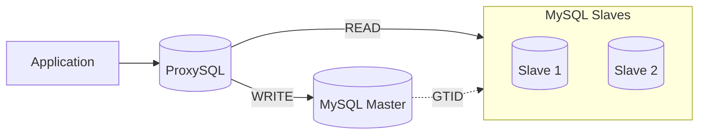

# MySQL 8 Master–Slave Replication with ProxySQL

This guide describes a `production‑ready deployment` of `Percona Server for MySQL 8` using `GTID‑based Master–Slave replication` with `ProxySQL` for `read/write splitting`. It covers installation, configuration, validation, scaling, and operational best practices.

---

## Architecture Overview

### Logical Flow

* Applications connect only to `ProxySQL`
* `WRITE` serving traffic to `Master` node
* `READ` serving traffic to `Slaves` node
* `GTID replication` simplifies recovery and scaling



---

## Node Inventory

| Role     | IP Address    | 
| -------- | ------------- | 
| Master   | 192.168.1.210 |
| Slave 1  | 192.168.1.211 | 
| Slave 2  | 192.168.1.212 | 
| ProxySQL | 192.168.1.50  |

---

## Install Percona Server 8

#### Percona provides its own signed YUM repository.

Input:

```
rpm --import https://downloads.percona.com/downloads/RPM-GPG-KEY-percona
yum install -y https://repo.percona.com/yum/percona-release-latest.noarch.rpm
percona-release setup ps-80
```

#### Install Percona Server & xtrabackup

Input:

```
yum install -y percona-server-server percona-xtrabackup-80 vim
```

#### Start mysql

Input:

```
systemctl enable mysqld
systemctl start mysqld
```

---

## Initial MySQL Security

### Temporary Root Password

#### Percona generates a temporary root password on first start.

Input:

```
grep 'temporary password' /var/log/mysqld.log
```

### Set Root Password

#### Login with temporary root password

Input:

```
mysql --connect-expired-password -uroot -p
```

#### Change root password

Input:

```
ALTER USER 'root'@'localhost'
IDENTIFIED WITH mysql_native_password BY 'Cocacola+1';
FLUSH PRIVILEGES;
```

### Root Client Configuration

Set root login without input password

Input:

```
cat <<EOF > /root/.my.cnf
[client]
user=root
password=Cocacola+1
EOF
```

#### Change Permission

Input:

```
chmod 600 /root/.my.cnf
```

---

## MySQL Configuration

### Master Configuration

#### Edit file on `/etc/my.cnf`

```
[mysqld]
sql_mode = ''
bind-address                = 192.168.1.210
skip_name_resolve           = 1

# GENERAL SETTINGS
datadir                     = /var/lib/mysql
socket                      = /var/lib/mysql/mysql.sock
pid-file                    = /var/run/mysqld/mysqld.pid
max_connections             = 100
open_files_limit            = 32768
max_allowed_packet          = 32M

# INNODB ENGINE
innodb_buffer_pool_size     = 1G
innodb_buffer_pool_instances= 1
innodb_file_per_table       = 1
innodb_log_file_size        = 256M
innodb_log_buffer_size      = 32M
innodb_flush_log_at_trx_commit = 1
innodb_flush_method         = O_DIRECT
innodb_io_capacity          = 200

# TEMP / PER-CONNECTION BUFFERS
tmp_table_size              = 64M
max_heap_table_size         = 64M
sort_buffer_size            = 512K
join_buffer_size            = 512K
read_buffer_size            = 512K
read_rnd_buffer_size        = 512K

thread_cache_size           = 50
table_open_cache            = 2000

# BINARY LOGGING 
server-id                   = 10
log_bin                     = mysql-bin
binlog_format               = ROW
expire_logs_days            = 7
sync_binlog                 = 1

# GTID (MASTER)
gtid_mode                   = ON
enforce_gtid_consistency    = ON

# IMPORTANT: MASTER MUST BE WRITABLE
read_only                   = OFF
super_read_only             = OFF

# REMOVE REPLICA-ONLY SETTINGS
# relay_log
# relay_log_recovery

# LOGGING
log_error                   = /var/log/mysqld.log
slow_query_log              = 1
slow_query_log_file         = /var/log/mysql/mysql-slow.log
long_query_time             = 1

# MYISAM 
key_buffer_size             = 16M
delay_key_write             = OFF
myisam_recover_options      = BACKUP,FORCE

# CHARACTER SET
character-set-server        = utf8mb4
collation-server            = utf8mb4_general_ci

# PERFORMANCE SCHEMA 
performance_schema          = OFF
```

#### Restart mysql

Input:

```
systemctl restart mysqld
```

---

### Slave Configuration 

#### Edit file on `/etc/my.cnf`

```
[mysqld]
sql_mode = ''
bind-address                = 192.168.1.211
skip_name_resolve           = 1

# GENERAL SETTINGS
datadir                     = /var/lib/mysql
socket                      = /var/lib/mysql/mysql.sock
pid-file                    = /var/run/mysqld/mysqld.pid
max_connections             = 100
open_files_limit            = 32768
max_allowed_packet          = 32M

# INNODB ENGINE 
innodb_buffer_pool_size     = 1G
innodb_buffer_pool_instances= 1
innodb_file_per_table       = 1
innodb_log_file_size        = 256M
innodb_log_buffer_size      = 32M
innodb_flush_log_at_trx_commit = 1
innodb_flush_method         = O_DIRECT
innodb_io_capacity          = 200

# TEMP / PER-CONNECTION BUFFERS 
tmp_table_size              = 64M
max_heap_table_size         = 64M
sort_buffer_size            = 512K
join_buffer_size            = 512K
read_buffer_size            = 512K
read_rnd_buffer_size        = 512K

thread_cache_size           = 50
table_open_cache            = 2000

# BINARY LOGGING 
server-id                   = 21
log_bin                     = mysql-bin
relay_log                   = relay-bin
relay_log_recovery          = 1
binlog_format               = ROW
expire_logs_days            = 7
sync_binlog                 = 1
gtid_mode                   = ON
enforce_gtid_consistency    = ON
read_only                   = 1
super_read_only             = 1

# LOGGING
log_error                   = /var/log/mysqld.log
slow_query_log              = 1
slow_query_log_file         = /var/log/mysql/mysql-slow.log
long_query_time             = 1

# MYISAM
key_buffer_size             = 16M
delay_key_write             = OFF
myisam_recover_options      = BACKUP,FORCE

# CHARACTER SET
character-set-server        = utf8mb4
collation-server            = utf8mb4_general_ci

# PERFORMANCE SCHEMA 
performance_schema          = OFF
```

:::info Repeat with unique `bind-address` & `server-id` for each slave, for apply configuration must restart MySQL.

Restart mysql:

```
systemctl restart mysqld
```
:::

---

## Replication Setup

### Replication User (Master)

#### Create Replication User on Master

Input:

```
mysql -uroot -e "
CREATE USER 'ReplicationUser'@'%' IDENTIFIED WITH mysql_native_password BY 'Str0ngPasswd!';
GRANT REPLICATION SLAVE ON *.* TO 'ReplicationUser'@'%';
FLUSH PRIVILEGES;
SHOW MASTER STATUS;
"
```

### Configure Slaves (GTID)

#### Configure Replication on Slaves

Input:

```
mysql -uroot -e "
STOP REPLICA;
RESET SLAVE ALL;
CHANGE REPLICATION SOURCE TO
  SOURCE_HOST='192.168.1.210',
  SOURCE_USER='ReplicationUser',
  SOURCE_PASSWORD='Str0ngPasswd!',
  SOURCE_AUTO_POSITION=1;
START REPLICA;
SHOW REPLICA STATUS\G
"
```

---

## Application Schema and User

#### Create application user on MySQL master, login into mysql

Input:

```
mysql -u root
```

### Create Database and Table

#### Create database for testdb 

Input:

```
CREATE DATABASE testdb;
```

#### Create table for test_table

Input:

```
CREATE TABLE testdb.test_table (
  id INT AUTO_INCREMENT PRIMARY KEY,
  name VARCHAR(100),
  created_at TIMESTAMP DEFAULT CURRENT_TIMESTAMP
);
```

### Application User

#### This creates a user that ProxySQL and applications will use.

Input:

```
CREATE USER 'apps'@'%'
IDENTIFIED BY 'str0ngPaswd!';
GRANT SELECT,INSERT,UPDATE,DELETE ON testdb.* TO 'apps'@'%';
FLUSH PRIVILEGES;
```

Verify user exists on replica nodes

Input:

```
SELECT Host, User FROM mysql.user WHERE User='apps';
```

---

## ProxySQL Installation

#### Percona provides its own signed YUM repository.

Input:

```
rpm --import https://downloads.percona.com/downloads/RPM-GPG-KEY-percona
yum install -y https://repo.percona.com/yum/percona-release-latest.noarch.rpm
percona-release setup pxc-80
```

#### Install ProxySQL and MySQL client packages

Input:

```
yum install -y proxysql2 percona-xtradb-cluster-client
```

#### Start ProxySQL

Input:

```
systemctl enable proxysql
systemctl start proxysql
```

---

## ProxySQL Configuration

### Admin Login

#### Connect to the admin interface.

Input:

```
mysql -uadmin -padmin -h127.0.0.1 -P6032
```

### Hostgroups

* 10 = Writer
* 20 = Readers

#### Registers a MySQL server into a specific hostgroup with connection limits and load-balancing weight

Input:

```
INSERT INTO mysql_servers (hostgroup_id, hostname, port, weight, max_connections)
VALUES (10, '192.168.1.210', 3306, 100, 1000);
```

This defines hostgroup 10 as a single MySQL server, typically used for WRITE `master` traffic.

Input:

```
INSERT INTO mysql_servers (hostgroup_id, hostname, port, weight, max_connections) 
VALUES (20, '192.168.1.212', 3306, 100, 1000);
INSERT INTO mysql_servers (hostgroup_id, hostname, port, weight, max_connections) VALUES (20, '192.168.1.211', 3306, 100, 1000);
```

This adds one READ `slave` node into hostgroup 20.

### Application User

#### Register Application User

Input:

```
INSERT INTO mysql_users
(username,password,default_hostgroup,transaction_persistent) VALUES ('apps','str0ngPaswd!',10,1);
```

### Query Rules

#### Routes all SELECT queries to the read replicas

Input:

```
INSERT INTO mysql_query_rules(rule_id,active,match_digest,destination_hostgroup,apply) VALUES(1,1,'^SELECT.*',20,1);
```
This rule sends every query starting with SELECT to hostgroup 20 `slaves`.

#### Routes all other queries to the master

Input:

```
INSERT INTO mysql_query_rules(rule_id,active,match_digest,destination_hostgroup,apply)
VALUES(2,1,'^.*',10,1);
```

This catches everything else (INSERT, UPDATE, DELETE, DDL) and sends it to hostgroup 10 `master`.

### Apply Configuration

#### Load and Save the configuration

Input:

```
LOAD MYSQL SERVERS TO RUNTIME;
LOAD MYSQL USERS TO RUNTIME;
LOAD MYSQL QUERY RULES TO RUNTIME;
SAVE MYSQL SERVERS TO DISK;
SAVE MYSQL USERS TO DISK;
SAVE MYSQL QUERY RULES TO DISK;
```

---

## End‑to‑End Validation

#### Connect through ProxySQL

Input:

```
mysql -uapps -pstr0ngPaswd! -h192.168.1.50 -P6033
```

Input:

```
SELECT @@hostname;
```

This confirms SELECT queries are served by slaves.

Input:

```
INSERT INTO testdb.test_table(name) VALUES ('proxy test');
```

This confirms writes are routed to the master

Input:

```
select * from test_table;
```

Output:

```
+----+------------+---------------------+
| id | name       | created_at          |
+----+------------+---------------------+
|  1 | proxy test | 2025-12-15 04:02:16 |
+----+------------+---------------------+
```
---

## Adding a New Slave 

:::info Please Install Percona Server 8 first and adjust configuration `/etc/my.cnf`.
:::

### Create Hot Backup

#### Login to existing node ( `slave1` / `slave2` / `master` )

Input:

```
xtrabackup --backup \
 --user=root \
 --slave-info \
 --safe-slave-backup \
 --target-dir=/opt/backupsql
```

### Transfer Backup

#### Copies all InnoDB files, metadata, and binlog position to the new slave host

Input:

```
rsync -avH /opt/backupsql root@new-slave:/opt/
```

### Prepare Backup on New Slave

#### Backup files must be prepared to apply redo logs before use.

Input:

```
xtrabackup --prepare --target-dir=/opt/backupsql
```

### Restore Backup

#### stop mysql service

Input:

```
systemctl stop mysqld
```

#### Clean data directory

Input:

```
rm -rf /var/lib/mysql/*
```

#### Restore physical files

Input:

```
xtrabackup --copy-back --target-dir=/opt/backupsql
```

This copies InnoDB tablespaces and system files into /var/lib/mysql.

#### Fix ownership

Input:

```
chown -R mysql:mysql /var/lib/mysql
```

Input:

```
systemctl start mysqld
```

### Start Replication

#### Configure Replication

Input:

```
mysql -uroot -e "
STOP REPLICA;
RESET SLAVE ALL;
CHANGE REPLICATION SOURCE TO
  SOURCE_HOST='192.168.1.210',
  SOURCE_USER='ReplicationUser',
  SOURCE_PASSWORD='Str0ngPasswd!',
  SOURCE_AUTO_POSITION=1;
START REPLICA;
SHOW REPLICA STATUS\G
"
```

---

Resources:
* [Percona Documentaion](https://docs.percona.com/)

---