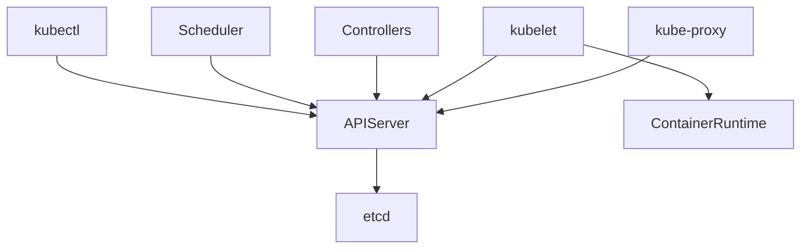

# Kubernetes Architecture 

Kubernetes is a **distributed control system** where a central control plane maintains desired state and worker nodes execute workloads.

Think of it as **brain (control plane)** and **muscles (workers)**.

## Control Plane Components

The control plane decides *what should happen* in the cluster.

| Component               | Role                   |
| ----------------------- | ---------------------- |
| kube-apiserver          | Cluster front door     |
| etcd                    | Persistent state store |
| kube-scheduler          | Pod placement          |
| kube-controller-manager | State reconciliation   |

### kube-apiserver

The API Server is the **only component that talks to everything**.

* All reads/writes go through it
* Authenticates and validates requests
* Persists state to etcd

### etcd

etcd is a **distributed, strongly-consistent key-value database**.

* Stores cluster state (Pods, Nodes, Secrets)
* Source of truth
* If etcd is unavailable, Kubernetes cannot function

### kube-scheduler

The scheduler assigns Pods to worker nodes.

* Watches for unscheduled Pods
* Evaluates resource availability
* Writes binding decision to API server

### kube-controller-manager

Controllers ensure **actual state matches desired state**.

Examples:

* Deployment Controller
* Node Controller
* ReplicaSet Controller

Analogy: **Thermostat correcting room temperature**

## Worker Node Components

Worker nodes are where applications actually run.

| Component         | Role               |
| ----------------- | ------------------ |
| kubelet           | Node agent         |
| kube-proxy        | Service networking |
| Container Runtime | Runs containers    |

### kubelet

kubelet is the **node-level manager**.

* Watches assigned Pods from API server
* Starts/stops containers
* Reports health and status

### kube-proxy

kube-proxy handles **service abstraction**.

* Implements load balancing
* Uses iptables or IPVS
* Routes traffic to Pod IPs

### Container Runtime

The runtime executes containers.

Common runtimes:

* containerd
* CRI-O

Docker is no longer required.

## Component Communication Flow

All communication flows through the API Server.



Key rules:

* No direct etcd access except API server
* Workers never talk to each other directly
* Desired state flows **down**, status flows **up**

## Master vs Worker Analogy

| Real World       | Kubernetes  |
| ---------------- | ----------- |
| CEO              | API Server  |
| Company records  | etcd        |
| HR               | Scheduler   |
| Managers         | Controllers |
| Employees        | kubelet     |
| Factory machines | Containers  |

## Hands-on: Explore a Running Cluster

### View Nodes

Input:

```
kubectl get nodes
```

Output:

```
NAME        STATUS   ROLES           AGE   VERSION
node-1      Ready    control-plane   10d   v1.35.0
node-2      Ready    worker          10d   v1.35.0
```

This shows control-plane and worker nodes.

### Describe a Node

Input:

```
kubectl describe node node-2
```

Output:

```
Capacity:
  cpu:                4
  memory:             16Gi
Conditions:
  Ready               True
```

This shows resources and node health.

### View Control Plane Pods

Input:

```
kubectl get pods -n kube-system
```

Output:

```
NAME                                READY   STATUS    NODE
kube-apiserver-node-1               1/1     Running   node-1
kube-scheduler-node-1               1/1     Running   node-1
kube-controller-manager-node-1      1/1     Running   node-1
etcd-node-1                         1/1     Running   node-1
```

This confirms control plane components are Pods.

### Check Component Health

Input:

```
kubectl get componentstatuses
```

Output:

```
NAME                 STATUS
scheduler            Healthy
controller-manager   Healthy
etcd-0               Healthy
```

This verifies core control plane health.

## Key Takeaways

| Concept       | Meaning                   |
| ------------- | ------------------------- |
| Control Plane | Decides desired state     |
| Worker Node   | Executes workloads        |
| API Server    | Central communication hub |
| etcd          | Cluster memory            |
| Controllers   | Continuous reconciliation |

Kubernetes works because **nothing is assumed to be correct — everything is constantly verified and fixed**.
