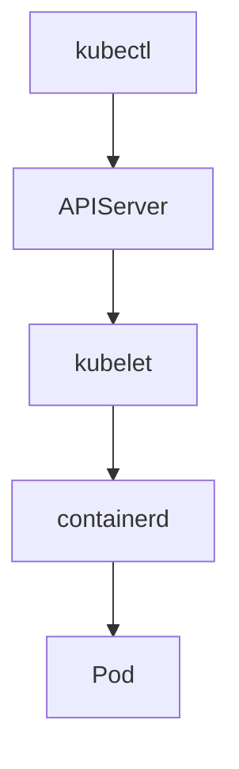

# Setting Up Your First Kubernetes Cluster 

A Kubernetes cluster needs a **container runtime** to run Pods.
`containerd` is the **default, CNCF-supported runtime** used by modern Kubernetes.

This guide shows **local cluster options using containerd** and a **working installation walkthrough**.

## What Is containerd

containerd is a **low-level container runtime** responsible for:

* Pulling images
* Creating containers
* Managing container lifecycle

Kubernetes talks to containerd via **CRI (Container Runtime Interface)**.

| Runtime    | Status                  |
| ---------- | ----------------------- |
| Docker     | Deprecated (as runtime) |
| containerd | Standard                |
| CRI-O      | Alternative             |

## Local Cluster Options (Containerd-based)

| Option   | Runtime    | Use Case           |
| -------- | ---------- | ------------------ |
| kind     | containerd | Learning, CI       |
| kubeadm  | containerd | Bare-metal realism |
| minikube | containerd | Simple local labs  |

This post focuses on **kind** because it is:

* Lightweight
* 100% containerd
* Zero VM setup

Kind uses containerd inside Kubernetes nodes, but requires Docker on the host to run the nodes as containers.

## Architecture (kind + containerd)



kind runs Kubernetes **nodes as containers**, but Pods still run on **containerd** inside those nodes.

## Install Prerequisites

### Install Docker (required to run kind nodes)

Input:

```
sudo apt install -y docker.io
```

No output is expected.

### Verify Docker

Input:

```
docker version
```

Output:

```
Server: Docker Engine
```

This confirms Docker is available.

## Install kubectl

### Download kubectl

Input:

```
curl -LO https://dl.k8s.io/release/$(curl -s https://cdn.dl.k8s.io/release/stable.txt)/bin/linux/amd64/kubectl
```

No output is expected.

### Install kubectl

Input:

```
chmod +x kubectl && sudo mv kubectl /usr/local/bin/
```

No output is expected.

### Verify kubectl

Input:

```
kubectl version --client
```

Output:

```
Client Version: v1.35.0
Kustomize Version: v5.7.1
```

This confirms kubectl is installed.

## Install kind (Kubernetes in Docker)

### Download kind

Input:

```
curl -Lo kind https://kind.sigs.k8s.io/dl/latest/kind-linux-amd64
```

No output is expected.

### Install kind

Input:

```
chmod +x kind && sudo mv kind /usr/local/bin/
```

No output is expected.

### Verify kind

Input:

```
kind version
```

Output:

```
kind v0.32.0-alpha+64799331dae3f7 go1.25.5 linux/amd64
```

This confirms kind is installed.

## Create a Local Kubernetes Cluster (containerd)

### Create Cluster

Input:

```
kind create cluster --name lab
```

Output:

```
Creating cluster "lab" ...
Set kubectl context to "kind-lab"
```

This creates a **single-node Kubernetes cluster using containerd**.

## Verify Cluster

### Check Nodes

Input:

```
kubectl get nodes
```

Output:

```
NAME                STATUS     ROLES           AGE   VERSION
lab-control-plane   Ready   control-plane   1m    v1.35.0
```

This confirms the node is running.

### Verify Runtime

Input:

```
kubectl describe node lab-control-plane | grep -i runtime
```

Output:

```
  Container Runtime Version:  containerd://2.2.0
```

This proves Kubernetes is using containerd.

## Verify System Pods

### Check kube-system

Input:

```
kubectl get pods -n kube-system
```

Output:

```
coredns-xxx                 Running
kube-apiserver              Running
kube-controller-manager     Running
kube-scheduler              Running
...
```

This confirms the control plane is healthy.

## First Pod Deployment

### Run a Test Pod

Input:

```
kubectl run nginx --image=nginx
```

Output:

```
pod/nginx created
```

This schedules a Pod via containerd.

### Verify Pod

Input:

```
kubectl get pods
```

Output:

```
nginx   1/1   Running
```

This confirms the Pod is running.

### Exec into Pod

Input:

```
kubectl exec -it nginx -- sh
```

No output is expected.

This opens a shell inside the container.

## What You Achieved

| Step       | Result             |
| ---------- | ------------------ |
| Runtime    | containerd         |
| Cluster    | Local Kubernetes   |
| Tooling    | kubectl + kind     |
| Validation | Node + Pod running |

