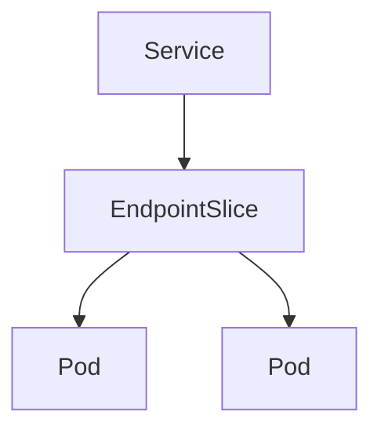

# Services 

A Service provides a **stable network endpoint** for a dynamic set of Pods whose IPs change over time.

Pods are temporary, Services are permanent.

## Why Do We Need Services

Pods are created, destroyed, and rescheduled constantly.

| Problem     | Without Service | With Service            |
| ----------- | --------------- | ----------------------- |
| Pod restart | IP changes      | Stable IP               |
| Scaling     | Manual routing  | Built-in load balancing |
| Discovery   | Hardcoded IP    | DNS-based               |
| Pod churn   | Broken clients  | Transparent             |

Services abstract **network identity** from **Pod lifecycle**.

## Service Types

| Type         | Reachability   | Typical Use            |
| ------------ | -------------- | ---------------------- |
| ClusterIP    | Inside cluster | Internal backends      |
| NodePort     | NodeIP:Port    | Simple external access |
| LoadBalancer | External IP    | Cloud / LB integration |
| ExternalName | DNS alias      | External dependencies  |

## How Services Find Pods

Services use **label selectors** to discover Pods and create endpoints.



Endpoints update automatically as Pods scale or restart.

## Service Discovery and DNS

Kubernetes runs **CoreDNS**.

DNS format:

```
<service>.<namespace>.svc.cluster.local
```

Clients connect using **names**, not IPs.

## Hands-on Setup: Test Application

### Create a Deployment

Input:

```
kubectl create deployment web --image=nginx
```

Output:

```
deployment.apps/web created
```

This creates Pods with label `app=web`.

### Verify Pods

Input:

```
kubectl get pods -l app=web
```

Output:

```
web-xxxxx   1/1   Running
```

This confirms backend Pods are running.

## ClusterIP Service

### Create ClusterIP Service

Input:

```
kubectl expose deployment web --port=80 --name=web-clusterip
```

Output:

```
service/web-clusterip exposed
```

This exposes the service internally.

### Inspect Service

Input:

```
kubectl get svc web-clusterip
```

Output:

```
NAME            TYPE        CLUSTER-IP     PORT(S)
web-clusterip   ClusterIP   10.96.12.45    80/TCP
```

This IP is reachable only inside the cluster.

## NodePort Service

### Create NodePort Service

Input:

```
kubectl expose deployment web --type=NodePort --port=80 --name=web-nodeport
```

Output:

```
service/web-nodeport exposed
```

This opens a port on every node.

### Inspect NodePort

Input:

```
kubectl get svc web-nodeport
```

Output:

```
NAME            TYPE       PORT(S)
web-nodeport    NodePort   80:31234/TCP
```

This exposes the service at `NodeIP:31234`.

## LoadBalancer Service

### Create LoadBalancer Service

Input:

```
kubectl expose deployment web --type=LoadBalancer --port=80 --name=web-lb
```

Output:

```
service/web-lb exposed
```

This requests an external load balancer.

### Inspect LoadBalancer

Input:

```
kubectl get svc web-lb
```

Output:

```
NAME     TYPE           EXTERNAL-IP
web-lb   LoadBalancer   <pending>
```

External IP assignment depends on the environment.

## ExternalName Service

### Create ExternalName Service

Input:

```
kubectl apply -f externalname.yaml
```

Output:

```
service/external-db created
```

This creates a DNS alias.

Example `externalname.yaml`:

```yaml
apiVersion: v1
kind: Service
metadata:
  name: external-db
spec:
  type: ExternalName
  externalName: db.example.com
```

## Service Discovery Test

### Create DNS Test Pod

Input:

```
kubectl run dns-test --image=busybox --restart=Never -- sleep 3600
```

Output:

```
pod/dns-test created
```

This Pod is used for connectivity tests.

### Resolve Service Name

Input:

```
kubectl exec dns-test -- nslookup web-clusterip
```

Output:

```
Address: 10.96.12.45
```

This confirms Service DNS resolution.

## Endpoints Verification

### View Endpoints

Input:

```
kubectl get endpoints web-clusterip
```

Output:

```
10.244.0.5:80
```

This shows which Pods receive traffic.

## Test Connectivity

### Access Service Internally

Input:

```
kubectl exec dns-test -- wget -qO- web-clusterip
```

Output:

```
<!DOCTYPE html>
<html>
<title>Welcome to nginx!</title>
```

This confirms Service-to-Pod connectivity.

## Key Takeaways

| Concept      | Meaning             |
| ------------ | ------------------- |
| Service      | Stable access layer |
| ClusterIP    | Internal networking |
| NodePort     | Node-level exposure |
| LoadBalancer | External access     |
| ExternalName | DNS alias           |
| Endpoints    | Pod backends        |

Services are the **network glue** that makes Kubernetes applications reliable and scalable.
