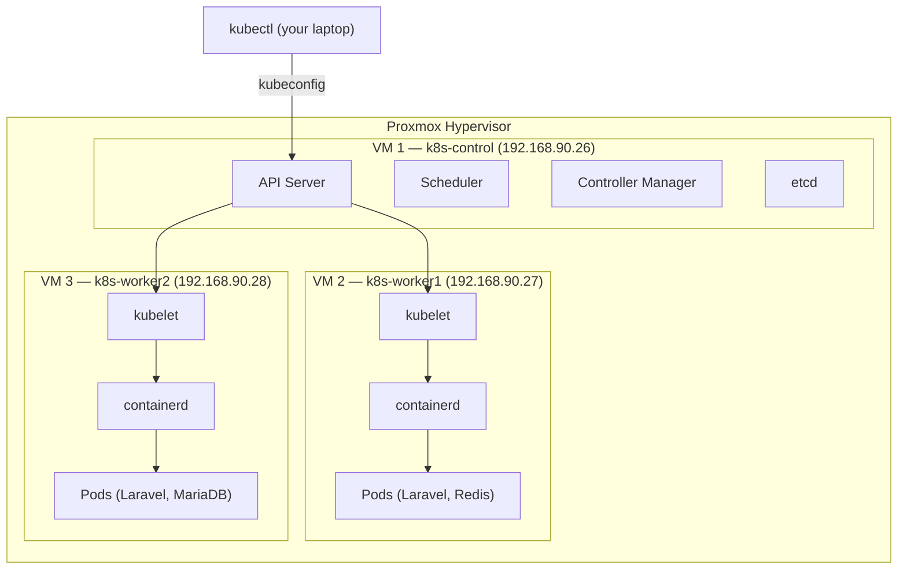
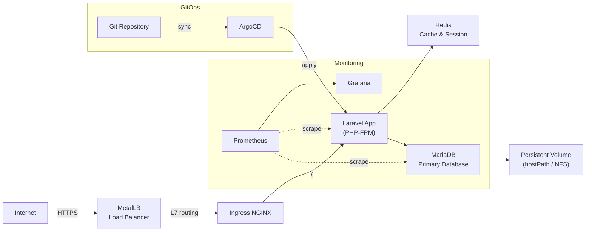

# Study Case Overview

> **Act as:** Senior DevOps / Platform Engineer mentoring a junior engineer.  
> **Goal:** Build a production-like Kubernetes environment from scratch on bare-metal VMs.

This is **not** a "Hello World" Kubernetes tutorial.  
You are here to understand how Kubernetes is **actually used in modern production environments** — from infrastructure bootstrapping to GitOps, monitoring, and failure recovery.

---

## What You Have

| Resource | Detail |
| -------- | ------ |
| VM 1 — `k8s-control` | Control-plane node — `192.168.90.26` |
| VM 2 — `k8s-worker1` | Worker node 1 — `192.168.90.27` |
| VM 3 — `k8s-worker2` | Worker node 2 — `192.168.90.28` |
| OS | Linux (Ubuntu 22.04 LTS recommended) |
| Networking | Basic host networking already configured |
| Kubernetes | Not yet installed |

---

## Cluster Topology



---

## Target Stack



---

## Learning Phases

| Phase | Topic | What You'll Build |
| ----- | ----- | ----------------- |
| 01 | Container Runtime | Install & verify containerd on all 3 VMs |
| 02 | Cluster Bootstrap | kubeadm init + join worker nodes |
| 03 | CNI Networking | Calico pod networking |
| 04 | Load Balancer | MetalLB for bare-metal external IPs |
| 05 | Ingress | NGINX Ingress Controller + host routing |
| 06 | Persistent Storage | PV, PVC, StorageClass + NFS for databases |
| 07 | Laravel Stack | Full production app deployment |
| 08 | Monitoring | Prometheus + Grafana stack |
| 09 | GitOps | ArgoCD for automated deployments |
| 10 | Security | RBAC, NetworkPolicy, TLS hardening |
| 11 | Failure Simulation | Real troubleshooting scenarios |

---

## Sample Application

You will deploy this Laravel application throughout the study case:

```
https://github.com/pndhkm/sample-app
```

It includes a web frontend, API routes, Redis integration, and database migrations — a realistic production workload.

---

## How to Follow This Guide

Each phase follows this structure:

1. **Concept** — why this component exists in production
2. **Architecture** — diagram of how it fits into the cluster
3. **Step-by-step** — exact commands to run
4. **YAML manifests** — production-grade configurations
5. **Validation** — how to verify it works
6. **Troubleshooting** — what breaks and how to fix it
7. **Best practices** — what production teams actually do

> **Production Mindset:** Every step you take here mirrors what a Platform Engineering team does when onboarding a new cluster. Read the "why" before running the commands.

---
