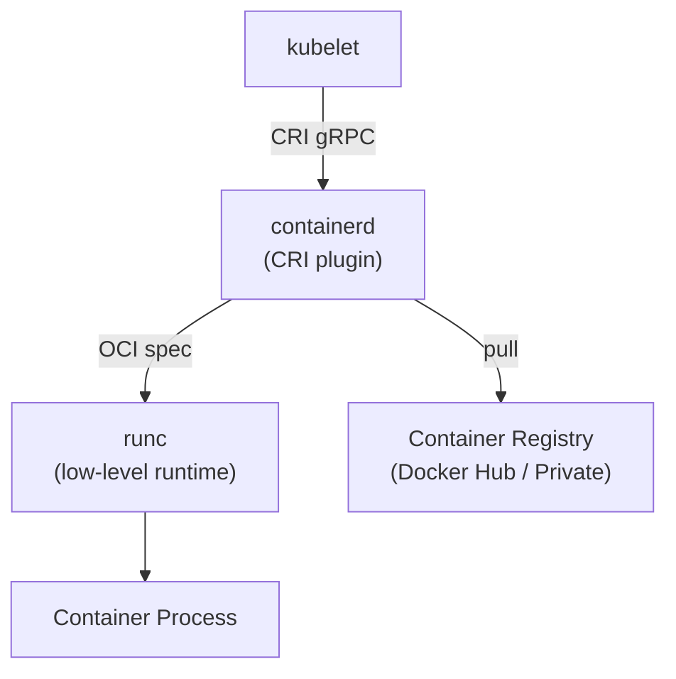

# Container Runtime (containerd)

> **Production Purpose:** Every Kubernetes node needs a container runtime. `containerd` is the CNCF-standard runtime used by all major managed Kubernetes services (EKS, GKE, AKS). Choosing it bare-metal mirrors exactly what cloud providers run under the hood.

---

## Why containerd, Not Docker?

Kubernetes removed Docker as a supported runtime in v1.24 (Dockershim removal). The reason:

| Layer | Docker | containerd |
| ----- | ------ | ---------- |
| Developer UX | `docker build`, `docker run` | No CLI needed at runtime |
| Kubernetes interface | Dockershim (deprecated) | CRI (Container Runtime Interface) |
| Overhead | Extra daemon layer | Direct CRI, lower overhead |
| CNCF standard | No | Yes — graduated project |

containerd is what Docker itself uses internally. Using it directly removes unnecessary abstraction.

---

## Architecture



- **kubelet** — the node agent, talks to containerd via CRI
- **containerd** — manages image pull, container lifecycle
- **runc** — the actual Linux process isolation (namespaces, cgroups)

---

## Pre-Flight Checklist

Run on **all 3 VMs** (control-plane + 2 workers).

### Verify Hostnames Are Set Correctly

Input:

```bash
hostnamectl set-hostname k8s-control   # on VM1
hostnamectl set-hostname k8s-worker1   # on VM2
hostnamectl set-hostname k8s-worker2   # on VM3
```

No output is expected.

### Update /etc/hosts on All Nodes

Input:

```bash
cat >> /etc/hosts << 'EOF'
192.168.90.26  k8s-control
192.168.90.27  k8s-worker1
192.168.90.28  k8s-worker2
EOF
```

Run this on **all 3 VMs**.

### Verify Connectivity Between Nodes

Input:

```bash
ping -c 3 k8s-worker1   # run from control-plane
```

Output:

```
3 packets transmitted, 3 received, 0% packet loss
```

This confirms nodes can talk to each other.

---

## Disable Swap

Kubernetes requires swap to be disabled. Swap breaks memory pressure assumptions in the scheduler.

Input:

```bash
swapoff -a
sed -i '/swap/d' /etc/fstab
```

Verify:

```bash
free -h | grep Swap
```

Output:

```
Swap:           0B          0B          0B
```

---

## Load Kernel Modules

Input:

```bash
cat << 'EOF' > /etc/modules-load.d/containerd.conf
overlay
br_netfilter
EOF

modprobe overlay
modprobe br_netfilter
```

Verify modules are loaded:

```bash
lsmod | grep -E "overlay|br_netfilter"
```

Output:

```
br_netfilter           32768  0
bridge                425984  1 br_netfilter
overlay               233472  0
```

---

## Configure Sysctl (Network)

Kubernetes networking requires IP forwarding and bridge netfilter.

Input:

```bash
cat << 'EOF' > /etc/sysctl.d/99-kubernetes.conf
net.bridge.bridge-nf-call-iptables  = 1
net.bridge.bridge-nf-call-ip6tables = 1
net.ipv4.ip_forward                 = 1
EOF

sysctl --system
```

Output (last lines):

```
* Applying /etc/sysctl.d/99-kubernetes.conf ...
net.bridge.bridge-nf-call-iptables = 1
net.ipv4.ip_forward = 1
```

---

## Install containerd

Input:

```bash
apt update && apt install -y containerd
```

### Configure containerd with Default Config

Input:

```bash
mkdir -p /etc/containerd
containerd config default > /etc/containerd/config.toml
```

### Enable SystemdCgroup (Critical!)

The kubelet uses systemd cgroup driver by default. containerd must match.

Input:

```bash
sed -i 's/SystemdCgroup = false/SystemdCgroup = true/' /etc/containerd/config.toml
```

Verify:

```bash
grep "SystemdCgroup" /etc/containerd/config.toml
```

Output:

```
SystemdCgroup = true
```

### Start and Enable containerd

Input:

```bash
systemctl enable --now containerd
```

Verify:

```bash
systemctl status containerd
```

Output:

```
● containerd.service - containerd container runtime
   Active: active (running)
```

---

## Install runc

runc is the OCI-compatible container runtime that containerd delegates to.

Input:

```bash
apt install -y runc
```

Verify:

```bash
runc --version
```

Output:

```
runc version 1.1.x
```

---

## Install CNI Plugins

CNI plugins are required for Pod networking. They'll be used later by Calico.

Input:

```bash
mkdir -p /opt/cni/bin
apt install -y containernetworking-plugins
```

---

## Validation

### Test containerd directly (no Kubernetes yet)

```bash
ctr image pull docker.io/library/nginx:alpine
ctr image ls
```

Output:

```
REF                              TYPE   DIGEST   ...
docker.io/library/nginx:alpine   ...
```

### Run a container with containerd

```bash
ctr run --rm docker.io/library/nginx:alpine test-nginx echo "containerd works"
```

Output:

```
containerd works
```

This confirms containerd is fully operational.

---

## Troubleshooting

| Symptom | Cause | Fix |
| ------- | ----- | --- |
| `containerd` fails to start | Config syntax error | Run `containerd config default` again |
| `SystemdCgroup = false` after restart | sed didn't apply | Edit `/etc/containerd/config.toml` manually |
| `ctr` command not found | containerd not installed | `apt install -y containerd` |
| Module not loaded on reboot | `/etc/modules-load.d/` file missing | Re-create the file and reboot |
| Swap still enabled | `/etc/fstab` not updated | Run `swapoff -a && sed -i '/swap/d' /etc/fstab` |

---

## Production Best Practices

| Practice | Reason |
| -------- | ------ |
| Always use `SystemdCgroup = true` | Prevents OOM kill mismatches between kubelet and runtime |
| Pin containerd version | Avoid unexpected upgrades breaking nodes |
| Enable containerd metrics | Expose to Prometheus for runtime monitoring |
| Use private registry mirror | Avoid Docker Hub rate limits in production |
| Disable swap permanently | Required for Kubernetes scheduler correctness |

---
