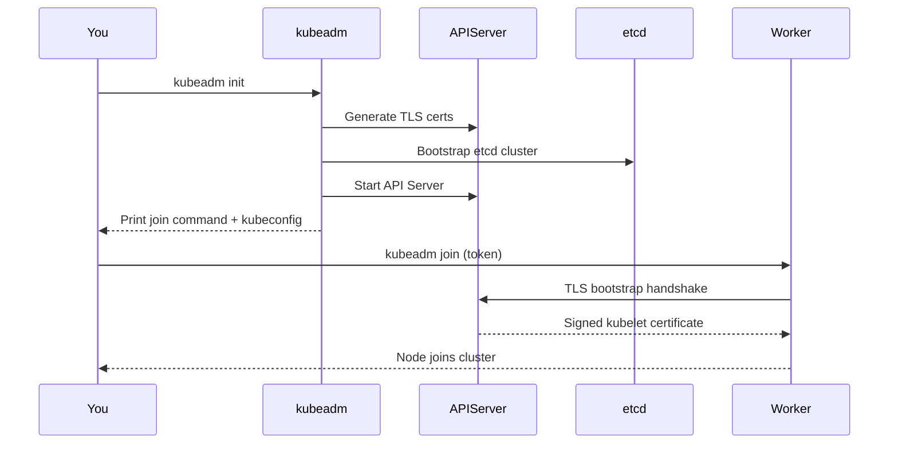
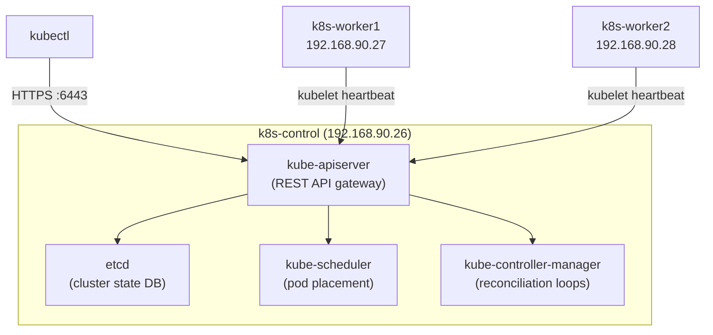

# Bootstrap Kubernetes Cluster with kubeadm

> **Production Purpose:** `kubeadm` is the official Kubernetes cluster bootstrapping tool. It handles control-plane initialization, TLS certificate generation, etcd setup, and node join tokens — the same steps cloud providers automate for managed Kubernetes (EKS, GKE, AKS).

---

## What kubeadm Does



---

## Node IP Reference

| Node | Hostname | IP |
| ---- | -------- | -- |
| Control Plane | `k8s-control` | `192.168.90.26` |
| Worker 1 | `k8s-worker1` | `192.168.90.27` |
| Worker 2 | `k8s-worker2` | `192.168.90.28` |

---

## Install kubeadm, kubelet, kubectl (All Nodes)

Run this on **all 3 VMs**.

### Add Kubernetes Repository

Input:

```bash
apt update && apt install -y apt-transport-https ca-certificates curl gpg
```

```bash
mkdir -p /etc/apt/keyrings
curl -fsSL https://pkgs.k8s.io/core:/stable:/v1.30/deb/Release.key \
  | gpg --dearmor -o /etc/apt/keyrings/kubernetes-apt-keyring.gpg
```

```bash
echo 'deb [signed-by=/etc/apt/keyrings/kubernetes-apt-keyring.gpg] https://pkgs.k8s.io/core:/stable:/v1.30/deb/ /' \
  | tee /etc/apt/sources.list.d/kubernetes.list
```

:::warning Common mistake
The `deb` line **must be a single line** — no line breaks inside the string. Using `tee` instead of `>` also makes the entry visible in output so you can verify it immediately.
:::

Verify the file looks correct:

```bash
cat /etc/apt/sources.list.d/kubernetes.list
```

Output:

```
deb [signed-by=/etc/apt/keyrings/kubernetes-apt-keyring.gpg] https://pkgs.k8s.io/core:/stable:/v1.30/deb/ /
```

It must be exactly one line with no backslashes.

No other output is expected.

### Install Kubernetes Components

Input:

```bash
apt update
apt install -y kubelet kubeadm kubectl
apt-mark hold kubelet kubeadm kubectl
```

`apt-mark hold` prevents automatic upgrades from breaking your cluster.

### Verify Installation

Input:

```bash
kubeadm version
kubelet --version
kubectl version --client
```

Output:

```
kubeadm version: &version.Info{Major:"1", Minor:"30", GitVersion:"v1.30.14", GitCommit:"9e18483918821121abdf9aa82bc14d66df5d68cd", GitTreeState:"clean", BuildDate:"2025-06-17T18:34:53Z", GoVersion:"go1.23.10", Compiler:"gc", Platform:"linux/amd64"}
Kubernetes v1.30.14
Client Version: v1.30.14
Kustomize Version: v5.0.4-0.20230601165947-6ce0bf390ce3
```

---

## Initialize the Control Plane (VM1 only)

Run on **k8s-control (192.168.90.26) only**.

### Create kubeadm Config File

Create: `kubeadm-config.yaml`

```yaml
apiVersion: kubeadm.k8s.io/v1beta3
kind: InitConfiguration
localAPIEndpoint:
  advertiseAddress: 192.168.90.26
  bindPort: 6443
---
apiVersion: kubeadm.k8s.io/v1beta3
kind: ClusterConfiguration
kubernetesVersion: v1.30.0
clusterName: k8s-prod
networking:
  podSubnet: 10.244.0.0/16     # Calico will use this range
  serviceSubnet: 10.96.0.0/12
controlPlaneEndpoint: 192.168.90.26:6443
---
apiVersion: kubelet.config.k8s.io/v1beta1
kind: KubeletConfiguration
cgroupDriver: systemd
```

:::info Why `podSubnet: 10.244.0.0/16`?
This is the CIDR Calico will use for pod IPs. Do NOT change it after cluster creation — it breaks all pod networking.
:::

### Run kubeadm init

Input:

```bash
kubeadm init --config kubeadm-config.yaml --upload-certs 2>&1 | tee kubeadm-init.log
```

Output (last few lines):

```
Your Kubernetes control-plane has initialized successfully!

To start using your cluster, you need to run the following as a regular user:

  mkdir -p $HOME/.kube
  sudo cp -i /etc/kubernetes/admin.conf $HOME/.kube/config
  sudo chown $(id -u):$(id -g) $HOME/.kube/config

Alternatively, if you are the root user, you can run:

  export KUBECONFIG=/etc/kubernetes/admin.conf

You should now deploy a pod network to the cluster.
Run "kubectl apply -f [podnetwork].yaml" with one of the options listed at:
  https://kubernetes.io/docs/concepts/cluster-administration/addons/

You can now join any number of the control-plane node running the following command on each as root:

  kubeadm join 192.168.90.26:6443 --token ligchj.j6fb8wfls2qr0r6z \
	--discovery-token-ca-cert-hash sha256:ce64982663604b98fbb3a7ddccca412acd9a1e63bf6b01a19758628114f937ed \
	--control-plane --certificate-key e26edb6d2b9a509112247470b6c32ba16717a3fa24a9a82a6eb4e377ccd15765

Please note that the certificate-key gives access to cluster sensitive data, keep it secret!
As a safeguard, uploaded-certs will be deleted in two hours; If necessary, you can use
"kubeadm init phase upload-certs --upload-certs" to reload certs afterward.

Then you can join any number of worker nodes by running the following on each as root:

kubeadm join 192.168.90.26:6443 --token ligchj.j6fb8wfls2qr0r6z \
	--discovery-token-ca-cert-hash sha256:ce64982663604b98fbb3a7ddccca412acd9a1e63bf6b01a19758628114f937ed 
```

:::warning Save the join command
Copy the entire `kubeadm join` command. You need it to add workers. It expires in 24 hours.
:::

### Configure kubectl for root User

Input:

```bash
mkdir -p $HOME/.kube
cp -i /etc/kubernetes/admin.conf $HOME/.kube/config
chown $(id -u):$(id -g) $HOME/.kube/config
```

### Verify Control Plane

Input:

```bash
kubectl get nodes
```

Output:

```
NAME          STATUS     ROLES           AGE   VERSION
k8s-control   NotReady   control-plane   1m    v1.30.x
```

`NotReady` is expected — no CNI (network plugin) is installed yet.

---

## Join Worker Nodes (VM2 and VM3)

Run the join command from `kubeadm-init.log` on **each worker node**.

```bash
kubeadm join 192.168.90.26:6443 --token <TOKEN> \
    --discovery-token-ca-cert-hash sha256:<HASH>
```

Output:

```
This node has joined the cluster:
* Certificate signing request was sent to apiserver
* The kubelet was informed of the new secure connection details

Run 'kubectl get nodes' on the control-plane to see this node join the cluster.
```

### If the Join Token Expired

Tokens expire after 24 hours. Generate a new one on the control plane:

```bash
kubeadm token create --print-join-command
```

---

## Verify All Nodes Joined

Input (on control-plane):

```bash
kubectl get nodes -o wide
```

Output:

```
NAME           STATUS     ROLES           AGE   VERSION   INTERNAL-IP      OS-IMAGE
k8s-control    NotReady   control-plane   5m    v1.30.x   192.168.90.26    Ubuntu 22.04
k8s-worker1    NotReady   <none>          2m    v1.30.x   192.168.90.27    Ubuntu 22.04
k8s-worker2    NotReady   <none>          1m    v1.30.x   192.168.90.28    Ubuntu 22.04
```

All nodes show `NotReady` until Calico is installed in Phase 03.

---

## Verify System Pods

Input:

```bash
kubectl get pods -n kube-system
```

Output:

```
NAME                                  READY   STATUS    RESTARTS   AGE
coredns-xxx                           0/1     Pending   0          5m
etcd-k8s-control                      1/1     Running   0          5m
kube-apiserver-k8s-control            1/1     Running   0          5m
kube-controller-manager-k8s-control   1/1     Running   0          5m
kube-scheduler-k8s-control            1/1     Running   0          5m
kube-proxy-xxx                        1/1     Running   0          5m
```

`coredns` is Pending — it waits for pod networking (Calico).

---

## Copy kubeconfig to Your Laptop (Optional)

If you want to run `kubectl` from your own machine:

```bash
# On your laptop
mkdir -p ~/.kube
scp root@192.168.90.26:/etc/kubernetes/admin.conf ~/.kube/config
```

Verify from your laptop:

```bash
kubectl cluster-info
```

Output:

```
Kubernetes control plane is running at https://192.168.90.26:6443
```

---

## Understanding the Control Plane Components



| Component | Role |
| --------- | ---- |
| **etcd** | Key-value store for all cluster state — losing it = losing the cluster |
| **kube-apiserver** | All kubectl commands go here — the single source of truth |
| **kube-scheduler** | Decides which node a Pod runs on |
| **kube-controller-manager** | Reconciles desired state (Deployments, ReplicaSets, etc.) |
| **kubelet** | Node agent — runs on every node, talks to containerd |
| **kube-proxy** | Maintains iptables rules for Service networking |

---

## Troubleshooting

| Symptom | Cause | Fix |
| ------- | ----- | --- |
| `kubeadm init` fails on preflight | Swap enabled | `swapoff -a` |
| `kubeadm init` fails on preflight | containerd not running | `systemctl start containerd` |
| Workers can't join | Firewall blocking 6443 | `ufw allow 6443/tcp` on control-plane |
| Node stays `NotReady` | No CNI installed | Install Calico (Phase 03) |
| coredns stays Pending | No CNI installed | Install Calico (Phase 03) |
| kubeadm token expired | 24h TTL | `kubeadm token create --print-join-command` |
| `kubectl` says no server | kubeconfig missing | `cp /etc/kubernetes/admin.conf ~/.kube/config` |
| First `kubectl` works, then **connection refused** | API server crashed after init | See runbook below ↓ |

---

### ⚠️ API Server Works Once Then Drops (connection refused)

This is the most common post-init failure. The API server started once (you got one successful `kubectl get nodes`), then crashed. The `kubeconfig` is correct — the server itself is down.

**Step 1 — Check if kube-apiserver container is still running:**

```bash
crictl ps -a | grep apiserver
```

If the STATUS column shows `Exited` → the container crashed. Continue below.

**Step 2 — Read kube-apiserver crash logs:**

```bash
crictl logs $(crictl ps -a | grep apiserver | awk '{print $1}')
```

Or via the pod log file:

```bash
ls /var/log/pods/kube-system_kube-apiserver*/kube-apiserver/
cat /var/log/pods/kube-system_kube-apiserver*/kube-apiserver/0.log | tail -40
```

**Step 3 — Check kubelet for the root cause:**

```bash
journalctl -u kubelet -n 80 --no-pager
```

**Step 4 — Interpret the error:**

| Error in logs | Root Cause | Fix |
| ------------- | ---------- | --- |
| `failed to initialize cgroup driver` | `SystemdCgroup = false` in containerd | Set to `true`, restart containerd |
| `bind: address already in use :6443` | Another process on port 6443 | `ss -tlnp \| grep 6443` then kill it |
| `etcd cluster is unavailable` | etcd also crashed | `crictl ps -a \| grep etcd` |
| `x509: certificate` errors | Cert mismatch or wrong advertiseAddress | Reset and reinit with correct IP |
| `permission denied` on pki files | Wrong file permissions | `chmod 600 /etc/kubernetes/pki/*.key` |

**Step 5 — Fix cgroup mismatch (most common cause):**

```bash
grep "SystemdCgroup" /etc/containerd/config.toml
```

If it shows `false`:

```bash
sed -i 's/SystemdCgroup = false/SystemdCgroup = true/' /etc/containerd/config.toml
systemctl restart containerd
systemctl status containerd
```

**Step 6 — Full reset and reinitialize if needed:**

:::caution
This wipes the cluster. Run only on the control-plane. Workers need to re-join after.
:::

```bash
kubeadm reset -f
rm -rf /etc/kubernetes /var/lib/etcd ~/.kube
iptables -F && iptables -t nat -F && iptables -t mangle -F && iptables -X
systemctl restart containerd kubelet
```

Then reinitialize:

```bash
kubeadm init --config kubeadm-config.yaml --upload-certs 2>&1 | tee kubeadm-init.log
mkdir -p $HOME/.kube
cp -i /etc/kubernetes/admin.conf $HOME/.kube/config
chown $(id -u):$(id -g) $HOME/.kube/config
```

---

### Firewall Rules Required

```bash
# On control-plane
ufw allow 6443/tcp       # API Server
ufw allow 2379:2380/tcp  # etcd
ufw allow 10250/tcp      # kubelet
ufw allow 10251/tcp      # kube-scheduler
ufw allow 10252/tcp      # kube-controller-manager

# On worker nodes
ufw allow 10250/tcp          # kubelet
ufw allow 30000:32767/tcp    # NodePort services
```

---

## Production Best Practices

| Practice | Reason |
| -------- | ------ |
| Use `kubeadm-config.yaml` | Version-controlled, reproducible cluster init |
| Pin Kubernetes version | Prevent uncontrolled upgrades |
| Backup etcd immediately after init | etcd = cluster state |
| Use `--upload-certs` flag | Enables HA control-plane certificate sharing |
| Save `kubeadm-init.log` | Contains join command and CA hash |
| Enable audit logging | Required for production compliance |

---
