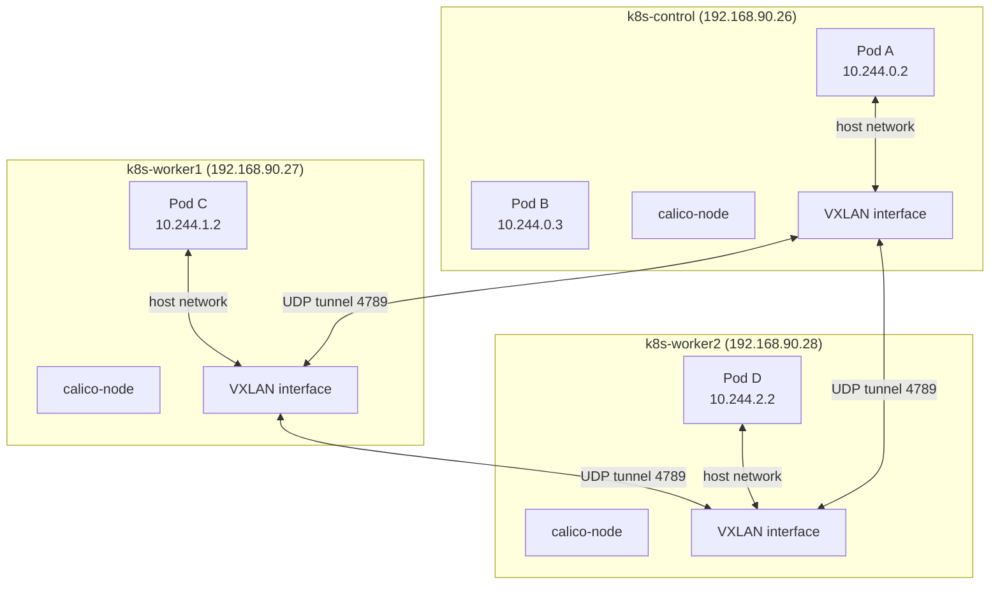

# Calico CNI Networking

> **Production Purpose:** Kubernetes itself does not implement pod networking. It delegates to a CNI (Container Network Interface) plugin. Calico is the most widely deployed CNI in production — used by major banks, telcos, and cloud-native platforms — because it provides scalable, policy-aware networking using BGP routing.

---

## Why Calico?

| Feature | Calico | Flannel | Weave |
| ------- | ------ | ------- | ----- |
| Network Policy | ✅ Full | ❌ None | ✅ Limited |
| BGP routing | ✅ | ❌ | ❌ |
| Performance | High (no overlay) | Medium (VXLAN) | Medium |
| Production adoption | Very high | Medium | Low |
| Observability | ✅ | ❌ | ❌ |

Calico can run in **overlay mode** (VXLAN) for compatibility or **direct routing mode** (BGP) for performance. In a Proxmox lab, VXLAN overlay is simpler to set up.

---

## How Calico Works



Each node gets a **pod subnet slice** (e.g., `10.244.0.0/24` per node). Calico routes traffic between them.

---

## Install Tigera Operator (Calico Operator)

The operator manages Calico's lifecycle — upgrades, configuration, and health monitoring.

Input (on control-plane):

```bash
kubectl create -f https://raw.githubusercontent.com/projectcalico/calico/v3.28.0/manifests/tigera-operator.yaml
```

Output:

```
namespace/tigera-operator created
customresourcedefinition.apiextensions.k8s.io/installations.operator.tigera.io created
...
deployment.apps/tigera-operator created
```

Verify the operator is running:

```bash
kubectl get pods -n tigera-operator
```

Output:

```
NAME                               READY   STATUS    RESTARTS   AGE
tigera-operator-xxx                1/1     Running   0          30s
```

---

## Install Calico Custom Resources

Create: `calico-installation.yaml`

```yaml
apiVersion: operator.tigera.io/v1
kind: Installation
metadata:
  name: default
spec:
  # VXLAN mode — works in Proxmox/NAT environments without BGP
  calicoNetwork:
    ipPools:
    - blockSize: 26
      cidr: 10.244.0.0/16
      encapsulation: VXLANCrossSubnet
      natOutgoing: Enabled
      nodeSelector: all()
---
apiVersion: operator.tigera.io/v1
kind: APIServer
metadata:
  name: default
spec: {}
```

:::info Why `VXLANCrossSubnet`?
This uses VXLAN only when pods are on different subnets (cross-node), and direct routing when on the same subnet. Best of both worlds for Proxmox labs.
:::

Apply:

```bash
kubectl apply -f calico-installation.yaml
```

---

## Wait for Calico to Come Up

Calico deploys multiple components. Watch them start:

```bash
watch kubectl get pods -n calico-system
```

Output (after 2-3 minutes):

```
NAME                                       READY   STATUS    RESTARTS   AGE
calico-kube-controllers-xxx                1/1     Running   0          2m
calico-node-xxxxx (k8s-control)            1/1     Running   0          2m
calico-node-xxxxx (k8s-worker1)            1/1     Running   0          2m
calico-node-xxxxx (k8s-worker2)            1/1     Running   0          2m
calico-typha-xxx                           1/1     Running   0          2m
```

All must be `Running` before proceeding.

---

## Verify Nodes Are Now Ready

Input:

```bash
kubectl get nodes -o wide
```

Output:

```
NAME           STATUS   ROLES           AGE   VERSION   INTERNAL-IP      
k8s-control    Ready    control-plane   10m   v1.30.x   192.168.90.26    
k8s-worker1    Ready    <none>          7m    v1.30.x   192.168.90.27    
k8s-worker2    Ready    <none>          6m    v1.30.x   192.168.90.28    
```

All nodes are `Ready` — pod networking is live.

---

## Verify coredns is Running

```bash
kubectl get pods -n kube-system | grep coredns
```

Output:

```
coredns-xxx   1/1   Running   0   10m
coredns-xxx   1/1   Running   0   10m
```

coredns was waiting for networking — it's now running.

---

## Test Pod-to-Pod Networking

Deploy two pods and verify they can reach each other across nodes.

```bash
kubectl run pod-a --image=busybox --restart=Never -- sleep 3600
kubectl run pod-b --image=busybox --restart=Never -- sleep 3600
```

Get the IP of pod-b:

```bash
kubectl get pod pod-b -o wide
```

Output:

```
NAME    READY   STATUS    IP            NODE
pod-b   1/1     Running   10.244.1.4    k8s-worker1
```

Ping from pod-a to pod-b:

```bash
kubectl exec -it pod-a -- ping -c 3 10.244.1.4
```

Output:

```
3 packets transmitted, 3 received, 0% packet loss
```

Cross-node pod networking is working.

---

## Test DNS Resolution

```bash
kubectl exec -it pod-a -- nslookup kubernetes.default.svc.cluster.local
```

Output:

```
Server:    10.96.0.10
Address 1: 10.96.0.10 kube-dns.kube-system.svc.cluster.local

Name:      kubernetes.default.svc.cluster.local
Address 1: 10.96.0.1
```

DNS is working — Services can be reached by hostname.

---

## Cleanup Test Pods

```bash
kubectl delete pod pod-a pod-b
```

---

## Understanding Network Policies (Production Feature)

Calico supports `NetworkPolicy` — pod-level firewall rules. Without policies, all pods can talk to all other pods.

```yaml
# Example: Only allow Laravel to talk to MariaDB
apiVersion: networking.k8s.io/v1
kind: NetworkPolicy
metadata:
  name: allow-laravel-to-mariadb
  namespace: production
spec:
  podSelector:
    matchLabels:
      app: mariadb
  policyTypes:
  - Ingress
  ingress:
  - from:
    - podSelector:
        matchLabels:
          app: laravel
    ports:
    - protocol: TCP
      port: 3306
```

We'll apply NetworkPolicies in Phase 10 (Security Hardening).

---

## Troubleshooting

| Symptom | Cause | Fix |
| ------- | ----- | --- |
| Nodes still `NotReady` | Calico pods not running | Check `kubectl get pods -n calico-system` |
| calico-node `CrashLoopBackOff` | CIDR mismatch | Ensure `cidr: 10.244.0.0/16` matches kubeadm podSubnet |
| calico-node `Init:Error` | Missing kernel modules | Run `modprobe overlay br_netfilter` on workers |
| Pod ping fails across nodes | VXLAN blocked | Allow UDP port 4789 between nodes |
| coredns still Pending | Calico not ready yet | Wait for all calico-node pods to be Running |

### Allow VXLAN Traffic on All Nodes

```bash
ufw allow 4789/udp   # VXLAN
ufw allow 179/tcp    # BGP (optional, for direct mode)
```

---

## Production Best Practices

| Practice | Reason |
| -------- | ------ |
| Use Calico operator (not raw manifests) | Lifecycle management, upgrades |
| Enable NetworkPolicy from day one | Default-deny posture is security best practice |
| Monitor calico-node pods | If one dies, pods on that node lose networking |
| Use `VXLANCrossSubnet` in multi-subnet envs | Optimizes performance while maintaining compatibility |
| Install `calicoctl` for debugging | Provides Calico-specific diagnostics |

---
