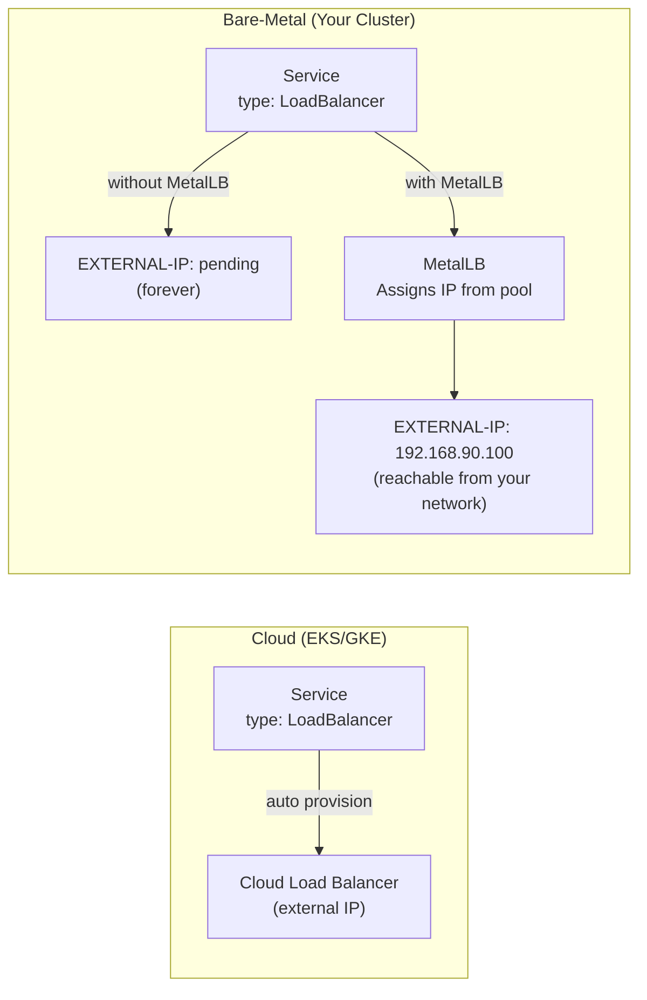
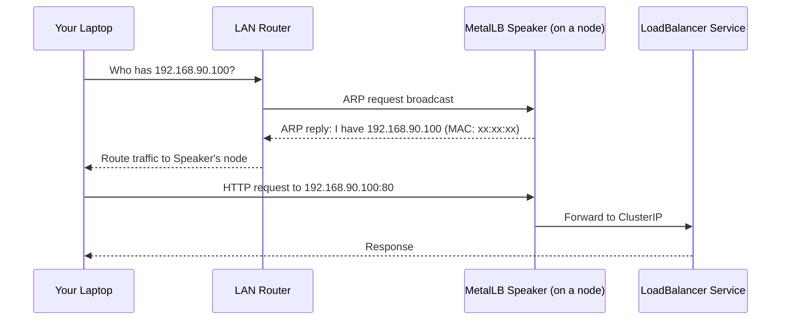

# MetalLB Load Balancer

> **Production Purpose:** In cloud environments (AWS, GCP), a `LoadBalancer` Service automatically provisions an external load balancer. On bare-metal, this doesn't exist. MetalLB fills that gap — it gives bare-metal Kubernetes clusters a real external IP for Services, exactly how cloud providers do it.

---

## Why MetalLB?



Without MetalLB, `LoadBalancer` Services on bare-metal stay in `<pending>` state forever.

---

## MetalLB Modes

| Mode | How It Works | Use Case |
| ---- | ------------ | -------- |
| **L2 (ARP/NDP)** | Announces IPs via ARP broadcasts | Simple LANs, Proxmox labs |
| **BGP** | Announces IPs via BGP to routers | Production data centers |

For this lab we use **L2 mode** — simpler and works without a BGP-capable router.

---

## IP Address Pool Planning

You need to dedicate a range of IPs on your LAN that:
- Are **not** in your DHCP range
- Are on the **same subnet** as your nodes

Since your nodes are on `192.168.90.0/24`, we'll use:

| Purpose | IP Range |
| ------- | -------- |
| Node IPs | `192.168.90.26` – `192.168.90.28` |
| MetalLB Pool | `192.168.90.100` – `192.168.90.120` |

:::caution
Reserve this range in your router/DHCP server to avoid IP conflicts.
:::

---

## Install MetalLB

Input:

```bash
kubectl apply -f https://raw.githubusercontent.com/metallb/metallb/v0.14.5/config/manifests/metallb-native.yaml
```

Output:

```
namespace/metallb-system created
customresourcedefinition.apiextensions.k8s.io/...
deployment.apps/controller created
daemonset.apps/speaker created
```

Wait for MetalLB pods to be ready:

```bash
kubectl wait --namespace metallb-system \
  --for=condition=ready pod \
  --selector=app=metallb \
  --timeout=90s
```

Output:

```
pod/controller-xxx condition met
pod/speaker-xxx condition met
```

---

## Configure IP Address Pool

Create: `metallb-pool.yaml`

```yaml
apiVersion: metallb.io/v1beta1
kind: IPAddressPool
metadata:
  name: production-pool
  namespace: metallb-system
spec:
  addresses:
  - 192.168.90.100-192.168.90.120
---
apiVersion: metallb.io/v1beta1
kind: L2Advertisement
metadata:
  name: production-l2
  namespace: metallb-system
spec:
  ipAddressPools:
  - production-pool
```

Apply:

```bash
kubectl apply -f metallb-pool.yaml
```

Output:

```
ipaddresspool.metallb.io/production-pool created
l2advertisement.metallb.io/production-l2 created
```

---

## Verify MetalLB is Working

### Create a Test LoadBalancer Service

Create: `test-lb.yaml`

```yaml
apiVersion: v1
kind: Pod
metadata:
  name: nginx-test
  labels:
    app: nginx-test
spec:
  containers:
  - name: nginx
    image: nginx:alpine
---
apiVersion: v1
kind: Service
metadata:
  name: nginx-test-lb
spec:
  type: LoadBalancer
  selector:
    app: nginx-test
  ports:
  - port: 80
    targetPort: 80
```

Apply:

```bash
kubectl apply -f test-lb.yaml
```

### Check External IP Assignment

```bash
kubectl get svc nginx-test-lb
```

Output:

```
NAME            TYPE           CLUSTER-IP     EXTERNAL-IP      PORT(S)        AGE
nginx-test-lb   LoadBalancer   10.96.45.123   192.168.90.100   80:32xxx/TCP   30s
```

MetalLB assigned `192.168.90.100` from the pool.

### Test Access from Your Laptop

```bash
curl http://192.168.90.100
```

Output:

```html
<!DOCTYPE html>
<html>
<head><title>Welcome to nginx!</title></head>
...
```

nginx is accessible from outside the cluster via a real IP.

---

## How L2 Mode Works Internally



MetalLB's `speaker` pods watch for `LoadBalancer` Services and announce IPs via ARP.

---

## Cleanup Test Resources

```bash
kubectl delete pod nginx-test
kubectl delete svc nginx-test-lb
```

---

## Troubleshooting

| Symptom | Cause | Fix |
| ------- | ----- | --- |
| `EXTERNAL-IP` stays `<pending>` | MetalLB not installed or pool not configured | Verify `kubectl get ipaddresspool -n metallb-system` |
| IP assigned but unreachable | IP conflicts with DHCP | Reserve the range in your router |
| `speaker` pods in `CrashLoopBackOff` | strict ARP not configured | See below |
| IP assigned but wrong node responds | ARP tie — multiple speakers | Expected in L2 mode, only one wins |

### Enable Strict ARP (Required for Some Setups)

```bash
kubectl edit configmap kube-proxy -n kube-system
```

Set:

```yaml
mode: "ipvs"
ipvs:
  strictARP: true
```

Or patch directly:

```bash
kubectl get configmap kube-proxy -n kube-system -o yaml | \
  sed -e 's/strictARP: false/strictARP: true/' | \
  kubectl apply -f -
```

---

## Production Best Practices

| Practice | Reason |
| -------- | ------ |
| Use BGP mode in real data centers | More scalable, no ARP broadcast storm |
| Reserve MetalLB IPs in DHCP server | Prevent IP conflicts |
| Create multiple IP pools | Separate dev/staging/prod load balancer IPs |
| Monitor speaker pods | If all speakers die, external IPs stop working |
| Use `spec.loadBalancerIP` to pin IPs | Ensures stable IP for DNS records |

### Pin a Specific IP to a Service

```yaml
spec:
  type: LoadBalancer
  loadBalancerIP: 192.168.90.100   # Always use this IP
```

---
