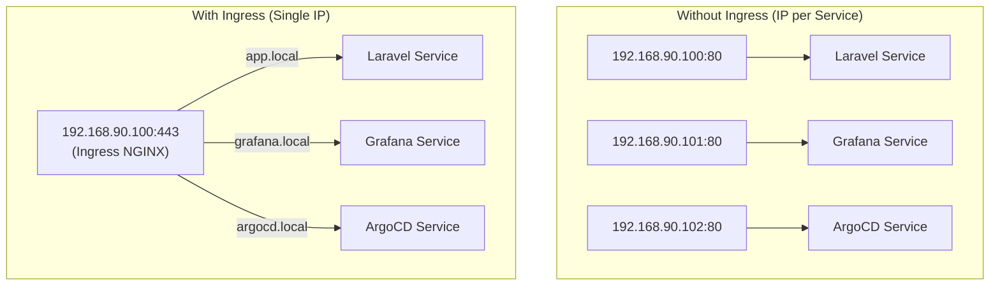
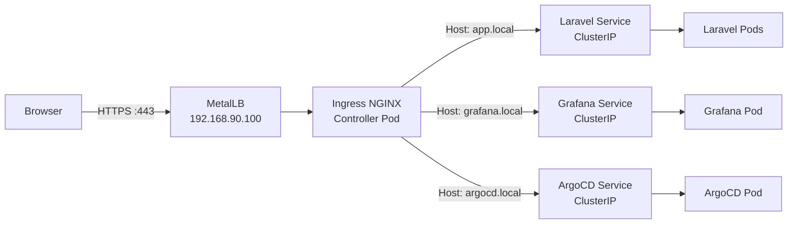

# Ingress NGINX Controller

> **Production Purpose:** Running one `LoadBalancer` Service per application is wasteful and expensive — each Service consumes an external IP. Ingress solves this by using a single external IP (from MetalLB) and routing traffic to multiple backend services based on hostname and URL path. This is the standard pattern used by every production Kubernetes platform.

---

## Ingress vs. Direct LoadBalancer



---

## Traffic Flow Architecture



---

## Install Ingress NGINX

Input:

```bash
kubectl apply -f https://raw.githubusercontent.com/kubernetes/ingress-nginx/controller-v1.10.1/deploy/static/provider/cloud/deploy.yaml
```

Output:

```
namespace/ingress-nginx created
serviceaccount/ingress-nginx created
deployment.apps/ingress-nginx-controller created
service/ingress-nginx-controller created
```

### Wait for the Controller to Start

```bash
kubectl wait --namespace ingress-nginx \
  --for=condition=ready pod \
  --selector=app.kubernetes.io/component=controller \
  --timeout=120s
```

Output:

```
pod/ingress-nginx-controller-xxx condition met
```

---

## Verify External IP from MetalLB

```bash
kubectl get svc -n ingress-nginx
```

Output:

```
NAME                                 TYPE           CLUSTER-IP     EXTERNAL-IP      PORT(S)
ingress-nginx-controller             LoadBalancer   10.96.x.x      192.168.90.100   80:xxxxx/TCP,443:xxxxx/TCP
ingress-nginx-controller-admission   ClusterIP      10.96.x.x      <none>           443/TCP
```

MetalLB assigned `192.168.90.100` to the Ingress controller — this is your **single entry point** for all traffic.

---

## Configure Local DNS (Your Laptop)

Add to your `/etc/hosts` (on your laptop, not the VMs):

```
192.168.90.100  app.local
192.168.90.100  grafana.local
192.168.90.100  argocd.local
```

This lets you use hostnames like `https://app.local` instead of IP addresses.

---

## Deploy a Test Application with Ingress

Create: `ingress-test.yaml`

```yaml
apiVersion: apps/v1
kind: Deployment
metadata:
  name: hello-app
spec:
  replicas: 2
  selector:
    matchLabels:
      app: hello
  template:
    metadata:
      labels:
        app: hello
    spec:
      containers:
      - name: hello
        image: nginxdemos/hello:plain-text
        ports:
        - containerPort: 80
---
apiVersion: v1
kind: Service
metadata:
  name: hello-svc
spec:
  selector:
    app: hello
  ports:
  - port: 80
    targetPort: 80
---
apiVersion: networking.k8s.io/v1
kind: Ingress
metadata:
  name: hello-ingress
  annotations:
    nginx.ingress.kubernetes.io/rewrite-target: /
spec:
  ingressClassName: nginx
  rules:
  - host: app.local
    http:
      paths:
      - path: /
        pathType: Prefix
        backend:
          service:
            name: hello-svc
            port:
              number: 80
```

Apply:

```bash
kubectl apply -f ingress-test.yaml
```

### Test Ingress Routing

```bash
curl http://app.local
```

Output:

```
Server address: 10.244.126.10:80
Server name: hello-app-xxx
Date: 24/May/2026:12:46:03 +0000
URI: /
Request ID: xxx
```

The request reached a pod via Ingress routing.

---

## Ingress Resource Anatomy

```yaml
apiVersion: networking.k8s.io/v1
kind: Ingress
metadata:
  name: example
  annotations:
    # Rate limiting
    nginx.ingress.kubernetes.io/limit-rps: "10"
    # Enable CORS
    nginx.ingress.kubernetes.io/enable-cors: "true"
    # Redirect HTTP to HTTPS
    nginx.ingress.kubernetes.io/ssl-redirect: "true"
spec:
  ingressClassName: nginx         # Must match the controller
  tls:
  - hosts:
    - app.local
    secretName: app-tls-secret    # TLS cert stored as Secret
  rules:
  - host: app.local               # Hostname-based routing
    http:
      paths:
      - path: /api                # Path-based routing
        pathType: Prefix
        backend:
          service:
            name: api-service
            port:
              number: 8080
      - path: /                   # Default catch-all
        pathType: Prefix
        backend:
          service:
            name: frontend-service
            port:
              number: 80
```

---

## Key Ingress Annotations for Production

| Annotation | Value | Purpose |
| ---------- | ----- | ------- |
| `ssl-redirect` | `"true"` | Force HTTPS |
| `proxy-body-size` | `"50m"` | Allow file uploads |
| `proxy-connect-timeout` | `"60"` | Long-running requests |
| `limit-rps` | `"10"` | Rate limiting |
| `use-regex` | `"true"` | Regex path matching |
| `whitelist-source-range` | `"10.0.0.0/8"` | IP allowlisting |
| `configuration-snippet` | custom NGINX | Advanced config injection |

---

## Multiple Services on One Host (Path Routing)

```yaml
spec:
  rules:
  - host: app.local
    http:
      paths:
      - path: /api
        pathType: Prefix
        backend:
          service:
            name: laravel-api
            port:
              number: 8000
      - path: /
        pathType: Prefix
        backend:
          service:
            name: laravel-frontend
            port:
              number: 80
```

---

## Troubleshooting

| Symptom | Cause | Fix |
| ------- | ----- | --- |
| `EXTERNAL-IP` stays `<pending>` | MetalLB not configured | Verify Phase 04 is complete |
| `curl` returns 404 | Ingress host not matching | Check `Host:` header matches Ingress `host:` field |
| `curl` returns 502 Bad Gateway | Backend pods not running | Check pod status and service selector |
| `curl` returns 503 Service Unavailable | No healthy endpoints | Check `kubectl get endpoints <svc-name>` |
| TLS cert errors | Self-signed cert | Configure cert-manager (Phase 10) |

### Debug Ingress Routing

```bash
# Check Ingress object
kubectl describe ingress hello-ingress

# Check NGINX logs
kubectl logs -n ingress-nginx deployment/ingress-nginx-controller --tail=50

# Check endpoints
kubectl get endpoints hello-svc
```

### Check if Endpoints Are Populated

```bash
kubectl get endpoints hello-svc
```

Output:

```
NAME        ENDPOINTS                     AGE
hello-svc   10.244.1.5:80,10.244.2.6:80   5m
```

If `ENDPOINTS` is `<none>`, the Service selector doesn't match any pod labels.

---

## Production Best Practices

| Practice | Reason |
| -------- | ------ |
| Always set `ingressClassName: nginx` | Prevents conflicts with multiple controllers |
| Use TLS on all production Ingresses | Never expose HTTP in production |
| Set resource limits on NGINX controller | Prevent it from starving other workloads |
| Enable access logging | Required for security auditing |
| Use `ssl-passthrough` for non-HTTP protocols | For databases, gRPC, etc. |
| Set `proxy-buffer-size` for large headers | Avoids 502 on JWT/cookie-heavy apps |

---

## Cleanup Test Resources

```bash
kubectl delete deployment hello-app
kubectl delete svc hello-svc
kubectl delete ingress hello-ingress
```

---
