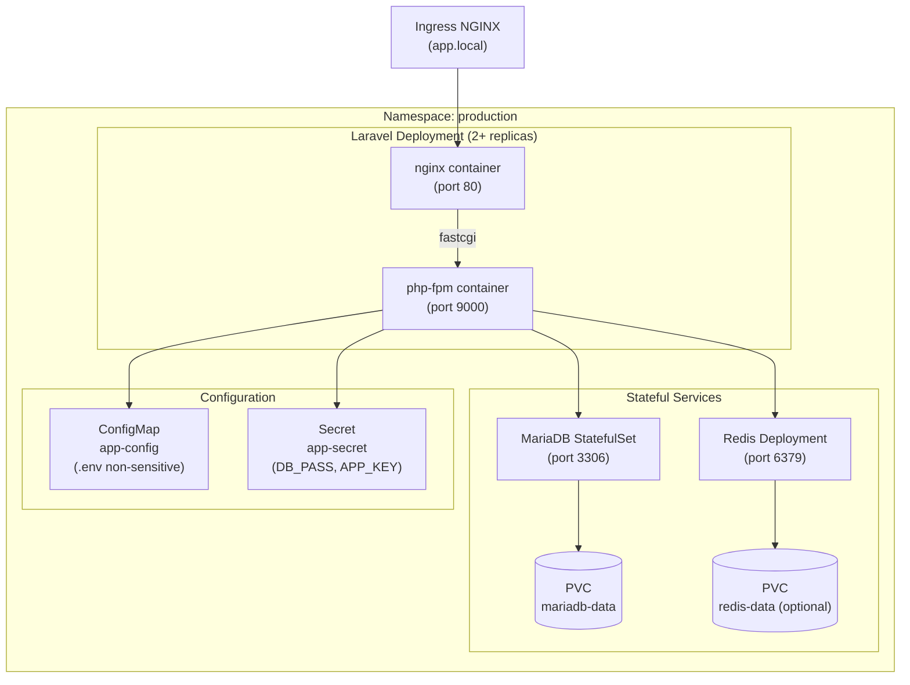
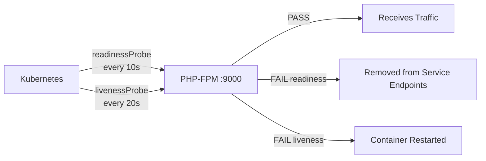

# Laravel Production Deployment

> **Production Purpose:** This is the core of the study case. We'll deploy a real Laravel application on Kubernetes with production-grade patterns: PHP-FPM + Nginx sidecar, MariaDB with persistent storage, Redis for cache/sessions, ConfigMaps for environment config, Secrets for credentials, and proper health probes.

---

## Application Architecture



---

## Create Production Namespace

```bash
kubectl create namespace production
kubectl config set-context --current --namespace=production
```

All resources in this phase live in the `production` namespace.

---

## Create ConfigMap (Non-Sensitive Config)

Create: `laravel-configmap.yaml`

```yaml
apiVersion: v1
kind: ConfigMap
metadata:
  name: laravel-config
  namespace: production
data:
  APP_NAME: "SampleApp"
  APP_ENV: "production"
  APP_DEBUG: "false"
  APP_URL: "https://app.local"
  LOG_CHANNEL: "stderr"          # Log to stdout for kubectl logs
  LOG_LEVEL: "warning"
  DB_CONNECTION: "mysql"
  DB_HOST: "mariadb-svc"         # Service name = DNS hostname
  DB_PORT: "3306"
  DB_DATABASE: "laravel"
  CACHE_DRIVER: "redis"
  SESSION_DRIVER: "redis"
  QUEUE_CONNECTION: "redis"
  REDIS_HOST: "redis-svc"        # Service name = DNS hostname
  REDIS_PORT: "6379"
  BROADCAST_DRIVER: "log"
```

Apply:

```bash
kubectl apply -f laravel-configmap.yaml
```

---

## Create Secret (Sensitive Config)

:::warning
Never commit Secrets to Git. Use a Secret manager or Sealed Secrets in real production.
:::

First generate an APP_KEY:

```bash
php artisan key:generate --show
# Output: base64:abc123...
```

Create: `laravel-secret.yaml`

```yaml
apiVersion: v1
kind: Secret
metadata:
  name: laravel-secret
  namespace: production
type: Opaque
stringData:
  APP_KEY: "base64:your-generated-key-here"
  DB_USERNAME: "laravel"
  DB_PASSWORD: "strongpassword123"
  REDIS_PASSWORD: ""
```

Apply:

```bash
kubectl apply -f laravel-secret.yaml
```

---

## Deploy MariaDB (StatefulSet)

We use a StatefulSet (not Deployment) for MariaDB because:
- StatefulSet provides stable, persistent identity per pod
- Ordered deployment and termination
- Stable PVC per replica

:::warning Bare-Metal Storage Prerequisite
The StatefulSet creates a PVC (`mariadb-data-mariadb-0`) automatically. On bare-metal **without a StorageClass**, this PVC will stay `Pending` and the pod will never schedule.

You have two options:
- **Quick lab fix:** Create a `hostPath` PV manually (see [Troubleshooting](#troubleshooting) below).
- **Production fix:** Complete Phase 07 (NFS StorageClass) first, then return here.
:::

Create: `mariadb-statefulset.yaml`

```yaml
apiVersion: v1
kind: Service
metadata:
  name: mariadb-svc
  namespace: production
spec:
  clusterIP: None        # Headless service for StatefulSet
  selector:
    app: mariadb
  ports:
  - port: 3306
    targetPort: 3306
---
apiVersion: apps/v1
kind: StatefulSet
metadata:
  name: mariadb
  namespace: production
spec:
  serviceName: mariadb-svc
  replicas: 1
  selector:
    matchLabels:
      app: mariadb
  template:
    metadata:
      labels:
        app: mariadb
    spec:
      containers:
      - name: mariadb
        image: mariadb:10.11
        ports:
        - containerPort: 3306
        env:
        - name: MYSQL_ROOT_PASSWORD
          valueFrom:
            secretKeyRef:
              name: laravel-secret
              key: DB_PASSWORD
        - name: MYSQL_DATABASE
          value: laravel
        - name: MYSQL_USER
          valueFrom:
            secretKeyRef:
              name: laravel-secret
              key: DB_USERNAME
        - name: MYSQL_PASSWORD
          valueFrom:
            secretKeyRef:
              name: laravel-secret
              key: DB_PASSWORD
        resources:
          requests:
            cpu: "250m"
            memory: "256Mi"
          limits:
            cpu: "500m"
            memory: "512Mi"
        readinessProbe:
          exec:
            command:
            - bash
            - -c
            - "mysqladmin ping -u root -p${MYSQL_ROOT_PASSWORD}"
          initialDelaySeconds: 20
          periodSeconds: 10
        livenessProbe:
          exec:
            command:
            - bash
            - -c
            - "mysqladmin ping -u root -p${MYSQL_ROOT_PASSWORD}"
          initialDelaySeconds: 30
          periodSeconds: 20
        volumeMounts:
        - name: mariadb-data
          mountPath: /var/lib/mysql
  volumeClaimTemplates:
  - metadata:
      name: mariadb-data
    spec:
      accessModes: ["ReadWriteOnce"]
      resources:
        requests:
          storage: 5Gi
```

Apply:

```bash
kubectl apply -f mariadb-statefulset.yaml
```

Wait for MariaDB to be ready:

```bash
kubectl wait pod/mariadb-0 --for=condition=ready --timeout=120s -n production
```

---

## Deploy Redis

Create: `redis-deployment.yaml`

```yaml
apiVersion: apps/v1
kind: Deployment
metadata:
  name: redis
  namespace: production
spec:
  replicas: 1
  selector:
    matchLabels:
      app: redis
  template:
    metadata:
      labels:
        app: redis
    spec:
      containers:
      - name: redis
        image: redis:7-alpine
        command: ["redis-server", "--appendonly", "yes"]
        ports:
        - containerPort: 6379
        resources:
          requests:
            cpu: "100m"
            memory: "128Mi"
          limits:
            cpu: "250m"
            memory: "256Mi"
        readinessProbe:
          exec:
            command: ["redis-cli", "ping"]
          initialDelaySeconds: 5
          periodSeconds: 5
        livenessProbe:
          exec:
            command: ["redis-cli", "ping"]
          initialDelaySeconds: 10
          periodSeconds: 10
---
apiVersion: v1
kind: Service
metadata:
  name: redis-svc
  namespace: production
spec:
  selector:
    app: redis
  ports:
  - port: 6379
    targetPort: 6379
```

Apply:

```bash
kubectl apply -f redis-deployment.yaml
```

---

## Build and Push Laravel Docker Image

The `sample-app` uses a **multi-stage Dockerfile** that separates PHP dependencies, Node.js frontend assets, and the final production image for a lean, reproducible build.

```bash
git clone https://github.com/pndhkm/sample-app
cd sample-app
```

The `Dockerfile` in the repo:

```dockerfile
FROM php:8.4-cli AS base

RUN apt-get update && apt-get install -y \
    curl ffmpeg libnspr4 libnss3 libpq-dev libzip-dev unzip git \
    && docker-php-ext-install pdo pdo_mysql pcntl zip bcmath \
    && pecl install redis && docker-php-ext-enable redis \
    && rm -rf /var/lib/apt/lists/*

COPY --from=composer:2 /usr/bin/composer /usr/bin/composer

WORKDIR /app

# ── Dependencies ─────────────────────────────────────────
FROM base AS vendor

COPY composer.json composer.lock ./
RUN composer install --no-dev --no-scripts --no-autoloader --prefer-dist

COPY . .
RUN composer dump-autoload --optimize

# ── Frontend assets ──────────────────────────────────────
FROM node:22-slim AS assets

WORKDIR /app
COPY package.json package-lock.json* ./
RUN npm ci

COPY resources/ resources/
COPY vite.config.js ./
RUN npm run build

# ── Production image ─────────────────────────────────────
FROM base AS production

COPY --from=vendor /app /app
COPY --from=assets /usr/local/bin/node /usr/local/bin/node
COPY --from=assets /usr/local/lib/node_modules /usr/local/lib/node_modules
COPY --from=assets /app/node_modules /app/node_modules
COPY --from=assets /app/public/build /app/public/build
COPY .env.example /app/.env.example

RUN ln -sf /usr/local/lib/node_modules/npm/bin/npm-cli.js /usr/local/bin/npm \
    && ln -sf /usr/local/lib/node_modules/npm/bin/npx-cli.js /usr/local/bin/npx \
    && npx playwright install chromium

RUN cp .env.example .env 2>/dev/null || echo "APP_KEY=" > .env
RUN php artisan key:generate --force
RUN php artisan vendor:publish --tag=waterline-assets --force 2>/dev/null || true

COPY docker/entrypoint.sh /usr/local/bin/app-entrypoint
RUN chmod +x /usr/local/bin/app-entrypoint

EXPOSE 8000

ENTRYPOINT ["app-entrypoint"]
CMD ["php", "artisan", "serve", "--host=0.0.0.0", "--port=8000"]
```

**Multi-stage build explained:**

| Stage | Base | Purpose |
| ----- | ---- | ------- |
| `base` | `php:8.4-cli` | Shared PHP runtime with extensions |
| `vendor` | `base` | Runs `composer install` — build cache friendly |
| `assets` | `node:22-slim` | Runs `npm ci` + `vite build` for JS/CSS |
| `production` | `base` | Final image: copies vendor + built assets only |

Build and push:

```bash
docker build --target production -t yourdockerhub/sample-app:v1 .
docker push yourdockerhub/sample-app:v1
```

:::tip Build cache
The `vendor` and `assets` stages are cached independently. Changing only PHP code won't rebuild node_modules, and changing only JS won't reinstall Composer packages.
:::

---

## Deploy Laravel Application

Since the image uses `php artisan serve` (port **8000**), a single container per pod handles all traffic — no nginx sidecar is needed.

Create: `laravel-deployment.yaml`

```yaml
apiVersion: apps/v1
kind: Deployment
metadata:
  name: laravel
  namespace: production
  labels:
    app: laravel
    version: v1
spec:
  replicas: 2
  strategy:
    type: RollingUpdate
    rollingUpdate:
      maxSurge: 1
      maxUnavailable: 0          # Zero-downtime rolling update
  selector:
    matchLabels:
      app: laravel
  template:
    metadata:
      labels:
        app: laravel
        version: v1
    spec:
      initContainers:
      - name: laravel-init
        image: yourdockerhub/sample-app:v1
        command:
        - sh
        - -c
        - |
          php artisan migrate --force
          php artisan config:cache
          php artisan route:cache
          php artisan view:cache
        envFrom:
        - configMapRef:
            name: laravel-config
        - secretRef:
            name: laravel-secret

      containers:
      - name: laravel
        image: yourdockerhub/sample-app:v1
        ports:
        - containerPort: 8000
        envFrom:
        - configMapRef:
            name: laravel-config
        - secretRef:
            name: laravel-secret
        resources:
          requests:
            cpu: "200m"
            memory: "256Mi"
          limits:
            cpu: "500m"
            memory: "512Mi"
        readinessProbe:
          httpGet:
            path: /
            port: 8000
          initialDelaySeconds: 15
          periodSeconds: 10
          failureThreshold: 5
        livenessProbe:
          httpGet:
            path: /
            port: 8000
          initialDelaySeconds: 30
          periodSeconds: 20
```

:::info Why initContainer?
The initContainer runs migrations **once before** the main app starts. This prevents multiple replicas from running migrations simultaneously — a common source of race conditions in production.
:::

Apply:

```bash
kubectl apply -f laravel-deployment.yaml
```

### Create the Laravel Service

```yaml
apiVersion: v1
kind: Service
metadata:
  name: laravel-svc
  namespace: production
spec:
  selector:
    app: laravel
  ports:
  - port: 80
    targetPort: 8000     # artisan serve listens on 8000
```

Apply:

```bash
kubectl apply -f laravel-service.yaml
```

---

## Create Ingress for Laravel

Create: `laravel-ingress.yaml`

```yaml
apiVersion: networking.k8s.io/v1
kind: Ingress
metadata:
  name: laravel-ingress
  namespace: production
  annotations:
    nginx.ingress.kubernetes.io/ssl-redirect: "false"   # Enable after TLS in Phase 10
    nginx.ingress.kubernetes.io/proxy-body-size: "50m"
    nginx.ingress.kubernetes.io/proxy-connect-timeout: "60"
    nginx.ingress.kubernetes.io/proxy-read-timeout: "300"
spec:
  ingressClassName: nginx
  rules:
  - host: app.local
    http:
      paths:
      - path: /
        pathType: Prefix
        backend:
          service:
            name: laravel-svc
            port:
              number: 80   # Service forwards to pod:8000
```

Apply:

```bash
kubectl apply -f laravel-ingress.yaml
```

---

## Validate Full Stack

### Check All Pods Are Running

```bash
kubectl get pods -n production
```

Output:

```
NAME                       READY   STATUS    RESTARTS   AGE
laravel-xxx                1/1     Running   0          3m
laravel-xxx                1/1     Running   0          3m
mariadb-0                  1/1     Running   0          5m
redis-xxx                  1/1     Running   0          4m
```

`1/1` means the single Laravel container (artisan serve) is running.

### Test the Application

```bash
curl http://app.local
```

### Test Database Connectivity

```bash
kubectl exec -it deployment/laravel -n production -- \
  php artisan migrate:status
```

### Test Redis Connectivity

```bash
kubectl exec -it deployment/redis -n production -- redis-cli ping
```

Output:

```
PONG
```

---

## Understanding Health Probes



| Probe | Purpose | Failure Action |
| ----- | ------- | -------------- |
| `readinessProbe` | Is the app ready to serve? | Remove from Service endpoints |
| `livenessProbe` | Is the app alive (not deadlocked)? | Restart the container |
| `startupProbe` | Did the app finish starting? | Block liveness/readiness probes |

---

## Troubleshooting

| Symptom | Cause | Fix |
| ------- | ----- | --- |
| `mariadb-0` stuck in `Pending` | PVC unbound — no StorageClass | See fix below ↓ |
| Laravel pod `0/2` not ready | initContainer still running | `kubectl describe pod <pod>` |
| `php artisan migrate` fails | MariaDB not ready | Wait for `mariadb-0` to be `Running` |
| 502 Bad Gateway | php-fpm not starting | `kubectl logs deployment/laravel -c php-fpm` |
| Redis connection refused | Redis not running | `kubectl get pod -n production \| grep redis` |
| App shows 500 error | APP_KEY missing | Verify Secret has `APP_KEY` |

### ⚠️ mariadb-0 Stuck in Pending — Unbound PVC

This is the most common bare-metal gotcha. The StatefulSet auto-creates a PVC, but on bare-metal there is no StorageClass to provision a PV automatically.

**Diagnose:**

```bash
kubectl get pvc -n production
kubectl describe pod mariadb-0 -n production | grep -A5 Events
```

If you see:
```
Warning  FailedScheduling  pod has unbound immediate PersistentVolumeClaims
```

→ No PV exists for the PVC. Choose a fix:

---

**Fix A — hostPath PV (lab, quick, node-pinned)**

```bash
# Create the data directory on worker1
ssh root@192.168.90.27 "mkdir -p /data/mariadb"
```

```bash
# Create a matching PV manually
kubectl apply -f - <<'EOF'
apiVersion: v1
kind: PersistentVolume
metadata:
  name: mariadb-pv
spec:
  capacity:
    storage: 5Gi
  accessModes:
    - ReadWriteOnce
  persistentVolumeReclaimPolicy: Retain
  storageClassName: ""            # empty = manual binding
  hostPath:
    path: /data/mariadb
    type: DirectoryOrCreate
EOF
```

Then patch the PVC to bind directly to this PV:

```bash
kubectl patch pvc mariadb-data-mariadb-0 -n production \
  -p '{"spec":{"storageClassName":"","volumeName":"mariadb-pv"}}'
```

Verify the PVC is now bound:

```bash
kubectl get pvc -n production
```

Expected output:

```
NAME                    STATUS   VOLUME       CAPACITY   ACCESS MODES
mariadb-data-mariadb-0  Bound    mariadb-pv   5Gi        RWO
```

Then watch the pod come up:

```bash
kubectl get pod mariadb-0 -n production -w
```

:::note
`hostPath` ties the pod to `k8s-worker1`. If that node goes down, the pod cannot reschedule until the node recovers. Use NFS (Phase 07) to remove this constraint.
:::

---

**Fix B — NFS StorageClass (production, multi-node)**

Complete Phase 07 first to install the NFS provisioner and StorageClass, then delete and re-create the StatefulSet:

```bash
# Delete the stuck StatefulSet and PVC
kubectl delete statefulset mariadb -n production
kubectl delete pvc mariadb-data-mariadb-0 -n production

# Update volumeClaimTemplate to use the NFS StorageClass, then re-apply
kubectl apply -f mariadb-statefulset.yaml
```

---

## Production Best Practices

| Practice | Reason |
| -------- | ------ |
| Use initContainers for migrations | Prevents race conditions on scale-out |
| Set `maxUnavailable: 0` | Zero-downtime deployments |
| Log to `stderr`/`stdout` | Enables `kubectl logs` and log aggregation |
| Separate nginx + php-fpm containers | Nginx handles static files efficiently |
| Use StatefulSet for MariaDB | Stable identity, ordered ops |
| Set resource requests AND limits | Prevents noisy-neighbor issues |

---
