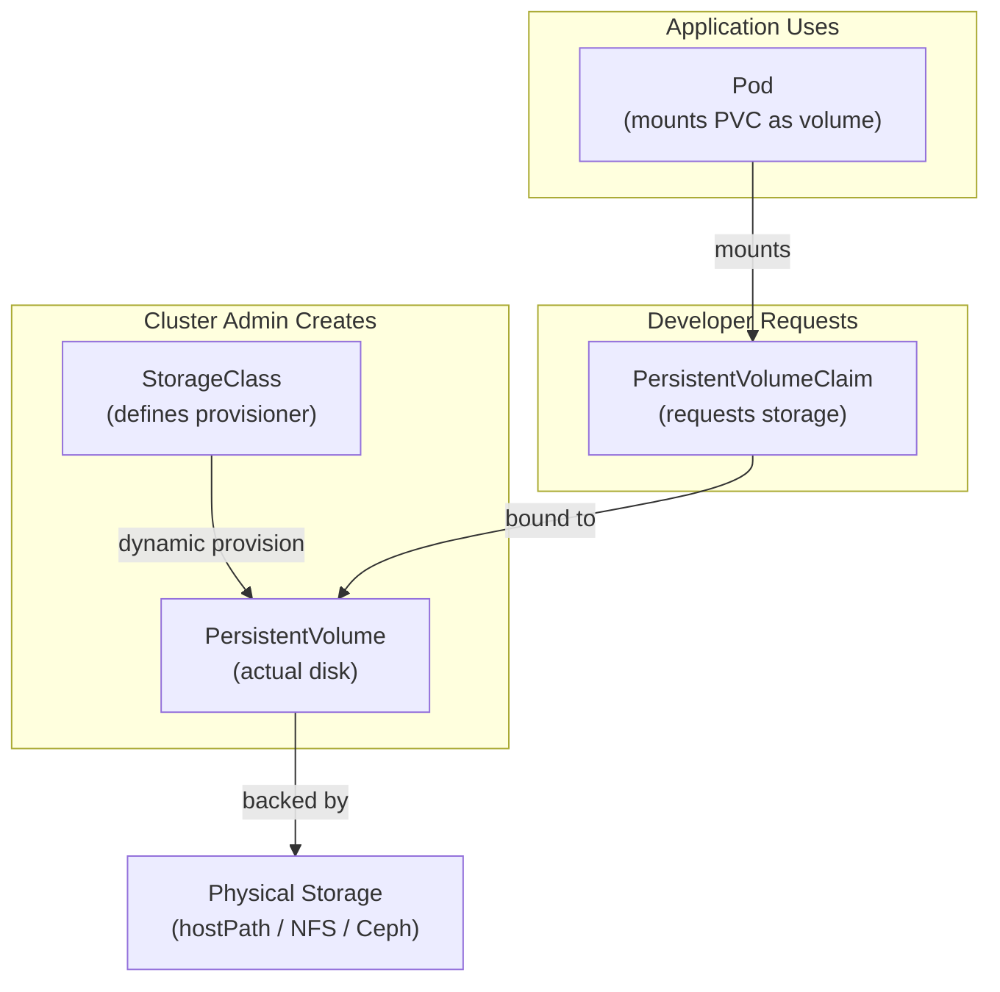
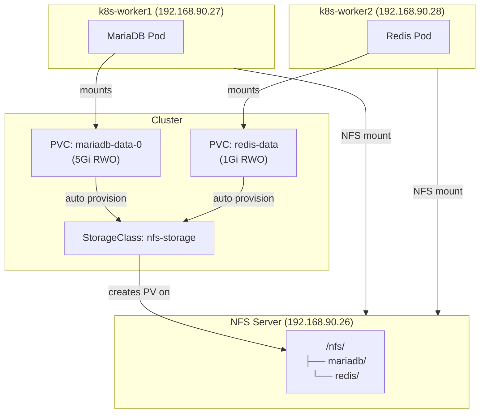

# Persistent Storage (PV, PVC, StorageClass)

> **Production Purpose:** Containers are ephemeral. When a pod restarts, all data written inside the container is lost. Persistent Volumes (PV) solve this by attaching durable storage to pods — even across pod restarts and node rescheduling. Getting storage right is critical: a misconfigured PV is the #1 cause of data loss incidents in Kubernetes.

---

## Storage Architecture



---

## Storage Options for Bare-Metal

| Type | Use Case | Persistence | Multi-node Access |
| ---- | -------- | ----------- | ----------------- |
| `hostPath` | Lab/dev, single node | Yes (on same node) | ❌ No |
| NFS | Multi-node shared storage | Yes | ✅ Yes |
| Ceph/Rook | Production distributed storage | Yes | ✅ Yes |
| Local PV | High performance, single node | Yes | ❌ No |

For this Proxmox lab, we'll use **hostPath** for simplicity, then upgrade to **NFS** for multi-node access.

---

## Understanding Access Modes

| Mode | Abbreviation | Meaning |
| ---- | ------------ | ------- |
| `ReadWriteOnce` | RWO | Mounted by one node at a time (read/write) |
| `ReadOnlyMany` | ROX | Mounted by many nodes (read-only) |
| `ReadWriteMany` | RWX | Mounted by many nodes (read/write) |

MariaDB needs `ReadWriteOnce` — only one pod writes at a time.

---

## Option A — hostPath (Quick Lab Fix)

:::info When to use this
Use Option A if `mariadb-0` is stuck in `Pending` with `unbound PersistentVolumeClaims` and you don't have NFS set up yet. This gets you unblocked immediately so you can continue Phase 06. Upgrade to NFS (Option B) afterwards.
:::

:::warning
`hostPath` ties the pod to a specific node. If the node goes down, the pod can't reschedule. Use for learning only.
:::

### Label a Node for Storage

```bash
kubectl label node k8s-worker1 storage=local
```

### Create PersistentVolume (Admin creates this)

Create: `mariadb-pv-hostpath.yaml`

```yaml
apiVersion: v1
kind: PersistentVolume
metadata:
  name: mariadb-pv
spec:
  capacity:
    storage: 5Gi
  accessModes:
    - ReadWriteOnce
  persistentVolumeReclaimPolicy: Retain   # Don't delete data when PVC is deleted
  storageClassName: local-storage
  hostPath:
    path: /data/mariadb                   # Directory on k8s-worker1
    type: DirectoryOrCreate
  nodeAffinity:
    required:
      nodeSelectorTerms:
      - matchExpressions:
        - key: storage
          operator: In
          values:
          - local
```

Apply:

```bash
# Create the directory on k8s-worker1 first
ssh root@192.168.90.27 "mkdir -p /data/mariadb"

kubectl apply -f mariadb-pv-hostpath.yaml
```

### Create PersistentVolumeClaim (Developer requests storage)

Create: `mariadb-pvc.yaml`

```yaml
apiVersion: v1
kind: PersistentVolumeClaim
metadata:
  name: mariadb-pvc
  namespace: production
spec:
  accessModes:
    - ReadWriteOnce
  storageClassName: local-storage
  resources:
    requests:
      storage: 5Gi
```

Apply:

```bash
kubectl apply -f mariadb-pvc.yaml
```

Check the PVC is bound:

```bash
kubectl get pvc -n production
```

Output:

```
NAME          STATUS   VOLUME      CAPACITY   ACCESS MODES   STORAGECLASS
mariadb-pvc   Bound    mariadb-pv  5Gi        RWO            local-storage
```

`STATUS: Bound` means the PVC is matched to a PV and ready.

---

## Option B — NFS (Recommended for Multi-Node)

NFS allows any pod on any node to mount the same volume — required for `ReadWriteMany` and pod rescheduling.

### Set Up NFS Server on k8s-control

:::caution Export the parent directory, not subdirectories
The NFS provisioner mounts the path you set in `--set nfs.path=/nfs` and **creates its own subdirectories** inside it dynamically. If you export subdirectories like `/nfs/mariadb` instead of the parent `/nfs`, the provisioner will mount a read-only filesystem and fail with:
```
failed to provision volume: mkdir /persistentvolumes/...: read-only file system
```
Always export the **parent** `/nfs` and let the provisioner manage the contents.
:::

```bash
# Install NFS server (on control-plane or a dedicated NFS VM)
apt install -y nfs-kernel-server

# Create the parent export directory
mkdir -p /nfs
chmod 777 /nfs

# Export the parent directory — NOT subdirectories
cat >> /etc/exports << 'EOF'
/nfs  192.168.90.0/24(rw,sync,no_subtree_check,no_root_squash)
EOF

exportfs -ra
systemctl enable --now nfs-kernel-server
```

Verify the export is active:

```bash
showmount -e localhost
```

Expected output:

```
Export list for localhost:
/nfs  192.168.90.0/24
```

### Install NFS Client on Worker Nodes

```bash
# Run on BOTH k8s-worker1 and k8s-worker2
apt install -y nfs-common
```

### Install NFS Subdir External Provisioner

This creates a StorageClass that auto-provisions PVs from NFS.

First, install Helm if it is not already available on the control-plane:

```bash
curl https://raw.githubusercontent.com/helm/helm/main/scripts/get-helm-3 | bash
```

Verify:

```bash
helm version
```

Output:

```
version.BuildInfo{Version:"v3.x.x", ...}
```

Then add the NFS provisioner chart and install it:

```bash
helm repo add nfs-subdir-external-provisioner \
  https://kubernetes-sigs.github.io/nfs-subdir-external-provisioner/

helm install nfs-provisioner \
  nfs-subdir-external-provisioner/nfs-subdir-external-provisioner \
  --namespace kube-system \
  --set nfs.server=192.168.90.26 \
  --set nfs.path=/nfs \
  --set storageClass.name=nfs-storage \
  --set storageClass.defaultClass=true
```

Verify:

```bash
kubectl get storageclass
```

Output:

```
NAME                    PROVISIONER                                   RECLAIMPOLICY   VOLUMEBINDINGMODE
nfs-storage (default)   cluster.local/nfs-provisioner-...            Delete          Immediate
```

---

## StorageClass Explained

```yaml
apiVersion: storage.k8s.io/v1
kind: StorageClass
metadata:
  name: nfs-storage
  annotations:
    storageclass.kubernetes.io/is-default-class: "true"
provisioner: cluster.local/nfs-provisioner   # Who creates PVs
reclaimPolicy: Retain                         # What happens when PVC is deleted
volumeBindingMode: Immediate                  # Bind immediately (not when pod scheduled)
```

| Reclaim Policy | Meaning |
| -------------- | ------- |
| `Retain` | PV data is kept after PVC deletion — admin must clean up manually |
| `Delete` | PV and data are deleted when PVC is deleted |
| `Recycle` | Data is wiped, PV reused (deprecated) |

:::caution Use `Retain` for databases
Always use `Retain` for stateful databases. `Delete` will wipe your data when a PVC is accidentally deleted.
:::

---

## Dynamic PVC for MariaDB (Using NFS StorageClass)

With a default StorageClass, PVCs are auto-provisioned — no need to create PVs manually.

Update the `volumeClaimTemplates` in MariaDB StatefulSet:

```yaml
volumeClaimTemplates:
- metadata:
    name: mariadb-data
  spec:
    accessModes: ["ReadWriteOnce"]
    storageClassName: nfs-storage      # Uses the NFS StorageClass
    resources:
      requests:
        storage: 5Gi
```

This automatically creates a PV on the NFS server when MariaDB starts.

---

## Verify Storage is Working

### Check PVs and PVCs

```bash
kubectl get pv,pvc -n production
```

Output:

```
NAME                              CAPACITY   ACCESS MODES   RECLAIM POLICY   STATUS   STORAGECLASS
persistentvolume/pvc-xxx          5Gi        RWO            Retain           Bound    nfs-storage

NAME                                    STATUS   VOLUME      CAPACITY   STORAGECLASS
persistentvolumeclaim/mariadb-data-0    Bound    pvc-xxx     5Gi        nfs-storage
```

### Verify Data Survives Pod Restart

Write data to the database:

```bash
kubectl exec -it mariadb-0 -n production -- \
  mysql -u laravel -pstrongpassword123 laravel -e \
  "CREATE TABLE test (id INT PRIMARY KEY, name VARCHAR(50)); INSERT INTO test VALUES (1, 'persistence-test');"
```

Delete the MariaDB pod (StatefulSet will recreate it):

```bash
kubectl delete pod mariadb-0 -n production
```

Wait for it to restart:

```bash
kubectl wait pod/mariadb-0 --for=condition=ready --timeout=60s -n production
```

Verify data is still there:

```bash
kubectl exec -it mariadb-0 -n production -- \
  mysql -u laravel -pstrongpassword123 laravel -e "SELECT * FROM test;"
```

Output:

```
+----+------------------+
| id | name             |
+----+------------------+
|  1 | persistence-test |
+----+------------------+
```

Data survived the pod restart.

---

## Storage Architecture Diagram



---

## Troubleshooting

| Symptom | Cause | Fix |
| ------- | ----- | --- |
| PVC stuck in `Pending` | No matching PV or StorageClass | Check `kubectl describe pvc <name>` |
| Pod stuck in `ContainerCreating` | PVC not bound | Verify PVC status is `Bound` |
| NFS mount fails on worker | nfs-common not installed | `apt install -y nfs-common` |
| Data lost after pod restart | `hostPath` node changed | Pod must reschedule to same node |
| StorageClass not default | Missing annotation | Add `is-default-class: "true"` annotation |

---

## Production Best Practices

| Practice | Reason |
| -------- | ------ |
| Always use `Retain` reclaim policy for databases | Prevents accidental data deletion |
| Use NFS or Ceph for multi-node HA | Allows pod rescheduling without data loss |
| Monitor PV usage | Storage full = database crash |
| Backup PVs separately from etcd | Data backup is separate from cluster backup |
| Use separate PVCs per service | Simplifies backup and recovery |
| Name PVCs clearly | `mariadb-data`, `redis-data` — not `pvc-1` |

---

