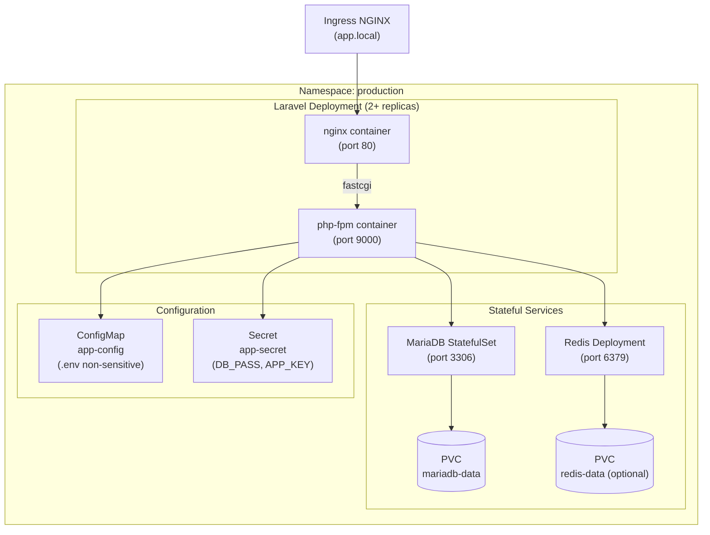
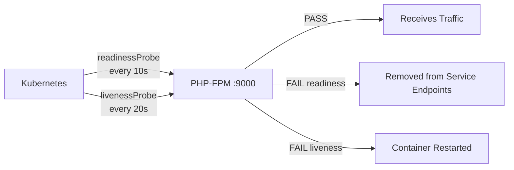

# Laravel Production Deployment

> **Production Purpose:** This is the core of the study case. We'll deploy a real Laravel application on Kubernetes with production-grade patterns: PHP-FPM + Nginx sidecar, MariaDB with persistent storage, Redis for cache/sessions, ConfigMaps for environment config, Secrets for credentials, and proper health probes.

---

## Application Architecture



---

## Create Production Namespace

```bash
kubectl create namespace production
kubectl config set-context --current --namespace=production
```

All resources in this phase live in the `production` namespace.

---

## Create ConfigMap (Non-Sensitive Config)

Create: `laravel-configmap.yaml`

```yaml
apiVersion: v1
kind: ConfigMap
metadata:
  name: laravel-config
  namespace: production
data:
  APP_NAME: "SampleApp"
  APP_ENV: "production"
  APP_DEBUG: "false"
  APP_URL: "http://app.local"        # https only after TLS is set up (Phase 10)
  LOG_CHANNEL: "stderr"              # Log to stdout for kubectl logs
  LOG_LEVEL: "warning"
  DB_CONNECTION: "mysql"
  DB_HOST: "mariadb-svc"             # Service name = DNS hostname
  DB_PORT: "3306"
  DB_DATABASE: "laravel"
  
  # Custom Connection (Used by migrations in this sample-app)
  SHARED_DB_HOST: "mariadb-svc"
  SHARED_DB_PORT: "3306"
  SHARED_DB_DATABASE: "laravel"

  # Waterline Dashboard Access
  WATERLINE_ALLOW_UNAUTHENTICATED: "true"  # Required to bypass 403 Forbidden in production environment

  CACHE_STORE: "redis"               # Laravel 11+: CACHE_STORE (not CACHE_DRIVER)
  SESSION_DRIVER: "redis"
  QUEUE_CONNECTION: "redis"
  REDIS_HOST: "redis-svc"            # Service name = DNS hostname
  REDIS_PORT: "6379"
```

:::info Waterline Dashboard Authorization
By default, the Waterline dashboard is protected by the `viewWaterline` gate and only allows access in the `local` environment (`APP_ENV=local`). Since this study case runs in the `production` environment (`APP_ENV=production`), accessing `app.local/waterline/dashboard` will return a **403 Forbidden** error unless `WATERLINE_ALLOW_UNAUTHENTICATED` is explicitly set to `"true"` in the ConfigMap.
:::

Apply:

```bash
kubectl apply -f laravel-configmap.yaml
```

---

## Create Secret (Sensitive Config)

:::warning
Never commit Secrets to Git. Use a Secret manager or Sealed Secrets in real production.
:::

Generate an APP_KEY using `openssl` — no PHP or Composer required:

```bash
echo "base64:$(openssl rand -base64 32)"
# Output: base64:K7Qx2mP9nYvL3tRjWdF8hCeA1oGbZsXu5NkMiHpV6wE=
```

Create the secret directly with `kubectl`, injecting the generated key inline:

```bash
kubectl create secret generic laravel-secret \
  --from-literal=APP_KEY="base64:$(openssl rand -base64 32)" \
  --from-literal=DB_USERNAME="laravel" \
  --from-literal=DB_PASSWORD="strongpassword123" \
  --from-literal=SHARED_DB_USERNAME="laravel" \
  --from-literal=SHARED_DB_PASSWORD="strongpassword123" \
  --from-literal=REDIS_PASSWORD="" \
  -n production
```

Verify the secret was created:

```bash
kubectl get secret laravel-secret -n production -o jsonpath='{.data.APP_KEY}' | base64 -d
# Must output: base64:xxxxxxxxxx... (not the placeholder)
```

:::caution Common mistake
Leaving `APP_KEY` as the placeholder value `base64:your-generated-key-here` causes a **500 Server Error** on every request. Always verify the secret value after creation.
:::

---

## Deploy MariaDB (StatefulSet)

We use a StatefulSet (not Deployment) for MariaDB because:
- StatefulSet provides stable, persistent identity per pod
- Ordered deployment and termination
- Stable PVC per replica

:::info Storage prerequisite
This phase requires the `nfs-storage` StorageClass from [Phase 06 — Persistent Storage](/docs/kubernetes/study-case/06-persistent-storage). Verify it is ready before continuing:

```bash
kubectl get storageclass
```

Expected output:

```
NAME                    PROVISIONER                                VOLUMEBINDINGMODE
nfs-storage (default)   cluster.local/nfs-provisioner-...         Immediate
```

If `nfs-storage` is missing, complete Phase 06 first.
:::

Create: `mariadb-statefulset.yaml`

```yaml
apiVersion: v1
kind: Service
metadata:
  name: mariadb-svc
  namespace: production
spec:
  clusterIP: None        # Headless service for StatefulSet
  selector:
    app: mariadb
  ports:
  - port: 3306
    targetPort: 3306
---
apiVersion: apps/v1
kind: StatefulSet
metadata:
  name: mariadb
  namespace: production
spec:
  serviceName: mariadb-svc
  replicas: 1
  selector:
    matchLabels:
      app: mariadb
  template:
    metadata:
      labels:
        app: mariadb
    spec:
      containers:
      - name: mariadb
        image: mariadb:10.11
        ports:
        - containerPort: 3306
        env:
        - name: MYSQL_ROOT_PASSWORD
          valueFrom:
            secretKeyRef:
              name: laravel-secret
              key: DB_PASSWORD
        - name: MYSQL_DATABASE
          value: laravel
        - name: MYSQL_USER
          valueFrom:
            secretKeyRef:
              name: laravel-secret
              key: DB_USERNAME
        - name: MYSQL_PASSWORD
          valueFrom:
            secretKeyRef:
              name: laravel-secret
              key: DB_PASSWORD
        resources:
          requests:
            cpu: "250m"
            memory: "256Mi"
          limits:
            cpu: "500m"
            memory: "512Mi"
        readinessProbe:
          exec:
            command:
            - bash
            - -c
            - "mysqladmin ping -u root -p${MYSQL_ROOT_PASSWORD}"
          initialDelaySeconds: 20
          periodSeconds: 10
        livenessProbe:
          exec:
            command:
            - bash
            - -c
            - "mysqladmin ping -u root -p${MYSQL_ROOT_PASSWORD}"
          initialDelaySeconds: 30
          periodSeconds: 20
        volumeMounts:
        - name: mariadb-data
          mountPath: /var/lib/mysql
  volumeClaimTemplates:
  - metadata:
      name: mariadb-data
    spec:
      accessModes: ["ReadWriteOnce"]
      storageClassName: nfs-storage        # NFS provisioner from Phase 06
      resources:
        requests:
          storage: 5Gi
```

Apply:

```bash
kubectl apply -f mariadb-statefulset.yaml
```

:::caution Before waiting — verify the PVC is Bound first
`kubectl wait` will silently time out and exit with an error if the NFS StorageClass is not working. A `Pending` PVC means the pod will **never** become Ready, no matter how long you wait.

Always check the PVC status before waiting for the pod:
:::

```bash
# Step 1 — Confirm the PVC was provisioned by NFS (STATUS must be Bound)
kubectl get pvc -n production
```

Expected output:

```
NAME                    STATUS   VOLUME        CAPACITY   STORAGECLASS
mariadb-data-mariadb-0  Bound    pvc-xxx...    5Gi        nfs-storage
```

If `STATUS` is `Pending`, **stop here** — NFS is not ready. Go to [Troubleshooting](#troubleshooting) below.

```bash
# Step 2 — Only run this AFTER the PVC is Bound
kubectl get pod mariadb-0 -n production -w
```

Expected output:

```
NAME        READY   STATUS              RESTARTS   AGE
mariadb-0   0/1     ContainerCreating   0          5s
mariadb-0   0/1     Running             0          15s
mariadb-0   1/1     Running             0          30s    ← Ready
```

---

## Deploy Redis

Create: `redis-deployment.yaml`

```yaml
apiVersion: apps/v1
kind: Deployment
metadata:
  name: redis
  namespace: production
spec:
  replicas: 1
  selector:
    matchLabels:
      app: redis
  template:
    metadata:
      labels:
        app: redis
    spec:
      containers:
      - name: redis
        image: redis:7-alpine
        command: ["redis-server", "--appendonly", "yes"]
        ports:
        - containerPort: 6379
        resources:
          requests:
            cpu: "100m"
            memory: "128Mi"
          limits:
            cpu: "250m"
            memory: "256Mi"
        readinessProbe:
          exec:
            command: ["redis-cli", "ping"]
          initialDelaySeconds: 5
          periodSeconds: 5
        livenessProbe:
          exec:
            command: ["redis-cli", "ping"]
          initialDelaySeconds: 10
          periodSeconds: 10
---
apiVersion: v1
kind: Service
metadata:
  name: redis-svc
  namespace: production
spec:
  selector:
    app: redis
  ports:
  - port: 6379
    targetPort: 6379
```

Apply:

```bash
kubectl apply -f redis-deployment.yaml
```

---

## Build and Push Laravel Docker Image

The `sample-app` uses a **multi-stage Dockerfile** that separates PHP dependencies, Node.js frontend assets, and the final production image for a lean, reproducible build.

```bash
git clone https://github.com/pndhkm/sample-app
cd sample-app
```

The `Dockerfile` in the repo:

```dockerfile
FROM php:8.4-cli AS base

RUN apt-get update && apt-get install -y \
    curl ffmpeg libnspr4 libnss3 libpq-dev libzip-dev unzip git \
    && docker-php-ext-install pdo pdo_mysql pcntl zip bcmath \
    && pecl install redis && docker-php-ext-enable redis \
    && rm -rf /var/lib/apt/lists/*

COPY --from=composer:2 /usr/bin/composer /usr/bin/composer

WORKDIR /app

# ── Dependencies ─────────────────────────────────────────
FROM base AS vendor

COPY composer.json composer.lock ./
RUN composer install --no-dev --no-scripts --no-autoloader --prefer-dist

COPY . .
RUN composer dump-autoload --optimize

# ── Frontend assets ──────────────────────────────────────
FROM node:22-slim AS assets

WORKDIR /app
COPY package.json package-lock.json* ./
RUN npm ci

COPY resources/ resources/
COPY vite.config.js ./
RUN npm run build

# ── Production image ─────────────────────────────────────
FROM base AS production

COPY --from=vendor /app /app
COPY --from=assets /usr/local/bin/node /usr/local/bin/node
COPY --from=assets /usr/local/lib/node_modules /usr/local/lib/node_modules
COPY --from=assets /app/node_modules /app/node_modules
COPY --from=assets /app/public/build /app/public/build
COPY .env.example /app/.env.example

RUN ln -sf /usr/local/lib/node_modules/npm/bin/npm-cli.js /usr/local/bin/npm \
    && ln -sf /usr/local/lib/node_modules/npm/bin/npx-cli.js /usr/local/bin/npx \
    && npx playwright install chromium

RUN cp .env.example .env 2>/dev/null || echo "APP_KEY=" > .env
RUN php artisan key:generate --force
RUN php artisan vendor:publish --tag=waterline-assets --force 2>/dev/null || true

COPY docker/entrypoint.sh /usr/local/bin/app-entrypoint
RUN chmod +x /usr/local/bin/app-entrypoint

EXPOSE 8000

ENTRYPOINT ["app-entrypoint"]
CMD ["php", "artisan", "serve", "--host=0.0.0.0", "--port=8000"]
```

**Multi-stage build explained:**

| Stage | Base | Purpose |
| ----- | ---- | ------- |
| `base` | `php:8.4-cli` | Shared PHP runtime with extensions |
| `vendor` | `base` | Runs `composer install` — build cache friendly |
| `assets` | `node:22-slim` | Runs `npm ci` + `vite build` for JS/CSS |
| `production` | `base` | Final image: copies vendor + built assets only |

Build and push:

```bash
docker build --target production -t panduhakam/sample-app:v1 .
docker push panduhakam/sample-app:v1
```

:::tip Build cache
The `vendor` and `assets` stages are cached independently. Changing only PHP code won't rebuild node_modules, and changing only JS won't reinstall Composer packages.
:::

---

## Deploy Laravel Application

Since the image uses `php artisan serve` (port **8000**), a single container per pod handles all traffic — no nginx sidecar is needed.

Create: `laravel-deployment.yaml`

```yaml
apiVersion: apps/v1
kind: Deployment
metadata:
  name: laravel
  namespace: production
  labels:
    app: laravel
    version: v1
spec:
  replicas: 2
  strategy:
    type: RollingUpdate
    rollingUpdate:
      maxSurge: 1
      maxUnavailable: 0          # Zero-downtime rolling update
  selector:
    matchLabels:
      app: laravel
  template:
    metadata:
      labels:
        app: laravel
        version: v1
    spec:
      initContainers:
      - name: laravel-init
        image: panduhakam/sample-app:v1
        args:
        - php
        - artisan
        - migrate
        - --force
        envFrom:
        - configMapRef:
            name: laravel-config
        - secretRef:
            name: laravel-secret

      containers:
      - name: laravel
        image: panduhakam/sample-app:v1
        ports:
        - containerPort: 8000
        envFrom:
        - configMapRef:
            name: laravel-config
        - secretRef:
            name: laravel-secret
        resources:
          requests:
            cpu: "200m"
            memory: "256Mi"
          limits:
            cpu: "500m"
            memory: "512Mi"
        readinessProbe:
          httpGet:
            path: /
            port: 8000
          initialDelaySeconds: 15
          periodSeconds: 10
          failureThreshold: 5
        livenessProbe:
          httpGet:
            path: /
            port: 8000
          initialDelaySeconds: 30
          periodSeconds: 20
```

:::info Why initContainer?
The initContainer runs `php artisan migrate --force` **once before** the main app starts. This prevents multiple replicas from running migrations simultaneously — a common race condition in production.

Note: `config:cache`, `route:cache`, and `view:cache` are intentionally **not** run here. The initContainer runs in an isolated filesystem that is not shared with the main container. The main container's `entrypoint.sh` also runs `config:clear` on every startup, so any cache written in the initContainer would be discarded anyway.
:::

Apply:

```bash
kubectl apply -f laravel-deployment.yaml
```

### Create the Laravel Service

```yaml
apiVersion: v1
kind: Service
metadata:
  name: laravel-svc
  namespace: production
  labels:
    app: laravel         # Required for ServiceMonitor discovery!
spec:
  selector:
    app: laravel
  ports:
  - name: http           # Required for ServiceMonitor endpoint mapping!
    port: 80
    targetPort: 8000     # artisan serve listens on 8000
```

Apply:

```bash
kubectl apply -f laravel-service.yaml
```

---

## Create Ingress for Laravel

Create: `laravel-ingress.yaml`

```yaml
apiVersion: networking.k8s.io/v1
kind: Ingress
metadata:
  name: laravel-ingress
  namespace: production
  annotations:
    nginx.ingress.kubernetes.io/ssl-redirect: "false"   # Enable after TLS in Phase 10
    nginx.ingress.kubernetes.io/proxy-body-size: "50m"
    nginx.ingress.kubernetes.io/proxy-connect-timeout: "60"
    nginx.ingress.kubernetes.io/proxy-read-timeout: "300"
spec:
  ingressClassName: nginx
  rules:
  - host: app.local
    http:
      paths:
      - path: /
        pathType: Prefix
        backend:
          service:
            name: laravel-svc
            port:
              number: 80   # Service forwards to pod:8000
```

Apply:

```bash
kubectl apply -f laravel-ingress.yaml
```

---

## Validate Full Stack

### Check All Pods Are Running

```bash
kubectl get pods -n production
```

Output:

```
NAME                       READY   STATUS    RESTARTS   AGE
laravel-xxx                1/1     Running   0          3m
laravel-xxx                1/1     Running   0          3m
mariadb-0                  1/1     Running   0          5m
redis-xxx                  1/1     Running   0          4m
```

`1/1` means the single Laravel container (artisan serve) is running.

### Test the Application

`app.local` is not a real DNS name. Before `curl` works, add it to `/etc/hosts` on the machine you are testing from:

```bash
# Get the MetalLB external IP assigned to ingress
kubectl get svc -n ingress-nginx
# Look for ingress-nginx-controller EXTERNAL-IP, e.g. 192.168.90.200

# Add to /etc/hosts
echo "192.168.90.200  app.local" >> /etc/hosts
```

Then test:

```bash
curl http://app.local
```

Or skip the hosts entry entirely and pass the Host header directly:

```bash
curl -H "Host: app.local" http://192.168.90.200
```

### Test Database Connectivity

The `exec` command targets a specific running pod — not the deployment. First confirm the pod is `1/1 Running`:

```bash
kubectl get pods -n production -l app=laravel
```

If the pod shows `Init:0/1`, the `laravel-init` initContainer is still running migrations. Wait for it:

```bash
# Watch initContainer logs
kubectl logs <pod-name> -n production -c laravel-init -f
```

Once the pod is `1/1 Running`, exec using the exact pod name:

```bash
kubectl exec -it <pod-name> -n production -- php artisan migrate:status
```

### Test Redis Connectivity

```bash
kubectl exec -it deployment/redis -n production -- redis-cli ping
```

Output:

```
PONG
```

---

## Understanding Health Probes



| Probe | Purpose | Failure Action |
| ----- | ------- | -------------- |
| `readinessProbe` | Is the app ready to serve? | Remove from Service endpoints |
| `livenessProbe` | Is the app alive (not deadlocked)? | Restart the container |
| `startupProbe` | Did the app finish starting? | Block liveness/readiness probes |

---

## Troubleshooting

| Symptom | Cause | Fix |
| ------- | ----- | --- |
| `mariadb-0` stuck in `Pending` | NFS StorageClass not ready | [See fix below ↓](#mariadb-0-stuck-in-pending) |
| Laravel pod `0/1` not ready | initContainer still running | `kubectl describe pod <pod> -n production` |
| `php artisan migrate` fails | MariaDB not ready OR `SHARED_DB_HOST` misconfigured | Ensure `mariadb-0` is running. Check ConfigMap has `SHARED_DB_HOST: "mariadb-svc"` since migration uses custom connection |
| 502 Bad Gateway | Laravel not starting | `kubectl logs deployment/laravel -n production` |
| Redis connection refused | Redis not running | `kubectl get pod -n production \| grep redis` |
| App shows 500 error | `APP_KEY` is the placeholder value | Run `kubectl get secret laravel-secret -n production -o jsonpath='{.data.APP_KEY}' \| base64 -d` and regenerate if it shows `your-generated-key-here` |

### mariadb-0 Stuck in Pending

**Diagnose:**

```bash
# Check PVC status — look for STATUS: Pending
kubectl get pvc -n production

# Read the exact scheduler error
kubectl describe pod mariadb-0 -n production | grep -A5 Events
```

If you see:
```
Warning  FailedScheduling  pod has unbound immediate PersistentVolumeClaims
```

The PVC cannot find a matching PV. Follow the steps below.

---

**Fix — Verify NFS StorageClass is working**

```bash
# 1. Check the StorageClass exists
kubectl get storageclass

# 2. Check the NFS provisioner pod is Running
kubectl get pods -n kube-system | grep nfs

# 3. Check the provisioner logs for errors
kubectl logs -n kube-system deployment/nfs-provisioner-nfs-subdir-external-provisioner
```

If the provisioner is not running, reinstall it (see [Phase 06 — Persistent Storage](/docs/kubernetes/study-case/06-persistent-storage)).

If the provisioner is running but the PVC is still `Pending`, describe the PVC for the exact reason:

```bash
kubectl describe pvc mariadb-data-mariadb-0 -n production
```

Once the StorageClass is healthy, delete and re-create the StatefulSet so a fresh PVC is provisioned:

```bash
kubectl delete statefulset mariadb -n production
kubectl delete pvc mariadb-data-mariadb-0 -n production
kubectl apply -f mariadb-statefulset.yaml
```

Verify:

```bash
kubectl get pvc -n production
```

Expected:

```
NAME                    STATUS   VOLUME        CAPACITY   STORAGECLASS
mariadb-data-mariadb-0  Bound    pvc-xxx...    5Gi        nfs-storage
```

---
