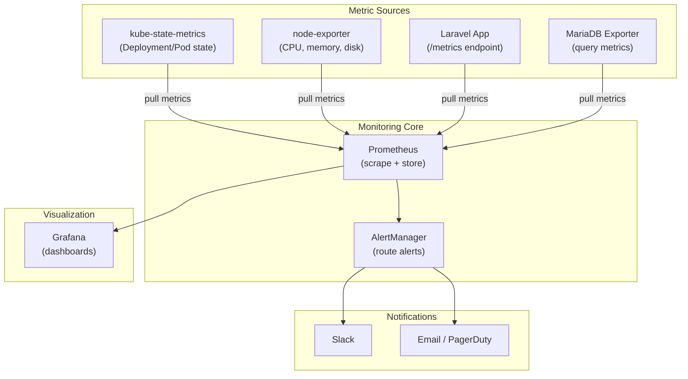
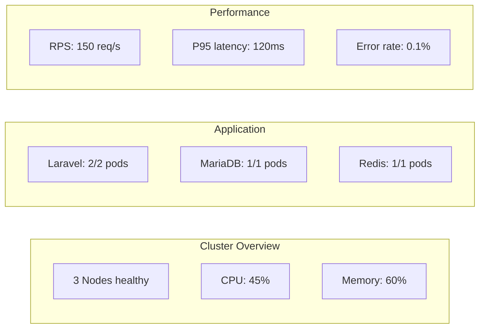

# Monitoring with Prometheus & Grafana

> **Production Purpose:** "You cannot improve what you cannot measure." Prometheus is the CNCF standard for Kubernetes metrics — it powers monitoring at Google, Netflix, Cloudflare, and virtually every production cloud-native platform. Grafana visualizes those metrics with dashboards that surface problems before users notice them.

---

## Monitoring Architecture



---

## Install kube-prometheus-stack (via Helm)

The `kube-prometheus-stack` Helm chart installs:
- Prometheus Operator
- Prometheus
- Grafana
- AlertManager
- kube-state-metrics
- node-exporter

This is the industry standard way to deploy monitoring — do not install them individually.

### Add Helm Repository

```bash
helm repo add prometheus-community https://prometheus-community.github.io/helm-charts
helm repo update
```

### Create Monitoring Namespace

```bash
kubectl create namespace monitoring
```

### Create Values File

Create: `monitoring-values.yaml`

```yaml
prometheus:
  ingress:
    enabled: true
    ingressClassName: nginx
    hosts:
      - prometheus.local
  prometheusSpec:
    retention: 15d
    storageSpec:
      volumeClaimTemplate:
        spec:
          storageClassName: nfs-storage
          accessModes: ["ReadWriteOnce"]
          resources:
            requests:
              storage: 10Gi
    resources:
      requests:
        cpu: 200m
        memory: 1024Mi
      limits:
        cpu: 500m
        memory: 2Gi

grafana:
  adminPassword: "admin123"          # Change in production!
  persistence:
    enabled: true
    storageClassName: nfs-storage
    size: 1Gi
  resources:
    requests:
      cpu: 100m
      memory: 512Mi
    limits:
      cpu: 200m
      memory: 1024Mi
  ingress:
    enabled: true
    ingressClassName: nginx
    hosts:
      - grafana.local

alertmanager:
  alertmanagerSpec:
    storage:
      volumeClaimTemplate:
        spec:
          storageClassName: nfs-storage
          resources:
            requests:
              storage: 1Gi

nodeExporter:
  enabled: true

kubeStateMetrics:
  enabled: true
```

### Install the Stack

```bash
helm install prometheus-stack prometheus-community/kube-prometheus-stack \
  --namespace monitoring \
  --values monitoring-values.yaml \
  --wait
```

This takes 2-3 minutes. Watch the pods:

```bash
kubectl get pods -n monitoring -w
```

Output (when ready):

```
NAME                                                    READY   STATUS
alertmanager-prometheus-stack-alertmanager-0            2/2     Running
prometheus-prometheus-stack-prometheus-0                2/2     Running
prometheus-stack-grafana-xxx                            3/3     Running
prometheus-stack-kube-state-metrics-xxx                 1/1     Running
prometheus-stack-prometheus-node-exporter-xxx (node1)   1/1     Running
prometheus-stack-prometheus-node-exporter-xxx (node2)   1/1     Running
prometheus-stack-prometheus-node-exporter-xxx (node3)   1/1     Running
```

---

## Access Grafana

Add to your laptop's `/etc/hosts`:

```
192.168.90.100  grafana.local
```

Open: `http://grafana.local`

Login: `admin` / `admin123`

---

## Explore Pre-Built Dashboards

The kube-prometheus-stack comes with many dashboards. Navigate to:

`Dashboards → Browse → Kubernetes`

| Dashboard | What It Shows |
| --------- | ------------- |
| Kubernetes / Compute Resources / Cluster | CPU, Memory usage per namespace |
| Kubernetes / Compute Resources / Pod | Per-pod resource usage |
| Kubernetes / Nodes | Node-level CPU, memory, disk, network |
| Node Exporter / Full | Full system metrics per VM |

---

## Monitor Laravel with ServiceMonitor

Prometheus discovers targets via `ServiceMonitor` CRDs — no config file editing needed.

### Add Laravel Metrics Endpoint

To expose application-level metrics to Prometheus, we use the `spatie/laravel-prometheus` package. Since our Laravel pod runs as a single container executing `php artisan serve` on port `8000`, **no Nginx reverse proxy configuration is required**.

Instead of manually installing dependencies locally, we will use a **new Git branch**, configure the package inside the **Dockerfile directly using `sed`**, and publish the image using a new version tag (`v1.1`) to ensure stable training documentation versioning.

Follow these steps to integrate and configure the metrics exporter:

#### Step 1: Create a New Git Branch
To keep your `main` branch clean and isolate your monitoring changes, create and checkout a new branch in your local `sample-app` repository:

```bash
git checkout -b feat-monitoring
```

#### Step 2: Register the Package in `composer.json`
Open the `composer.json` file in a text editor (no PHP required on your host machine!) and add `"spatie/laravel-prometheus": "^2.2"` to the `"require"` block:

```json
    "require": {
        "php": "^8.4",
        "durable-workflow/workflow": "^2.0.0-alpha",
        "durable-workflow/waterline": "^2.0.0-alpha",
        "laravel/ai": "^0.6.0",
        "laravel/framework": "^13.0",
        "laravel/mcp": "^0.6.0",
        "laravel/tinker": "^3.0",
        "spatie/laravel-prometheus": "^2.2"
    },
```

#### Step 2.5: Update the `composer.lock` File (Without Local PHP/Composer)

You can safely update the lock file on your host machine by running Composer inside a temporary Docker container with the `--no-scripts` flag (which prevents Laravel from trying to run setup scripts before the dependencies are actually installed):

```bash
docker run --rm -v $(pwd):/app -w /app composer:2 composer update spatie/laravel-prometheus --no-install --no-scripts
```

This will analyze the new dependency and cleanly update the `composer.lock` file directly in your workspace directory without triggering scripts.

#### Step 3: Create the `config/prometheus.php` File Locally
Since we don't have PHP/Composer installed locally on the host, we can simply create the configuration file manually using a text editor. 

Create a new file at **`config/prometheus.php`** in your repository and paste the following content. **Crucial:** Make sure the very first line starts with `<?php` so that Laravel executes it as code instead of outputting it as plain text:

```php
<?php

return [
    'enabled' => true,

    /*
     * The urls that will return metrics.
     * We change this from 'prometheus' to 'metrics' to match K8s standards.
     */
    'urls' => [
        'default' => 'metrics',
    ],

    /*
     * Only these IP's will be allowed to visit the above urls.
     * All IP's are allowed when empty.
     */
    'allowed_ips' => [],

    /*
     * This is the default namespace that will be used by all metrics.
     */
    'default_namespace' => 'app',

    /*
     * The middleware that will be applied to the urls above.
     */
    'middleware' => [
        Spatie\Prometheus\Http\Middleware\AllowIps::class,
    ],
];
```

*Note: Since the Dockerfile's `vendor` stage copies your local directory via `COPY . .` and then the `production` stage imports it, this config file will automatically be bundled into your final production image.*

---

#### Step 4: Build and Push with a New Tag (`v1.1`)
Build your updated production image. Use tag `v1.1` to avoid overwriting your baseline `v1` image:

```bash
docker build --target production -t panduhakam/sample-app:v1.1 .
docker push panduhakam/sample-app:v1.1
```

Once pushed, commit all modified and newly created files, then push your new branch to GitHub:
```bash
git add composer.json composer.lock config/prometheus.php
git commit -m "feat: add prometheus monitoring package and configuration"
git push origin feat-monitoring
```

#### Step 5: Update the Kubernetes Deployment Image
Update your running deployment in the cluster to use the new image tag. Kubernetes will automatically trigger a rolling update:

```bash
kubectl set image deployment/laravel laravel=panduhakam/sample-app:v1.1 -n production
```

---

### Create ServiceMonitor

Prometheus Operator discovers scraping targets dynamically using `ServiceMonitor` CRDs. 

Create: `laravel-servicemonitor.yaml`

```yaml
apiVersion: monitoring.coreos.com/v1
kind: ServiceMonitor
metadata:
  name: laravel-monitor
  namespace: production
  labels:
    release: prometheus-stack    # Must match the Prometheus operator release label
spec:
  selector:
    matchLabels:
      app: laravel
  endpoints:
  - port: http                   # Refers to targetPort 8000 defined in laravel-svc
    path: /metrics
    interval: 30s
```

Apply:

```bash
kubectl apply -f laravel-servicemonitor.yaml
```

---

## Set Up Alerting Rules

Create: `laravel-alert-rules.yaml`

```yaml
apiVersion: monitoring.coreos.com/v1
kind: PrometheusRule
metadata:
  name: laravel-alerts
  namespace: production
  labels:
    release: prometheus-stack
spec:
  groups:
  - name: laravel.rules
    rules:
    # Alert when pod restarts more than 3 times in 5 minutes
    - alert: LaravelPodCrashLooping
      expr: |
        rate(kube_pod_container_status_restarts_total{
          namespace="production",
          pod=~"laravel-.*"
        }[5m]) * 60 * 5 > 3
      for: 2m
      labels:
        severity: critical
      annotations:
        summary: "Laravel pod is crash looping"
        description: "Pod {{ $labels.pod }} restarted more than 3 times in 5 minutes"

    # Alert when pod count drops below 2
    - alert: LaravelReplicasLow
      expr: |
        kube_deployment_status_replicas_available{
          namespace="production",
          deployment="laravel"
        } < 2
      for: 5m
      labels:
        severity: warning
      annotations:
        summary: "Laravel has fewer than 2 replicas running"

    # Alert when MariaDB is unreachable
    - alert: MariaDBDown
      expr: |
        kube_pod_status_ready{
          namespace="production",
          pod=~"mariadb-.*",
          condition="true"
        } == 0
      for: 1m
      labels:
        severity: critical
      annotations:
        summary: "MariaDB pod is not ready"
```

Apply:

```bash
kubectl apply -f laravel-alert-rules.yaml
```

---

## Configure AlertManager (Slack)

Create: `alertmanager-config.yaml`

```yaml
apiVersion: monitoring.coreos.com/v1alpha1
kind: AlertmanagerConfig
metadata:
  name: slack-alerts
  namespace: monitoring
spec:
  route:
    receiver: slack-critical
    groupBy: ['alertname', 'namespace']
    groupWait: 30s
    groupInterval: 5m
    repeatInterval: 12h
  receivers:
  - name: slack-critical
    slackConfigs:
    - apiURL:
        key: slack-webhook-url
        name: alertmanager-secrets
      channel: '#k8s-alerts'
      sendResolved: true
      text: |
        {{ range .Alerts }}
        *Alert:* {{ .Annotations.summary }}
        *Description:* {{ .Annotations.description }}
        *Severity:* {{ .Labels.severity }}
        {{ end }}
```

---

## Key Metrics to Watch in Production

### Node Health

```promql
# Node CPU usage %
100 - (avg by (instance) (rate(node_cpu_seconds_total{mode="idle"}[5m])) * 100)

# Node memory available
node_memory_MemAvailable_bytes / node_memory_MemTotal_bytes * 100

# Node disk usage
100 - ((node_filesystem_avail_bytes * 100) / node_filesystem_size_bytes)
```

### Pod Health

```promql
# Pods not running in production namespace
count(kube_pod_status_phase{namespace="production", phase!="Running"}) > 0

# Container restart rate
rate(kube_pod_container_status_restarts_total{namespace="production"}[5m])

# CPU throttling
rate(container_cpu_cfs_throttled_seconds_total{namespace="production"}[5m])
```

### Application (Laravel)

```promql
# HTTP request rate
rate(http_requests_total{namespace="production"}[5m])

# HTTP error rate (4xx + 5xx)
rate(http_requests_total{namespace="production",status=~"[45].."}[5m])

# Response time P95
histogram_quantile(0.95, rate(http_request_duration_seconds_bucket[5m]))
```

---

## Grafana Dashboard Walkthrough



---

## Troubleshooting

| Symptom | Cause | Fix |
| ------- | ----- | --- |
| Prometheus pod `Pending` | PVC not bound | Check StorageClass and NFS |
| No targets in Prometheus | ServiceMonitor not matching | Verify `release:` label matches Helm release name |
| `0 / 0 active targets` | Service port not named | Ensure Service port is explicitly named `http` to match ServiceMonitor |
| Grafana shows "No data" | Prometheus not scraping | Check `http://prometheus:9090/targets` |
| `Connection Refused` on `kube-proxy` | Bound to `127.0.0.1` by default | Edit `kube-proxy` ConfigMap, change `metricsBindAddress` to `0.0.0.0` |
| `Connection Refused` on `etcd`/control-plane | Bound to `127.0.0.1` in Static Pod manifests | Change `--bind-address` / `--listen-metrics-urls` to `0.0.0.0` |
| Alerts not firing | PrometheusRule label missing | Add `release: prometheus-stack` label |
| node-exporter not on all nodes | DaemonSet issue | `kubectl get ds -n monitoring` |

---

### Target Discovery Shows `0 / 0 up` (Missing Service Port Name)

If your Prometheus target discovery lists your ServiceMonitor but displays `0 / 0 active targets` (or `No active targets in this scrape pool`), this is almost always caused by a missing **port name** on your Kubernetes Service definition.

A `ServiceMonitor` endpoint port reference (e.g. `port: http`) matches the **`name`** field in the Service's `ports` block, **not** the numeric port or protocol.

#### Fix:
Ensure your Service has a named port matching your ServiceMonitor. You can apply a fast, live patch to your running service in the cluster using:

```bash
kubectl patch svc laravel-svc -n production --type='json' -p='[{"op": "add", "path": "/spec/ports/0/name", "value": "http"}]'
```

---

### Control Plane Targets Show `Connection Refused` (etcd, scheduler, controller-manager, kube-proxy)

By default, in Kubernetes clusters initialized with `kubeadm` (such as on your Proxmox virtual machines), control plane components are configured to bind their metrics endpoints exclusively to `127.0.0.1` (localhost) for security. 

Because Prometheus scrapes endpoints from within the cluster pod network (`10.244.x.x`), it cannot access `127.0.0.1` on the host, resulting in a **`dial tcp ...: connect: connection refused`** error.

To allow Prometheus to scrape these control plane components, you must modify them to bind to all interfaces (`0.0.0.0`):

#### 1. Fix `kube-proxy` (ConfigMap update)
The `kube-proxy` metrics binding address is defined inside a ConfigMap.

1. Edit the configmap in the `kube-system` namespace:
   ```bash
   kubectl edit cm kube-proxy -n kube-system
   ```
2. Locate `metricsBindAddress` and change it from `127.0.0.1:10249` to `0.0.0.0:10249`:
   ```yaml
   metricsBindAddress: "0.0.0.0:10249"
   ```
3. Save and exit. Then, trigger a rollout restart of the `kube-proxy` DaemonSet to apply the change:
   ```bash
   kubectl rollout restart ds/kube-proxy -n kube-system
   ```

---

#### 2. Fix Static Pods: `etcd`, `kube-scheduler`, and `kube-controller-manager`
For control plane components running as static pods, you must edit their manifest files **on your master/control-plane node**. Once edited, the Kubelet will automatically restart the pods with the new configurations.

SSH into your Kubernetes master node and perform the following edits under `/etc/kubernetes/manifests/`:

*   **ETCD (Port 2381):**
    Open `/etc/kubernetes/manifests/etcd.yaml` and edit the `--listen-metrics-urls` flag to listen on `0.0.0.0` instead of `127.0.0.1`:
    ```yaml
    # /etc/kubernetes/manifests/etcd.yaml
    spec:
      containers:
      - command:
        - etcd
        ...
        - --listen-metrics-urls=http://0.0.0.0:2381 # Change from 127.0.0.1 to 0.0.0.0
    ```

*   **Kube-Controller-Manager (Port 10257):**
    Open `/etc/kubernetes/manifests/kube-controller-manager.yaml` and edit the `--bind-address` flag to `0.0.0.0`:
    ```yaml
    # /etc/kubernetes/manifests/kube-controller-manager.yaml
    spec:
      containers:
      - command:
        - kube-controller-manager
        ...
        - --bind-address=0.0.0.0 # Change from 127.0.0.1 to 0.0.0.0
    ```

*   **Kube-Scheduler (Port 10259):**
    Open `/etc/kubernetes/manifests/kube-scheduler.yaml` and edit the `--bind-address` flag to `0.0.0.0`:
    ```yaml
    # /etc/kubernetes/manifests/kube-scheduler.yaml
    spec:
      containers:
      - command:
        - kube-scheduler
        ...
        - --bind-address=0.0.0.0 # Change from 127.0.0.1 to 0.0.0.0
    ```

Once edited and saved, wait 30 seconds for Kubelet to automatically restart these control plane components. Once they restart, they will listen on all interfaces, and Prometheus will successfully scrape their metrics, changing their status to **`UP`**!

---

### Access Prometheus UI

To verify that your Prometheus Operator is scraping targets, you can access the Prometheus dashboard. Since port-forwarding is temporary and blocks your shell by default, you can choose one of the following methods for access:

#### Method A: Temporary Background Port-Forward (Quick check)

Run the port-forward command in the background using `nohup` (No Hang Up) and the `&` operator so it survives session disconnections:

```bash
nohup kubectl port-forward -n monitoring svc/prometheus-stack-kube-prom-prometheus 9090:9090 >/dev/null 2>&1 &
```

*To shut down the background forwarding later, run:*
```bash
kill $(pgrep -f "port-forward -n monitoring svc/prometheus-stack-kube-prom-prometheus")
```

Once running, open `http://localhost:9090/targets` in your web browser. All targets should show as `UP`.

---

#### Method B: Permanent Ingress Setup (Production Best Practice)

Instead of using port-forwarding commands, you can expose Prometheus permanently through your Nginx Ingress Controller:

1. **Update `monitoring-values.yaml`:** Add the `ingress` configuration block inside the `prometheus` spec:

   ```yaml
   prometheus:
     ingress:
       enabled: true
       ingressClassName: nginx
       hosts:
         - prometheus.local
     prometheusSpec:
       retention: 15d
       # ... rest of your existing prometheus config ...
   ```

2. **Apply the upgrade via Helm:**
   ```bash
   helm upgrade prometheus-stack prometheus-community/kube-prometheus-stack \
     --namespace monitoring \
     --values monitoring-values.yaml
   ```

3. **Add DNS record to your host machine's `/etc/hosts`:**
   ```text
   192.168.90.100  prometheus.local
   ```

You can now permanently access the Prometheus UI at `http://prometheus.local/targets` without tying up your terminal!

---

## Production Best Practices

| Practice | Reason |
| -------- | ------ |
| Retain 15-30 days of metrics | Enough for incident investigation |
| Use PVC for Prometheus storage | Survive pod restarts |
| Page on critical alerts only | Alert fatigue kills SRE teams |
| Create SLO dashboards | Track error budgets, not just raw metrics |
| Set Grafana admin password via Secret | Never hardcode in values file |
| Use `PrometheusRule` for alerts | GitOps-friendly, version controlled |

---
