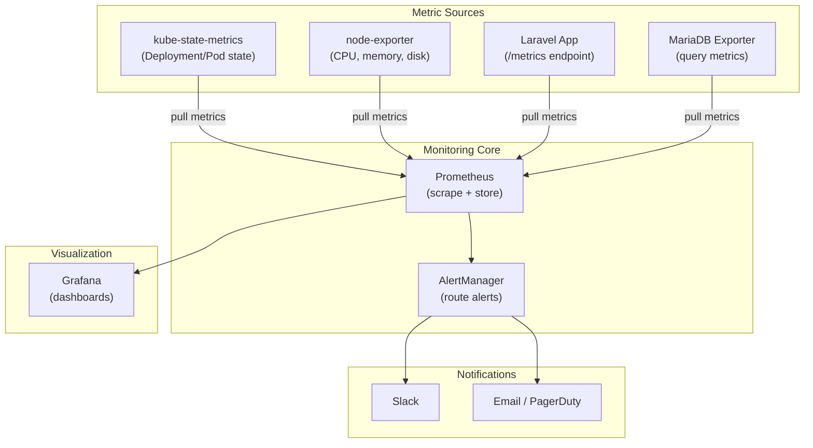
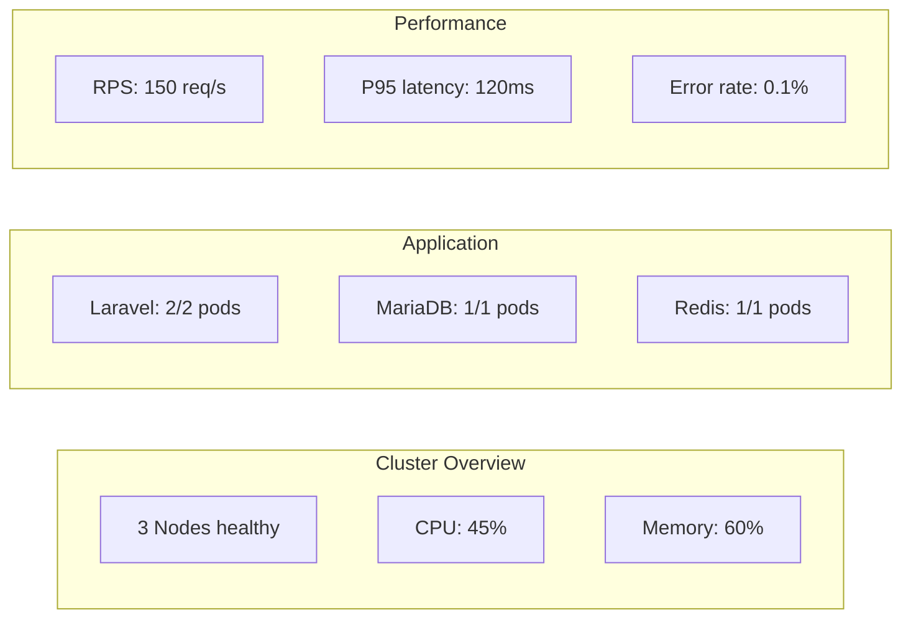

# Monitoring with Prometheus & Grafana

> **Production Purpose:** "You cannot improve what you cannot measure." Prometheus is the CNCF standard for Kubernetes metrics — it powers monitoring at Google, Netflix, Cloudflare, and virtually every production cloud-native platform. Grafana visualizes those metrics with dashboards that surface problems before users notice them.

---

## Monitoring Architecture



---

## Install kube-prometheus-stack (via Helm)

The `kube-prometheus-stack` Helm chart installs:
- Prometheus Operator
- Prometheus
- Grafana
- AlertManager
- kube-state-metrics
- node-exporter

This is the industry standard way to deploy monitoring — do not install them individually.

### Add Helm Repository

```bash
helm repo add prometheus-community https://prometheus-community.github.io/helm-charts
helm repo update
```

### Create Monitoring Namespace

```bash
kubectl create namespace monitoring
```

### Create Values File

Create: `monitoring-values.yaml`

```yaml
prometheus:
  prometheusSpec:
    retention: 15d
    storageSpec:
      volumeClaimTemplate:
        spec:
          storageClassName: nfs-storage
          accessModes: ["ReadWriteOnce"]
          resources:
            requests:
              storage: 10Gi
    resources:
      requests:
        cpu: 200m
        memory: 512Mi
      limits:
        cpu: 500m
        memory: 1Gi

grafana:
  adminPassword: "admin123"          # Change in production!
  persistence:
    enabled: true
    storageClassName: nfs-storage
    size: 1Gi
  resources:
    requests:
      cpu: 100m
      memory: 128Mi
    limits:
      cpu: 200m
      memory: 256Mi
  ingress:
    enabled: true
    ingressClassName: nginx
    hosts:
      - grafana.local

alertmanager:
  alertmanagerSpec:
    storage:
      volumeClaimTemplate:
        spec:
          storageClassName: nfs-storage
          resources:
            requests:
              storage: 1Gi

nodeExporter:
  enabled: true

kubeStateMetrics:
  enabled: true
```

### Install the Stack

```bash
helm install prometheus-stack prometheus-community/kube-prometheus-stack \
  --namespace monitoring \
  --values monitoring-values.yaml \
  --wait
```

This takes 2-3 minutes. Watch the pods:

```bash
kubectl get pods -n monitoring -w
```

Output (when ready):

```
NAME                                                    READY   STATUS
alertmanager-prometheus-stack-alertmanager-0            2/2     Running
prometheus-prometheus-stack-prometheus-0                2/2     Running
prometheus-stack-grafana-xxx                            3/3     Running
prometheus-stack-kube-state-metrics-xxx                 1/1     Running
prometheus-stack-prometheus-node-exporter-xxx (node1)   1/1     Running
prometheus-stack-prometheus-node-exporter-xxx (node2)   1/1     Running
prometheus-stack-prometheus-node-exporter-xxx (node3)   1/1     Running
```

---

## Access Grafana

Add to your laptop's `/etc/hosts`:

```
192.168.90.100  grafana.local
```

Open: `http://grafana.local`

Login: `admin` / `admin123`

---

## Explore Pre-Built Dashboards

The kube-prometheus-stack comes with many dashboards. Navigate to:

`Dashboards → Browse → Kubernetes`

| Dashboard | What It Shows |
| --------- | ------------- |
| Kubernetes / Compute Resources / Cluster | CPU, Memory usage per namespace |
| Kubernetes / Compute Resources / Pod | Per-pod resource usage |
| Kubernetes / Nodes | Node-level CPU, memory, disk, network |
| Node Exporter / Full | Full system metrics per VM |

---

## Monitor Laravel with ServiceMonitor

Prometheus discovers targets via `ServiceMonitor` CRDs — no config file editing needed.

### Add Laravel Metrics Endpoint

First, add Laravel Prometheus exporter (if not already in the app):

```bash
composer require spatie/laravel-prometheus
php artisan vendor:publish --tag=prometheus-config
```

Then add to your `nginx` config to expose `/metrics`:

```nginx
location /metrics {
    allow 10.244.0.0/16;   # Only allow from inside cluster
    deny all;
    fastcgi_pass 127.0.0.1:9000;
    fastcgi_param SCRIPT_FILENAME $realpath_root$fastcgi_script_name;
    include fastcgi_params;
}
```

### Create ServiceMonitor

Create: `laravel-servicemonitor.yaml`

```yaml
apiVersion: monitoring.coreos.com/v1
kind: ServiceMonitor
metadata:
  name: laravel-monitor
  namespace: production
  labels:
    release: prometheus-stack    # Must match Prometheus selector
spec:
  selector:
    matchLabels:
      app: laravel
  endpoints:
  - port: http
    path: /metrics
    interval: 30s
```

Apply:

```bash
kubectl apply -f laravel-servicemonitor.yaml
```

---

## Set Up Alerting Rules

Create: `laravel-alert-rules.yaml`

```yaml
apiVersion: monitoring.coreos.com/v1
kind: PrometheusRule
metadata:
  name: laravel-alerts
  namespace: production
  labels:
    release: prometheus-stack
spec:
  groups:
  - name: laravel.rules
    rules:
    # Alert when pod restarts more than 3 times in 5 minutes
    - alert: LaravelPodCrashLooping
      expr: |
        rate(kube_pod_container_status_restarts_total{
          namespace="production",
          pod=~"laravel-.*"
        }[5m]) * 60 * 5 > 3
      for: 2m
      labels:
        severity: critical
      annotations:
        summary: "Laravel pod is crash looping"
        description: "Pod {{ $labels.pod }} restarted more than 3 times in 5 minutes"

    # Alert when pod count drops below 2
    - alert: LaravelReplicasLow
      expr: |
        kube_deployment_status_replicas_available{
          namespace="production",
          deployment="laravel"
        } < 2
      for: 5m
      labels:
        severity: warning
      annotations:
        summary: "Laravel has fewer than 2 replicas running"

    # Alert when MariaDB is unreachable
    - alert: MariaDBDown
      expr: |
        kube_pod_status_ready{
          namespace="production",
          pod=~"mariadb-.*",
          condition="true"
        } == 0
      for: 1m
      labels:
        severity: critical
      annotations:
        summary: "MariaDB pod is not ready"
```

Apply:

```bash
kubectl apply -f laravel-alert-rules.yaml
```

---

## Configure AlertManager (Slack)

Create: `alertmanager-config.yaml`

```yaml
apiVersion: monitoring.coreos.com/v1alpha1
kind: AlertmanagerConfig
metadata:
  name: slack-alerts
  namespace: monitoring
spec:
  route:
    receiver: slack-critical
    groupBy: ['alertname', 'namespace']
    groupWait: 30s
    groupInterval: 5m
    repeatInterval: 12h
  receivers:
  - name: slack-critical
    slackConfigs:
    - apiURL:
        key: slack-webhook-url
        name: alertmanager-secrets
      channel: '#k8s-alerts'
      sendResolved: true
      text: |
        {{ range .Alerts }}
        *Alert:* {{ .Annotations.summary }}
        *Description:* {{ .Annotations.description }}
        *Severity:* {{ .Labels.severity }}
        {{ end }}
```

---

## Key Metrics to Watch in Production

### Node Health

```promql
# Node CPU usage %
100 - (avg by (instance) (rate(node_cpu_seconds_total{mode="idle"}[5m])) * 100)

# Node memory available
node_memory_MemAvailable_bytes / node_memory_MemTotal_bytes * 100

# Node disk usage
100 - ((node_filesystem_avail_bytes * 100) / node_filesystem_size_bytes)
```

### Pod Health

```promql
# Pods not running in production namespace
count(kube_pod_status_phase{namespace="production", phase!="Running"}) > 0

# Container restart rate
rate(kube_pod_container_status_restarts_total{namespace="production"}[5m])

# CPU throttling
rate(container_cpu_cfs_throttled_seconds_total{namespace="production"}[5m])
```

### Application (Laravel)

```promql
# HTTP request rate
rate(http_requests_total{namespace="production"}[5m])

# HTTP error rate (4xx + 5xx)
rate(http_requests_total{namespace="production",status=~"[45].."}[5m])

# Response time P95
histogram_quantile(0.95, rate(http_request_duration_seconds_bucket[5m]))
```

---

## Grafana Dashboard Walkthrough



---

## Troubleshooting

| Symptom | Cause | Fix |
| ------- | ----- | --- |
| Prometheus pod `Pending` | PVC not bound | Check StorageClass and NFS |
| No targets in Prometheus | ServiceMonitor not matching | Verify `release:` label matches Helm release name |
| Grafana shows "No data" | Prometheus not scraping | Check `http://prometheus:9090/targets` |
| Alerts not firing | PrometheusRule label missing | Add `release: prometheus-stack` label |
| node-exporter not on all nodes | DaemonSet issue | `kubectl get ds -n monitoring` |

### Check Prometheus Targets

```bash
kubectl port-forward -n monitoring svc/prometheus-stack-prometheus 9090:9090
```

Open: `http://localhost:9090/targets`

All targets should show `UP`.

---

## Production Best Practices

| Practice | Reason |
| -------- | ------ |
| Retain 15-30 days of metrics | Enough for incident investigation |
| Use PVC for Prometheus storage | Survive pod restarts |
| Page on critical alerts only | Alert fatigue kills SRE teams |
| Create SLO dashboards | Track error budgets, not just raw metrics |
| Set Grafana admin password via Secret | Never hardcode in values file |
| Use `PrometheusRule` for alerts | GitOps-friendly, version controlled |

---
