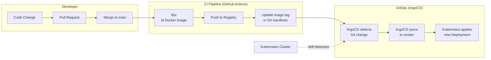
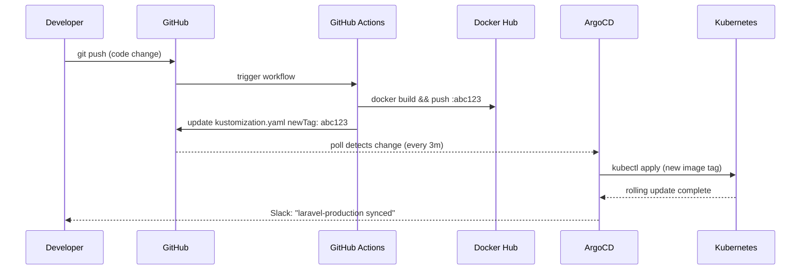

# GitOps with ArgoCD

> **Production Purpose:** GitOps means Git is the single source of truth for your cluster state. You never `kubectl apply` directly in production — instead, you push to Git, and ArgoCD automatically detects and syncs the changes. This gives you full audit trail, rollback history, and drift detection for free.

---

## GitOps Principles



### GitOps vs Traditional Deployment

| Aspect | Traditional | GitOps |
| ------ | ----------- | ------ |
| Deploy method | `kubectl apply` manually | ArgoCD syncs from Git |
| Audit trail | Shell history | Git commit history |
| Rollback | Remember exact state | `git revert` |
| Drift detection | None | ArgoCD alerts on drift |
| Access control | Who has kubectl | Who has Git write access |
| Multi-env promotion | Manual, error-prone | Git branch per environment |

---

## Repository Structure

Organize your Git repo like this:

```
sample-app/                        ← Application code
├── app/
├── Dockerfile
└── ...

k8s-manifests/                     ← Kubernetes manifests (separate repo)
├── base/
│   ├── laravel/
│   │   ├── deployment.yaml
│   │   ├── service.yaml
│   │   └── ingress.yaml
│   ├── mariadb/
│   │   └── statefulset.yaml
│   └── redis/
│       └── deployment.yaml
├── overlays/
│   ├── staging/
│   │   └── kustomization.yaml
│   └── production/
│       └── kustomization.yaml
└── apps/
    ├── laravel-app.yaml           ← ArgoCD Application CRD
    └── monitoring.yaml
```

ArgoCD watches the `k8s-manifests` repo. Your app code repo is separate.

---

## Install ArgoCD

```bash
kubectl create namespace argocd

kubectl apply --server-side -n argocd \
  -f https://raw.githubusercontent.com/argoproj/argo-cd/stable/manifests/install.yaml
```

Wait for all ArgoCD pods to start:

```bash
kubectl wait --namespace argocd \
  --for=condition=ready pod \
  --selector=app.kubernetes.io/name=argocd-server \
  --timeout=120s
```

---

## Expose ArgoCD via Ingress

Create: `argocd-ingress.yaml`

```yaml
apiVersion: networking.k8s.io/v1
kind: Ingress
metadata:
  name: argocd-ingress
  namespace: argocd
  annotations:
    nginx.ingress.kubernetes.io/ssl-passthrough: "true"    # ArgoCD uses its own TLS
    nginx.ingress.kubernetes.io/backend-protocol: "HTTPS"
spec:
  ingressClassName: nginx
  rules:
  - host: argocd.local
    http:
      paths:
      - path: /
        pathType: Prefix
        backend:
          service:
            name: argocd-server
            port:
              number: 443
```

Apply:

```bash
kubectl apply -f argocd-ingress.yaml
```

Add to your laptop's `/etc/hosts`:

```
192.168.90.100  argocd.local
```

---

## Get Initial Admin Password

```bash
kubectl get secret argocd-initial-admin-secret \
  -n argocd \
  -o jsonpath="{.data.password}" | base64 -d && echo
```

Output:

```
SomeRandomGeneratedPassword123
```

Login at: `https://argocd.local`
Username: `admin`
Password: (from above)

---

## Install ArgoCD CLI

```bash
curl -sSL -o argocd https://github.com/argoproj/argo-cd/releases/latest/download/argocd-linux-amd64
chmod +x argocd && sudo mv argocd /usr/local/bin/
```

Login via CLI:

```bash
argocd login argocd.local --username admin --password <your-password> --insecure
```

---

## Create ArgoCD Application (Laravel)

Create: `argocd-laravel-app.yaml`

```yaml
apiVersion: argoproj.io/v1alpha1
kind: Application
metadata:
  name: laravel-production
  namespace: argocd
  finalizers:
  - resources-finalizer.argocd.argoproj.io   # Cleanup resources when App is deleted
spec:
  project: default

  source:
    repoURL: https://github.com/pndhkm/sample-app
    targetRevision: main
    path: k8s/production                      # Path inside the repo with K8s manifests

  destination:
    server: https://kubernetes.default.svc    # This cluster
    namespace: production

  syncPolicy:
    automated:
      prune: true          # Delete resources removed from Git
      selfHeal: true       # Revert manual kubectl changes (drift correction)
    syncOptions:
    - CreateNamespace=true
    - PrunePropagationPolicy=foreground
    retry:
      limit: 3
      backoff:
        duration: 5s
        factor: 2
        maxDuration: 3m
```

Apply:

```bash
kubectl apply -f argocd-laravel-app.yaml
```

---

## Add Kubernetes Manifests to Your Repo

In your `sample-app` repository, create the `k8s/production/` directory:

Create: `k8s/production/kustomization.yaml`

```yaml
apiVersion: kustomize.config.k8s.io/v1beta1
kind: Kustomization

namespace: production

resources:
- deployment.yaml
- service.yaml
- ingress.yaml
- configmap.yaml

images:
- name: panduhakam/sample-app
  newTag: "v1"                    # ArgoCD + CI will update this tag
```

Push to GitHub:

```bash
git add k8s/
git commit -m "feat: add kubernetes production manifests"
git push origin main
```

ArgoCD will detect the change within 3 minutes (default poll interval) and sync.

---

## Watch ArgoCD Sync

### Via CLI

```bash
argocd app get laravel-production
argocd app sync laravel-production    # Manual sync (usually automatic)
```

Output:

```
Name:               laravel-production
Project:            default
Server:             https://kubernetes.default.svc
Namespace:          production
URL:                https://argocd.local/applications/laravel-production
Repo:               https://github.com/pndhkm/sample-app
Target:             main
Path:               k8s/production
SyncStatus:         Synced
HealthStatus:       Healthy
```

### Via UI

The ArgoCD UI shows a live graph of all Kubernetes objects and their health.

---

## CI/CD Integration (GitHub Actions)

Create: `.github/workflows/deploy.yaml`

```yaml
name: Build and Deploy

on:
  push:
    branches: [main]

jobs:
  build-and-deploy:
    runs-on: ubuntu-latest
    steps:
    - uses: actions/checkout@v4

    - name: Build Docker image
      run: |
        docker build -t panduhakam/sample-app:${{ github.sha }} .

    - name: Push to Docker Hub
      env:
        DOCKER_PASSWORD: ${{ secrets.DOCKER_PASSWORD }}
      run: |
        echo $DOCKER_PASSWORD | docker login -u panduhakam --password-stdin
        docker push panduhakam/sample-app:${{ github.sha }}

    - name: Update Kubernetes manifests
      run: |
        # Update the image tag in kustomization.yaml
        sed -i "s/newTag: .*/newTag: \"${{ github.sha }}\"/" k8s/production/kustomization.yaml
        git config user.name "GitHub Actions"
        git config user.email "actions@github.com"
        git add k8s/production/kustomization.yaml
        git commit -m "ci: update image tag to ${{ github.sha }}"
        git push
```

### Full GitOps Flow



---

## Rollback a Bad Deployment

### Via ArgoCD UI

1. Open `https://argocd.local`
   

2. Select the `laravel-production` application.
   

3. Navigate to the **History and Rollback** tab.
   

4. Select the last known good revision.

5. Click the three-dot menu (**⋮**) next to the selected revision, then choose **Rollback**.
### Via CLI

```bash
# List sync history
argocd app history laravel-production

# Rollback to previous revision
argocd app rollback laravel-production <REVISION-ID>
```

This reverts Git to the previous commit's state — proper rollback.

---

## Troubleshooting

| Symptom | Cause | Fix |
| ------- | ----- | --- |
| App shows `OutOfSync` | Manual kubectl change made | Let ArgoCD self-heal, or sync manually |
| App shows `Degraded` | Pod health failing | Check pod logs and events |
| ArgoCD can't pull from private repo | No credentials | Add repo via `argocd repo add` with SSH key |
| Sync fails on resource conflict | Existing resources not owned by ArgoCD | Add `argocd.argoproj.io/managed-by: argocd` annotation |
| `selfHeal` reverts your changes | `selfHeal: true` is set | This is correct behavior — change Git instead |

### Connect ArgoCD to Private GitHub Repo

```bash
argocd repo add git@github.com:pndhkm/sample-app.git \
  --ssh-private-key-path ~/.ssh/id_rsa \
  --name sample-app
```

---

## Production Best Practices

| Practice | Reason |
| -------- | ------ |
| Separate app code and manifests repos | Clean separation of concerns |
| Enable `selfHeal: true` | Prevents configuration drift |
| Enable `prune: true` | Removes orphaned resources automatically |
| Use Kustomize overlays per environment | Share base manifests, override per env |
| Use ArgoCD Projects | Restrict which repos/namespaces each team can deploy |
| Set up SSO (OIDC) | Don't use local ArgoCD admin in production |
| Use Sealed Secrets | Safe to commit encrypted Secrets to Git |

---
