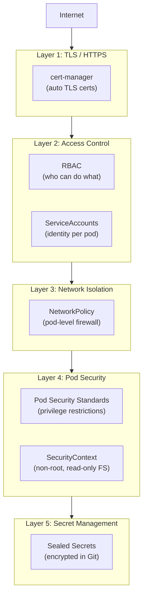

# Security Hardening

> **Production Purpose:** A default Kubernetes installation is NOT secure. Pods run as root, all pods can talk to all other pods, Secrets are only base64-encoded, and any user with kubectl can do anything. Security hardening closes these gaps systematically — following the principle of least privilege at every layer.

---

## Security Layers



---

## Part A — TLS with cert-manager

### Why TLS Matters

Running HTTP in production leaks credentials, session tokens, and user data. All production traffic must be HTTPS.

### Install cert-manager

```bash
kubectl apply -f https://github.com/cert-manager/cert-manager/releases/download/v1.14.4/cert-manager.yaml
```

Wait for cert-manager to be ready:

```bash
kubectl wait --namespace cert-manager \
  --for=condition=ready pod \
  --selector=app.kubernetes.io/instance=cert-manager \
  --timeout=120s
```

### Create Self-Signed Cluster Issuer (Lab)

For production, use Let's Encrypt. For this lab, we'll use a self-signed CA.

Create: `cluster-issuer.yaml`

```yaml
apiVersion: cert-manager.io/v1
kind: ClusterIssuer
metadata:
  name: selfsigned-issuer
spec:
  selfSigned: {}
---
apiVersion: cert-manager.io/v1
kind: Certificate
metadata:
  name: lab-ca
  namespace: cert-manager
spec:
  isCA: true
  commonName: lab-ca
  secretName: lab-ca-secret
  privateKey:
    algorithm: ECDSA
    size: 256
  issuerRef:
    name: selfsigned-issuer
    kind: ClusterIssuer
    group: cert-manager.io
---
apiVersion: cert-manager.io/v1
kind: ClusterIssuer
metadata:
  name: lab-ca-issuer
spec:
  ca:
    secretName: lab-ca-secret
```

Apply:

```bash
kubectl apply -f cluster-issuer.yaml
```

### Create TLS Certificate for Laravel

Create: `laravel-certificate.yaml`

```yaml
apiVersion: cert-manager.io/v1
kind: Certificate
metadata:
  name: laravel-tls
  namespace: production
spec:
  secretName: laravel-tls-secret       # cert-manager creates this Secret
  issuerRef:
    name: lab-ca-issuer
    kind: ClusterIssuer
  commonName: app.local
  dnsNames:
  - app.local
```

Apply:

```bash
kubectl apply -f laravel-certificate.yaml
```

Verify certificate is issued:

```bash
kubectl get certificate -n production
```

Output:

```
NAME           READY   SECRET               AGE
laravel-tls    True    laravel-tls-secret   30s
```

### Update Ingress to Use TLS

Update `laravel-ingress.yaml`:

```yaml
apiVersion: networking.k8s.io/v1
kind: Ingress
metadata:
  name: laravel-ingress
  namespace: production
  annotations:
    nginx.ingress.kubernetes.io/ssl-redirect: "true"    # Force HTTPS
    nginx.ingress.kubernetes.io/proxy-body-size: "50m"
spec:
  ingressClassName: nginx
  tls:
  - hosts:
    - app.local
    secretName: laravel-tls-secret              # cert-manager created this
  rules:
  - host: app.local
    http:
      paths:
      - path: /
        pathType: Prefix
        backend:
          service:
            name: laravel-svc
            port:
              number: 80
```

Test:

```bash
curl -k https://app.local      # -k ignores self-signed cert warning
```

---

## Part B — RBAC (Role-Based Access Control)

### Why RBAC?

Without RBAC, any pod can read all Secrets, modify Deployments, or delete namespaces. RBAC enforces least privilege.

### Create a Read-Only Role for Developers

Create: `rbac-developer.yaml`

```yaml
apiVersion: v1
kind: ServiceAccount
metadata:
  name: developer
  namespace: production
---
apiVersion: rbac.authorization.k8s.io/v1
kind: Role
metadata:
  name: developer-role
  namespace: production
rules:
- apiGroups: [""]
  resources: ["pods", "services", "configmaps"]
  verbs: ["get", "list", "watch"]
- apiGroups: ["apps"]
  resources: ["deployments", "replicasets"]
  verbs: ["get", "list", "watch"]
- apiGroups: [""]
  resources: ["pods/log"]
  verbs: ["get"]
# Explicitly NO access to Secrets
---
apiVersion: rbac.authorization.k8s.io/v1
kind: RoleBinding
metadata:
  name: developer-binding
  namespace: production
subjects:
- kind: ServiceAccount
  name: developer
  namespace: production
roleRef:
  kind: Role
  name: developer-role
  apiGroup: rbac.authorization.k8s.io
```

Apply:

```bash
kubectl apply -f rbac-developer.yaml
```

### Test RBAC

```bash
# Can the developer read pods?
kubectl auth can-i list pods --namespace production --as system:serviceaccount:production:developer
# Expected: yes

# Can the developer read Secrets?
kubectl auth can-i list secrets --namespace production --as system:serviceaccount:production:developer
# Expected: no
```

### Laravel App Should Have Minimal Permissions

Pods should not use the `default` ServiceAccount (which often has too many permissions).

Create: `laravel-serviceaccount.yaml`

```yaml
apiVersion: v1
kind: ServiceAccount
metadata:
  name: laravel-sa
  namespace: production
automountServiceAccountToken: false    # Don't mount API tokens unless needed
```

Add to the Laravel Deployment:

```yaml
spec:
  template:
    spec:
      serviceAccountName: laravel-sa
```

---

## Part C — NetworkPolicy (Pod Firewall)

By default, all pods can reach all other pods. NetworkPolicy creates pod-level firewall rules.

### Default Deny All (Start with Zero Trust)

Create: `netpol-default-deny.yaml`

```yaml
apiVersion: networking.k8s.io/v1
kind: NetworkPolicy
metadata:
  name: default-deny-all
  namespace: production
spec:
  podSelector: {}         # Applies to ALL pods in namespace
  policyTypes:
  - Ingress
  - Egress
```

:::warning
After applying this, all pods in `production` lose connectivity. Apply allow rules immediately after.
:::

### Allow Laravel to Receive Traffic from Ingress

```yaml
apiVersion: networking.k8s.io/v1
kind: NetworkPolicy
metadata:
  name: allow-ingress-to-laravel
  namespace: production
spec:
  podSelector:
    matchLabels:
      app: laravel
  policyTypes:
  - Ingress
  ingress:
  - from:
    - namespaceSelector:
        matchLabels:
          kubernetes.io/metadata.name: ingress-nginx
    ports:
    - protocol: TCP
      port: 80
```

### Allow Laravel to Talk to MariaDB

```yaml
apiVersion: networking.k8s.io/v1
kind: NetworkPolicy
metadata:
  name: allow-laravel-to-mariadb
  namespace: production
spec:
  podSelector:
    matchLabels:
      app: mariadb
  policyTypes:
  - Ingress
  ingress:
  - from:
    - podSelector:
        matchLabels:
          app: laravel
    ports:
    - protocol: TCP
      port: 3306
```

### Allow Laravel to Talk to Redis

```yaml
apiVersion: networking.k8s.io/v1
kind: NetworkPolicy
metadata:
  name: allow-laravel-to-redis
  namespace: production
spec:
  podSelector:
    matchLabels:
      app: redis
  policyTypes:
  - Ingress
  ingress:
  - from:
    - podSelector:
        matchLabels:
          app: laravel
    ports:
    - protocol: TCP
      port: 6379
```

### Allow Egress for DNS (Required!)

```yaml
apiVersion: networking.k8s.io/v1
kind: NetworkPolicy
metadata:
  name: allow-dns-egress
  namespace: production
spec:
  podSelector: {}
  policyTypes:
  - Egress
  egress:
  - ports:
    - protocol: UDP
      port: 53
    - protocol: TCP
      port: 53
```

Apply all NetworkPolicies:

```bash
kubectl apply -f netpol-default-deny.yaml
kubectl apply -f netpol-allow-ingress.yaml
kubectl apply -f netpol-allow-mariadb.yaml
kubectl apply -f netpol-allow-redis.yaml
kubectl apply -f netpol-allow-dns.yaml
```

---

## Part D — Pod SecurityContext

Prevent containers from running as root and writing to the filesystem.

Add to all production pods:

```yaml
spec:
  template:
    spec:
      securityContext:
        runAsNonRoot: true
        runAsUser: 1000
        fsGroup: 1000
      containers:
      - name: php-fpm
        securityContext:
          allowPrivilegeEscalation: false
          readOnlyRootFilesystem: true          # Can't write to container FS
          capabilities:
            drop:
            - ALL                               # Drop all Linux capabilities
        volumeMounts:
        - name: tmp-dir
          mountPath: /tmp                       # Laravel needs /tmp writable
        - name: storage-dir
          mountPath: /var/www/html/storage
      volumes:
      - name: tmp-dir
        emptyDir: {}
      - name: storage-dir
        emptyDir: {}
```

---

## Part E — Sealed Secrets (Safe Git Storage)

Never commit Kubernetes Secrets to Git — they're only base64-encoded.
Sealed Secrets encrypts them so they're safe to commit.

### Install Sealed Secrets Controller

```bash
helm repo add sealed-secrets https://bitnami-labs.github.io/sealed-secrets
helm install sealed-secrets sealed-secrets/sealed-secrets -n kube-system
```

### Install kubeseal CLI

```bash
curl -sSL https://github.com/bitnami-labs/sealed-secrets/releases/download/v0.26.0/kubeseal-0.26.0-linux-amd64.tar.gz \
  | tar xz && sudo mv kubeseal /usr/local/bin/
```

### Create a Sealed Secret

```bash
# Start from your regular Secret YAML
kubectl create secret generic laravel-secret \
  --from-literal=APP_KEY=base64:abc123 \
  --from-literal=DB_PASSWORD=strongpass \
  --dry-run=client -o yaml | \
  kubeseal --controller-namespace kube-system > laravel-sealed-secret.yaml
```

Now `laravel-sealed-secret.yaml` is safe to commit to Git. Only this cluster can decrypt it.

---

## Security Audit Checklist

| Check | Command | Expected |
| ----- | ------- | -------- |
| No pods running as root | `kubectl get pods -n production -o jsonpath='{range .items[*]}{.metadata.name}{"\t"}{.spec.securityContext.runAsUser}{"\n"}{end}'` | Non-zero UID |
| RBAC is limiting access | `kubectl auth can-i list secrets --as system:serviceaccount:production:laravel-sa -n production` | `no` |
| NetworkPolicy applied | `kubectl get networkpolicy -n production` | Multiple policies |
| TLS is enabled | `curl -k https://app.local -v` | TLS handshake succeeds |
| Secrets not in env (prefer files) | `kubectl describe pod -n production -l app=laravel` | No plaintext secrets in env output |

---

## Troubleshooting

| Symptom | Cause | Fix |
| ------- | ----- | --- |
| App unreachable after NetworkPolicy | Missing allow rules | Check `kubectl describe networkpolicy` |
| Certificate not issuing | cert-manager issue | `kubectl describe certificate laravel-tls -n production` |
| Pod fails to start after securityContext | Writes to read-only FS | Add `emptyDir` volumes for writable paths |
| RBAC denying legitimate access | Missing verb in Role | `kubectl auth can-i` to debug, then update Role |

---

## Production Best Practices

| Practice | Reason |
| -------- | ------ |
| Default-deny NetworkPolicy in every namespace | Zero-trust networking posture |
| Never run containers as root | Root in container = root on host if breakout occurs |
| Use Sealed Secrets for Git storage | Secrets stay encrypted at rest |
| Use cert-manager with Let's Encrypt | Auto-renewing free TLS certs |
| Set `automountServiceAccountToken: false` | Apps don't need API access by default |
| Regularly audit RBAC | `kubectl auth can-i --list` shows all permissions |

---
