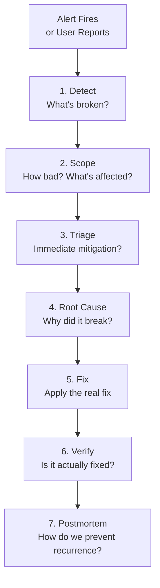
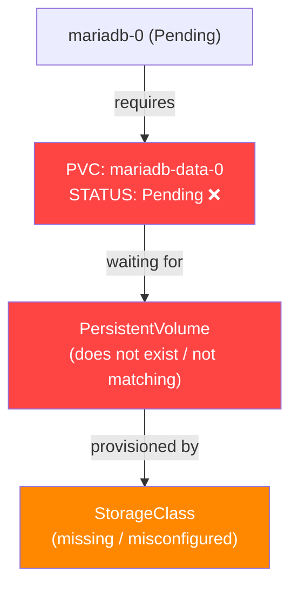
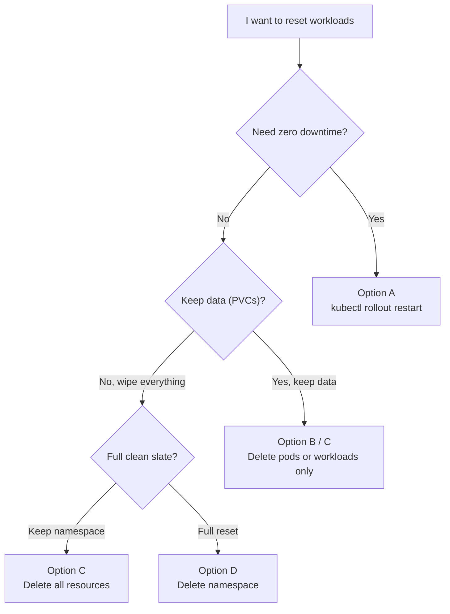

# Failure Simulation & Troubleshooting

> **Production Purpose:** The only way to build confidence in a production system is to break it deliberately and practice recovery. This phase simulates real production failures — node crashes, OOM kills, database corruption, network splits, and misconfigured rollouts — and teaches you the systematic approach that SREs use to diagnose and fix them.

---

## The SRE Incident Response Framework



Each scenario below follows this framework.

---

## Scenario 1 — Node Goes Down

**Simulates:** VM crash, hardware failure, kernel panic

### Break It

```bash
# SSH into k8s-worker1 and shut it down
ssh root@192.168.90.27 "shutdown -h now"
```

### What Kubernetes Does Automatically

```bash
watch kubectl get nodes
```

Output (progression):

```
NAME           STATUS     ROLES           AGE   VERSION
k8s-control    Ready      control-plane   2d    v1.30.x
k8s-worker1    NotReady   <none>          2d    v1.30.x    ← goes NotReady after ~40s
k8s-worker2    Ready      <none>          2d    v1.30.x
```

After ~5 minutes (`pod-eviction-timeout`), pods on worker1 are evicted and rescheduled to worker2.

```bash
kubectl get pods -n production -o wide
```

Output:

```
NAME           READY   STATUS    NODE
laravel-xxx    2/2     Running   k8s-worker2     ← rescheduled here
laravel-xxx    2/2     Running   k8s-worker2
```

### Fix It

```bash
# Start the VM back up from Proxmox console
# Then verify node rejoins
kubectl get nodes
```

### Lessons Learned

| Observation | Lesson |
| ----------- | ------ |
| App stayed up because we had 2 replicas | Always run `replicas: 2+` for HA |
| Pods took 5 min to reschedule | Tune `--pod-eviction-timeout` for faster response |
| MariaDB StatefulSet stuck (if on failed node) | Use NFS storage for pod mobility |
| MetalLB speaker reassigned IP automatically | L2 mode handles node failures |

---

## Scenario 2 — OOM Kill (Out of Memory)

**Simulates:** Memory leak in application, resource limit too low

### Break It

Deploy a memory-hungry pod with a low limit:

```bash
kubectl run oom-test \
  --image=polinux/stress \
  --restart=Never \
  --limits='memory=50Mi' \
  -- stress --vm 1 --vm-bytes 100M --vm-hang 1
```

### Observe the Kill

```bash
watch kubectl get pod oom-test
```

Output:

```
NAME       READY   STATUS      RESTARTS   AGE
oom-test   0/1     OOMKilled   0          10s
```

```bash
kubectl describe pod oom-test | grep -A5 "Last State"
```

Output:

```
Last State:     Terminated
  Reason:       OOMKilled
  Exit Code:    137
```

Exit code `137` = killed by OOM killer.

### Investigate

```bash
# Check memory pressure on nodes
kubectl top nodes

# Check pod resource usage before OOM
kubectl top pods -n production
```

### Fix

Increase memory limits in the Deployment:

```yaml
resources:
  requests:
    memory: "256Mi"
  limits:
    memory: "512Mi"    # Was 50Mi — too low
```

Or investigate the memory leak in the application code.

### Cleanup

```bash
kubectl delete pod oom-test
```

---

## Scenario 3 — Bad Deployment (CrashLoopBackOff)

**Simulates:** Deploying a broken image, missing environment variable, wrong entrypoint

### Break It

Update the Laravel deployment with a bad image:

```bash
kubectl set image deployment/laravel \
  laravel=panduhakam/sample-app:broken \
  -n production
```

### Observe the Cascade

```bash
kubectl rollout status deployment/laravel -n production
```

Output:

```
Waiting for deployment "laravel" rollout to finish: 1 out of 2 new replicas have been updated...
error: deployment "laravel" exceeded its progress deadline
```

```bash
kubectl get pods -n production
```

Output:

```
NAME           READY   STATUS             RESTARTS   AGE
laravel-NEW    0/2     CrashLoopBackOff   3          2m
laravel-OLD    2/2     Running            0          10m    ← old pods still serving!
laravel-OLD    2/2     Running            0          10m
```

Because `maxUnavailable: 0`, old pods keep serving while the bad rollout is stuck.

### Diagnose

```bash
# Get the crash reason
kubectl logs deployment/laravel -c php-fpm -n production

# Check events
kubectl describe pod laravel-NEW -n production | grep -A20 Events
```

Output:

```
Events:
  Warning  BackOff    CrashLoopBackOff: Back-off restarting failed container
  Warning  Failed     Error: failed to create containerd task: failed to create shim: OCI runtime create failed: ...
```

### Fix — Rollback

```bash
kubectl rollout undo deployment/laravel -n production
```

Output:

```
deployment.apps/laravel rolled back
```

```bash
kubectl rollout status deployment/laravel -n production
```

Output:

```
deployment "laravel" successfully rolled out
```

### Verify

```bash
kubectl get pods -n production
```

Output:

```
NAME           READY   STATUS    RESTARTS   AGE
laravel-OLD    2/2     Running   0          12m    ← back to working version
laravel-OLD    2/2     Running   0          12m
```

---

## Scenario 4 — Database Connection Failure

**Simulates:** Database pod crash, wrong credentials, network partition

### Break It

Delete the MariaDB pod:

```bash
kubectl delete pod mariadb-0 -n production
```

StatefulSet will restart it, but there's a ~30 second window where the database is unavailable.

### Observe Laravel Behavior

```bash
kubectl logs deployment/laravel -c php-fpm -n production | tail -20
```

Output:

```
[ERROR] SQLSTATE[HY000] [2002] Connection refused
[ERROR] Illuminate\Database\QueryException: Could not connect to database
```

But because the `readinessProbe` catches this:

```bash
kubectl get pods -n production -l app=laravel
```

Output:

```
NAME          READY   STATUS
laravel-xxx   1/2     Running    ← nginx container up, but php-fpm fails readiness
laravel-xxx   1/2     Running
```

`1/2` means NGINX is running but PHP-FPM failed its readiness probe — traffic is automatically routed away from these pods.

### Wait for Auto-Recovery

```bash
watch kubectl get pod mariadb-0 -n production
```

Output (after ~20 seconds):

```
NAME        READY   STATUS    RESTARTS
mariadb-0   1/1     Running   0
```

Then Laravel pods become `2/2` again automatically.

### Lessons

- `readinessProbe` prevents traffic to unhealthy pods
- StatefulSet auto-restarts the database
- Application should implement connection retry logic

---

## Scenario 5 — Horizontal Pod Autoscaler (HPA) Test

**Simulates:** Traffic spike requiring auto-scaling

### Set Up HPA

```bash
kubectl autoscale deployment laravel \
  --namespace production \
  --cpu-percent=50 \
  --min=2 \
  --max=10
```

### Generate Load

```bash
# Install hey (HTTP load generator)
apt install -y hey

# Generate load
hey -n 10000 -c 100 http://app.local
```

### Watch HPA Scale Up

```bash
watch kubectl get hpa -n production
```

Output:

```
NAME      REFERENCE              TARGETS   MINPODS   MAXPODS   REPLICAS
laravel   Deployment/laravel     72%/50%   2         10        4         ← scaled from 2 to 4
```

```bash
kubectl get pods -n production -l app=laravel
```

Output:

```
NAME          READY   STATUS    AGE
laravel-xxx   2/2     Running   10m
laravel-xxx   2/2     Running   10m
laravel-xxx   2/2     Running   45s    ← new replicas
laravel-xxx   2/2     Running   45s
```

After load stops, HPA scales back down after ~5 minutes.

---

## Scenario 6 — etcd Backup and Restore

**Simulates:** Control-plane corruption — the most catastrophic Kubernetes failure

### Backup etcd

```bash
# Run on control-plane
ETCDCTL_API=3 etcdctl snapshot save /backup/etcd-snapshot.db \
  --endpoints=https://127.0.0.1:2379 \
  --cacert=/etc/kubernetes/pki/etcd/ca.crt \
  --cert=/etc/kubernetes/pki/etcd/server.crt \
  --key=/etc/kubernetes/pki/etcd/server.key
```

Verify the backup:

```bash
ETCDCTL_API=3 etcdctl snapshot status /backup/etcd-snapshot.db
```

Output:

```
+----------+----------+------------+------------+
|   HASH   | REVISION | TOTAL KEYS | TOTAL SIZE |
+----------+----------+------------+------------+
| abc12345 |    12345 |       1234 |    5.2 MB  |
+----------+----------+------------+------------+
```

### Automate etcd Backup (CronJob)

Create: `etcd-backup-cronjob.yaml`

```yaml
apiVersion: batch/v1
kind: CronJob
metadata:
  name: etcd-backup
  namespace: kube-system
spec:
  schedule: "0 2 * * *"          # Every day at 2:00 AM
  jobTemplate:
    spec:
      template:
        spec:
          hostNetwork: true       # Access host etcd
          hostPID: true
          tolerations:
          - key: node-role.kubernetes.io/control-plane
            effect: NoSchedule
          nodeSelector:
            node-role.kubernetes.io/control-plane: ""
          containers:
          - name: etcd-backup
            image: bitnami/etcd:latest
            command:
            - /bin/sh
            - -c
            - |
              ETCDCTL_API=3 etcdctl snapshot save \
                /backup/etcd-$(date +%Y%m%d-%H%M%S).db \
                --endpoints=https://127.0.0.1:2379 \
                --cacert=/etc/kubernetes/pki/etcd/ca.crt \
                --cert=/etc/kubernetes/pki/etcd/server.crt \
                --key=/etc/kubernetes/pki/etcd/server.key
              # Keep only last 7 backups
              ls -t /backup/etcd-*.db | tail -n +8 | xargs rm -f
            volumeMounts:
            - name: etcd-certs
              mountPath: /etc/kubernetes/pki/etcd
            - name: backup-dir
              mountPath: /backup
          volumes:
          - name: etcd-certs
            hostPath:
              path: /etc/kubernetes/pki/etcd
          - name: backup-dir
            hostPath:
              path: /backup/etcd
          restartPolicy: OnFailure
```

---

## Scenario 7 — Unbound PVC (Pod Stuck in Pending)

**Simulates:** StatefulSet deployed without a matching PersistentVolume or StorageClass

> **Real Incident:** `mariadb-0` in the `production` namespace was stuck in `Pending` for 5+ days because its PersistentVolumeClaim (PVC) had no PersistentVolume (PV) to bind to.

### The Symptom

```bash
kubectl describe pod mariadb-0 -n production | grep -A5 Events
```

Output:

```
Events:
  Type     Reason            Age                     From               Message
  ----     ------            ----                    ----               -------
  Warning  FailedScheduling  14m (x1650 over 5d17h)  default-scheduler  0/3 nodes are available: pod has unbound immediate PersistentVolumeClaims. preemption: 0/3 nodes are available: 3 Preemption is not helpful for scheduling.
```

| Field | Meaning |
| ----- | ------- |
| `FailedScheduling` | The scheduler tried and failed — this is **not** a node resource issue |
| `x1650 over 5d17h` | Has been retrying for 5+ days, ~1650 attempts |
| `pod has unbound immediate PersistentVolumeClaims` | The PVC exists but has no PV bound to it |
| `preemption: 0/3 nodes are available` | Preemption (evicting lower-priority pods) won't help — the problem is storage, not CPU/memory |

### Root Cause Analysis



The Kubernetes scheduler enforces a hard rule: **a pod with `volumeBindingMode: Immediate` cannot be scheduled until ALL its PVCs are `Bound`**. Since the PVC is `Pending`, no node will ever accept the pod — regardless of available CPU or memory.

### Diagnose

```bash
# 1. Confirm pod is Pending
kubectl get pod mariadb-0 -n production

# 2. Find the unbound PVC
kubectl get pvc -n production
# Look for STATUS: Pending

# 3. Describe the PVC to find the exact reason
kubectl describe pvc mariadb-data-0 -n production

# 4. Check available StorageClasses
kubectl get storageclass

# 5. Check existing PVs
kubectl get pv
```

Common PVC describe outputs:

```
# Case A — No matching PV
Warning  ProvisioningFailed  no persistent volumes available for this claim

# Case B — StorageClass not found
Warning  ProvisioningFailed  storageclass.storage.k8s.io "local-storage" not found

# Case C — WaitForFirstConsumer (volumeBindingMode)
Normal   WaitForFirstConsumer  waiting for first consumer to be created before binding
```

### Fix — Option A: hostPath (Quick Lab Fix)

:::info When to use this
Unblocks `mariadb-0` immediately without setting up NFS. The pod will be pinned to one node.
:::

:::warning
`hostPath` ties the pod to a specific node. If that node fails, the pod cannot be rescheduled elsewhere.
:::

```bash
# Label a node to host the storage
kubectl label node k8s-worker1 storage=local

# Create the directory on that node
ssh root@192.168.90.27 "mkdir -p /data/mariadb"
```

Create `mariadb-pv-hostpath.yaml`:

```yaml
apiVersion: v1
kind: PersistentVolume
metadata:
  name: mariadb-pv
spec:
  capacity:
    storage: 5Gi
  accessModes:
    - ReadWriteOnce
  persistentVolumeReclaimPolicy: Retain
  storageClassName: local-storage
  hostPath:
    path: /data/mariadb
    type: DirectoryOrCreate
  nodeAffinity:
    required:
      nodeSelectorTerms:
      - matchExpressions:
        - key: storage
          operator: In
          values:
          - local
```

Create `mariadb-pvc.yaml`:

```yaml
apiVersion: v1
kind: PersistentVolumeClaim
metadata:
  name: mariadb-data-0
  namespace: production
spec:
  accessModes:
    - ReadWriteOnce
  storageClassName: local-storage
  resources:
    requests:
      storage: 5Gi
```

```bash
kubectl apply -f mariadb-pv-hostpath.yaml
kubectl apply -f mariadb-pvc.yaml
```

Verify PVC is now `Bound`:

```bash
kubectl get pvc -n production
```

Output:

```
NAME               STATUS   VOLUME       CAPACITY   ACCESS MODES   STORAGECLASS
mariadb-data-0     Bound    mariadb-pv   5Gi        RWO            local-storage
```

The pod will be scheduled within seconds.

### Fix — Option B: NFS StorageClass (Recommended for Multi-Node)

:::tip
NFS allows the pod to reschedule to any node — the correct production choice for a 3-node cluster.
:::

```bash
# On control-plane: set up NFS server
apt install -y nfs-kernel-server
mkdir -p /nfs/mariadb && chmod 777 /nfs/mariadb
echo '/nfs/mariadb  192.168.90.0/24(rw,sync,no_subtree_check,no_root_squash)' >> /etc/exports
exportfs -ra && systemctl enable --now nfs-kernel-server

# On ALL worker nodes
apt install -y nfs-common

# Install NFS dynamic provisioner
helm repo add nfs-subdir-external-provisioner \
  https://kubernetes-sigs.github.io/nfs-subdir-external-provisioner/

helm install nfs-provisioner \
  nfs-subdir-external-provisioner/nfs-subdir-external-provisioner \
  --namespace kube-system \
  --set nfs.server=192.168.90.26 \
  --set nfs.path=/nfs \
  --set storageClass.name=nfs-storage \
  --set storageClass.defaultClass=true
```

Verify:

```bash
kubectl get storageclass
```

Output:

```
NAME                    PROVISIONER                                VOLUMEBINDINGMODE
nfs-storage (default)   cluster.local/nfs-provisioner-...         Immediate
```

Update the MariaDB StatefulSet `volumeClaimTemplates`:

```yaml
volumeClaimTemplates:
- metadata:
    name: mariadb-data
  spec:
    accessModes: ["ReadWriteOnce"]
    storageClassName: nfs-storage
    resources:
      requests:
        storage: 5Gi
```

### Verify Recovery

```bash
# PVC must be Bound
kubectl get pvc -n production

# Pod must be Running
kubectl get pod mariadb-0 -n production

# No more FailedScheduling events
kubectl describe pod mariadb-0 -n production | grep -A5 Events
```

Expected final state:

```
NAME               STATUS   VOLUME       CAPACITY   STORAGECLASS
mariadb-data-0     Bound    mariadb-pv   5Gi        local-storage

NAME        READY   STATUS    RESTARTS   AGE
mariadb-0   1/1     Running   0          2m

Events:
  Type    Reason     Age   From               Message
  ----    ------     ----  ----               -------
  Normal  Scheduled  2m    default-scheduler  Successfully assigned production/mariadb-0 to k8s-worker1
  Normal  Pulled     2m    kubelet            Container image already present on machine
  Normal  Started    2m    kubelet            Started container mariadb
```

### Lessons Learned

| Root Cause | Prevention |
| ---------- | ---------- |
| StatefulSet deployed without a pre-existing PV or StorageClass | Always provision storage **before** deploying stateful workloads |
| `storageClassName` in PVC didn't match any available StorageClass | Use `kubectl get storageclass` to verify before deploying |
| No default StorageClass on the cluster | Set a default StorageClass via `is-default-class: "true"` annotation |
| hostPath PV was on a different node than where the pod was scheduled | Use NFS or node-affinity label to pin correctly |

---

## Troubleshooting Reference Card

### Pod in CrashLoopBackOff

```bash
# Step 1: Get recent logs
kubectl logs <pod> --previous

# Step 2: Check events
kubectl describe pod <pod> | grep -A30 Events

# Step 3: Check exit code
kubectl get pod <pod> -o jsonpath='{.status.containerStatuses[0].state.terminated.exitCode}'
# 137 = OOMKilled, 1 = app error, 2 = misuse, 139 = segfault
```

### Pod Stuck in Pending

```bash
# Check why it can't be scheduled
kubectl describe pod <pod> | grep -A10 Events

# Common reasons:
# "Insufficient memory" → increase node or lower requests
# "No nodes available" → check node taints and tolerations
# "PVC not bound" → see Scenario 7 — Unbound PVC

# PVC diagnostic chain:
kubectl get pvc -n <namespace>             # look for STATUS: Pending
kubectl describe pvc <name> -n <namespace> # find exact reason
kubectl get storageclass                   # verify StorageClass exists
kubectl get pv                             # verify a PV exists and matches
```

### Service Not Routing Traffic

```bash
# Check if endpoints are populated
kubectl get endpoints <service-name>

# If empty → selector doesn't match pod labels
kubectl get pods --show-labels
kubectl get svc <service-name> -o jsonpath='{.spec.selector}'
```

### DNS Not Resolving Inside Pods

```bash
kubectl run dns-test --image=busybox --restart=Never -- nslookup mariadb-svc.production.svc.cluster.local

# If failing, check coredns
kubectl get pods -n kube-system | grep coredns
kubectl logs -n kube-system deployment/coredns
```

### Node NotReady

```bash
# Check kubelet on the node
ssh root@192.168.90.27 "systemctl status kubelet"
ssh root@192.168.90.27 "journalctl -u kubelet -n 50"

# Common causes:
# - containerd not running: systemctl restart containerd
# - Swap enabled: swapoff -a
# - Disk full: df -h
# - OOM on node: dmesg | grep -i oom
```

---

## Production Runbook Template

For every failure you encounter in production, document it:

```markdown
## Incident: [Short Description]

**Date:** 2026-05-24
**Duration:** X minutes
**Severity:** P1 / P2 / P3
**Impact:** N% of users affected

### Timeline
- HH:MM — Alert fired / user reported
- HH:MM — Engineer paged
- HH:MM — Root cause identified
- HH:MM — Mitigation applied
- HH:MM — Incident resolved

### Root Cause
[What actually broke and why]

### Impact
[What users experienced]

### Fix Applied
[Commands or changes made to resolve]

### Prevention
[What will we change to prevent recurrence?]
- [ ] Add alert for early detection
- [ ] Improve health probe sensitivity
- [ ] Add runbook link to alert
```

---

## Scenario 8 — Workload Reset Without Touching the Cluster

**Simulates:** Resetting all pods, services, and workloads in a namespace while keeping the cluster infrastructure (nodes, control plane, CNI, storage) fully intact.

> **Use case:** You want a clean slate for the `production` namespace — restart all workloads, clear stuck pods, or re-apply configs — without rebooting nodes or disrupting other namespaces.

### How Kubernetes Self-Heals

Before resetting anything, understand what each controller does when its pods are deleted:

| Resource | What controls it | What happens on delete |
| -------- | ---------------- | ---------------------- |
| `Pod` (standalone) | Nothing | Gone permanently |
| `Pod` in `Deployment` | ReplicaSet | Automatically recreated |
| `Pod` in `StatefulSet` | StatefulSet controller | Recreated with same name and PVC |
| `Pod` in `DaemonSet` | DaemonSet controller | Recreated on same node |
| `Service` | kube-proxy / CNI | Must be reapplied manually |
| `ConfigMap` / `Secret` | Nothing | Must be reapplied manually |
| `PVC` | Nothing (data on PV) | Must be reapplied — **data survives on PV** |

---

### Option A — Rolling Restart (Zero Downtime)

Forces all pods in a Deployment or StatefulSet to restart one by one, respecting `maxUnavailable`:

```bash
# Restart a specific Deployment
kubectl rollout restart deployment/laravel -n production

# Restart a StatefulSet
kubectl rollout restart statefulset/mariadb -n production

# Restart ALL Deployments in a namespace at once
kubectl rollout restart deployment -n production

# Watch the rollout progress
kubectl rollout status deployment/laravel -n production
```

Output:

```
Waiting for deployment "laravel" rollout to finish: 1 out of 2 new replicas have been updated...
Waiting for deployment "laravel" rollout to finish: 1 old replicas are pending termination...
deployment "laravel" successfully rolled out
```

The cluster keeps serving traffic during this — old pods stay up until new pods are `Ready`.

---

### Option B — Delete All Pods (Instant Hard Reset)

Deletes every pod in the namespace. Controllers will immediately recreate them.

```bash
# Delete all pods in the namespace
kubectl delete pods --all -n production

# Watch them come back
watch kubectl get pods -n production
```

Output (immediately after delete):

```
NAME           READY   STATUS              RESTARTS   AGE
laravel-xxx    0/2     ContainerCreating   0          2s
laravel-xxx    0/2     ContainerCreating   0          2s
mariadb-0      0/1     ContainerCreating   0          1s
```

Output (after ~30 seconds):

```
NAME           READY   STATUS    RESTARTS   AGE
laravel-xxx    2/2     Running   0          35s
laravel-xxx    2/2     Running   0          35s
mariadb-0      1/1     Running   0          30s
```

:::warning
This causes a brief downtime since all pods restart simultaneously. Use Option A (rolling restart) if zero-downtime is required.
:::

---

### Option C — Full Namespace Workload Reset

Deletes all workload resources (pods, deployments, services, configmaps, secrets) but **preserves the namespace, PVCs, and PVs** — data is safe.

```bash
# Delete all workloads by type
kubectl delete deployment,statefulset,daemonset,service,configmap,secret --all -n production

# Confirm what's left (namespace and PVCs should remain)
kubectl get all -n production
kubectl get pvc -n production
```

Output after delete:

```
# kubectl get all -n production
No resources found in production namespace.

# kubectl get pvc -n production
NAME               STATUS   VOLUME       CAPACITY   STORAGECLASS
mariadb-data-0     Bound    mariadb-pv   5Gi        local-storage
```

The namespace is empty but PVC + PV + data remain intact.

Redeploy your stack:

```bash
# Re-apply all manifests from your GitOps directory
kubectl apply -f k8s/production/

# Or with ArgoCD, sync the app
argocd app sync production
```

---

### Option D — Delete and Recreate the Namespace

The most thorough reset. Deletes **everything** in the namespace including PVCs, then recreates it fresh.

:::caution
This **will delete all PVCs**. If your PV reclaim policy is `Delete`, the actual data is also lost. Only use this when you want a true clean slate.
:::

Check the reclaim policy before proceeding:

```bash
kubectl get pv -o custom-columns=NAME:.metadata.name,RECLAIM:.spec.persistentVolumeReclaimPolicy
```

Output:

```
NAME         RECLAIM
mariadb-pv   Retain    ← safe to delete namespace, data stays on disk
```

If `Retain`, the PV data survives namespace deletion.

```bash
# Delete the namespace (all resources inside are deleted)
kubectl delete namespace production

# Recreate the namespace
kubectl create namespace production

# Re-apply your stack
kubectl apply -f k8s/production/
```

If using `Retain` PVs, the PVs will be in `Released` state after namespace deletion. Reclaim them:

```bash
# Check PV status
kubectl get pv

# Output:
# NAME         CAPACITY   STATUS     CLAIM
# mariadb-pv   5Gi        Released   production/mariadb-data-0

# Patch the PV to remove the old claimRef so it can be rebound
kubectl patch pv mariadb-pv -p '{"spec":{"claimRef": null}}'

# PV is now Available again
kubectl get pv
# NAME         CAPACITY   STATUS      CLAIM
# mariadb-pv   5Gi        Available
```

When you re-apply the PVC, it will rebind to the same PV and recover the data.

---

### Verify the Cluster Is Still Healthy After Reset

```bash
# Nodes must still be Ready
kubectl get nodes

# Control-plane pods must be Running
kubectl get pods -n kube-system

# CNI (Calico) must be Running
kubectl get pods -n calico-system

# MetalLB must be Running
kubectl get pods -n metallb-system

# All production pods must be Running
kubectl get pods -n production
```

Expected output after a healthy reset:

```
# Nodes
NAME           STATUS   ROLES           AGE
k8s-control    Ready    control-plane   6d
k8s-worker1    Ready    <none>          6d
k8s-worker2    Ready    <none>          6d

# Production workloads
NAME           READY   STATUS    RESTARTS   AGE
laravel-xxx    2/2     Running   0          2m
laravel-xxx    2/2     Running   0          2m
mariadb-0      1/1     Running   0          90s
```

---

### Decision Guide



### Lessons Learned

| Action | Cluster Impact | Data Impact |
| ------ | -------------- | ----------- |
| `kubectl rollout restart` | Zero — pods replaced gradually | Safe |
| `kubectl delete pods --all` | Brief downtime | Safe |
| `kubectl delete deployment,service --all` | Workloads gone until reapplied | Safe |
| `kubectl delete namespace` | All resources gone | PV data safe if policy is `Retain` |
| Node reboot | Cluster degrades temporarily | Safe |

---

## Summary

| Scenario | Skill Practiced |
| -------- | --------------- |
| Node down | HA, pod rescheduling, StatefulSet behavior |
| OOM Kill | Resource limits, memory monitoring |
| Bad deployment | Rollback, RollingUpdate safety |
| Database down | Readiness probes, connection resilience |
| HPA scaling | Auto-scaling under load |
| etcd backup | Disaster recovery preparation |
| Unbound PVC | Storage diagnosis, PV/PVC/StorageClass chain |
| Workload reset | Rolling restart, namespace cleanup, PV data retention |

---


