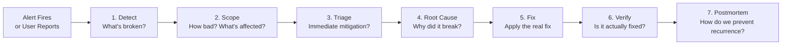

# Failure Simulation & Troubleshooting

> **Production Purpose:** The only way to build confidence in a production system is to break it deliberately and practice recovery. This phase simulates real production failures — node crashes, OOM kills, database corruption, network splits, and misconfigured rollouts — and teaches you the systematic approach that SREs use to diagnose and fix them.

---

## The SRE Incident Response Framework



Each scenario below follows this framework.

---

## Scenario 1 — Node Goes Down

**Simulates:** VM crash, hardware failure, kernel panic

### Break It

```bash
# SSH into k8s-worker1 and shut it down
ssh root@192.168.90.27 "shutdown -h now"
```

### What Kubernetes Does Automatically

```bash
watch kubectl get nodes
```

Output (progression):

```
NAME           STATUS     ROLES           AGE   VERSION
k8s-control    Ready      control-plane   2d    v1.30.x
k8s-worker1    NotReady   <none>          2d    v1.30.x    ← goes NotReady after ~40s
k8s-worker2    Ready      <none>          2d    v1.30.x
```

After ~5 minutes (`pod-eviction-timeout`), pods on worker1 are evicted and rescheduled to worker2.

```bash
kubectl get pods -n production -o wide
```

Output:

```
NAME           READY   STATUS    NODE
laravel-xxx    2/2     Running   k8s-worker2     ← rescheduled here
laravel-xxx    2/2     Running   k8s-worker2
```

### Fix It

```bash
# Start the VM back up from Proxmox console
# Then verify node rejoins
kubectl get nodes
```

### Lessons Learned

| Observation | Lesson |
| ----------- | ------ |
| App stayed up because we had 2 replicas | Always run `replicas: 2+` for HA |
| Pods took 5 min to reschedule | Tune `--pod-eviction-timeout` for faster response |
| MariaDB StatefulSet stuck (if on failed node) | Use NFS storage for pod mobility |
| MetalLB speaker reassigned IP automatically | L2 mode handles node failures |

---

## Scenario 2 — OOM Kill (Out of Memory)

**Simulates:** Memory leak in application, resource limit too low

### Break It

Deploy a memory-hungry pod with a low limit:

```bash
kubectl run oom-test \
  --image=polinux/stress \
  --restart=Never \
  --limits='memory=50Mi' \
  -- stress --vm 1 --vm-bytes 100M --vm-hang 1
```

### Observe the Kill

```bash
watch kubectl get pod oom-test
```

Output:

```
NAME       READY   STATUS      RESTARTS   AGE
oom-test   0/1     OOMKilled   0          10s
```

```bash
kubectl describe pod oom-test | grep -A5 "Last State"
```

Output:

```
Last State:     Terminated
  Reason:       OOMKilled
  Exit Code:    137
```

Exit code `137` = killed by OOM killer.

### Investigate

```bash
# Check memory pressure on nodes
kubectl top nodes

# Check pod resource usage before OOM
kubectl top pods -n production
```

### Fix

Increase memory limits in the Deployment:

```yaml
resources:
  requests:
    memory: "256Mi"
  limits:
    memory: "512Mi"    # Was 50Mi — too low
```

Or investigate the memory leak in the application code.

### Cleanup

```bash
kubectl delete pod oom-test
```

---

## Scenario 3 — Bad Deployment (CrashLoopBackOff)

**Simulates:** Deploying a broken image, missing environment variable, wrong entrypoint

### Break It

Update the Laravel deployment with a bad image:

```bash
kubectl set image deployment/laravel \
  php-fpm=yourdockerhub/sample-app:broken \
  -n production
```

### Observe the Cascade

```bash
kubectl rollout status deployment/laravel -n production
```

Output:

```
Waiting for deployment "laravel" rollout to finish: 1 out of 2 new replicas have been updated...
error: deployment "laravel" exceeded its progress deadline
```

```bash
kubectl get pods -n production
```

Output:

```
NAME           READY   STATUS             RESTARTS   AGE
laravel-NEW    0/2     CrashLoopBackOff   3          2m
laravel-OLD    2/2     Running            0          10m    ← old pods still serving!
laravel-OLD    2/2     Running            0          10m
```

Because `maxUnavailable: 0`, old pods keep serving while the bad rollout is stuck.

### Diagnose

```bash
# Get the crash reason
kubectl logs deployment/laravel -c php-fpm -n production

# Check events
kubectl describe pod laravel-NEW -n production | grep -A20 Events
```

Output:

```
Events:
  Warning  BackOff    CrashLoopBackOff: Back-off restarting failed container
  Warning  Failed     Error: failed to create containerd task: failed to create shim: OCI runtime create failed: ...
```

### Fix — Rollback

```bash
kubectl rollout undo deployment/laravel -n production
```

Output:

```
deployment.apps/laravel rolled back
```

```bash
kubectl rollout status deployment/laravel -n production
```

Output:

```
deployment "laravel" successfully rolled out
```

### Verify

```bash
kubectl get pods -n production
```

Output:

```
NAME           READY   STATUS    RESTARTS   AGE
laravel-OLD    2/2     Running   0          12m    ← back to working version
laravel-OLD    2/2     Running   0          12m
```

---

## Scenario 4 — Database Connection Failure

**Simulates:** Database pod crash, wrong credentials, network partition

### Break It

Delete the MariaDB pod:

```bash
kubectl delete pod mariadb-0 -n production
```

StatefulSet will restart it, but there's a ~30 second window where the database is unavailable.

### Observe Laravel Behavior

```bash
kubectl logs deployment/laravel -c php-fpm -n production | tail -20
```

Output:

```
[ERROR] SQLSTATE[HY000] [2002] Connection refused
[ERROR] Illuminate\Database\QueryException: Could not connect to database
```

But because the `readinessProbe` catches this:

```bash
kubectl get pods -n production -l app=laravel
```

Output:

```
NAME          READY   STATUS
laravel-xxx   1/2     Running    ← nginx container up, but php-fpm fails readiness
laravel-xxx   1/2     Running
```

`1/2` means NGINX is running but PHP-FPM failed its readiness probe — traffic is automatically routed away from these pods.

### Wait for Auto-Recovery

```bash
watch kubectl get pod mariadb-0 -n production
```

Output (after ~20 seconds):

```
NAME        READY   STATUS    RESTARTS
mariadb-0   1/1     Running   0
```

Then Laravel pods become `2/2` again automatically.

### Lessons

- `readinessProbe` prevents traffic to unhealthy pods
- StatefulSet auto-restarts the database
- Application should implement connection retry logic

---

## Scenario 5 — Horizontal Pod Autoscaler (HPA) Test

**Simulates:** Traffic spike requiring auto-scaling

### Set Up HPA

```bash
kubectl autoscale deployment laravel \
  --namespace production \
  --cpu-percent=50 \
  --min=2 \
  --max=10
```

### Generate Load

```bash
# Install hey (HTTP load generator)
apt install -y hey

# Generate load
hey -n 10000 -c 100 http://app.local
```

### Watch HPA Scale Up

```bash
watch kubectl get hpa -n production
```

Output:

```
NAME      REFERENCE              TARGETS   MINPODS   MAXPODS   REPLICAS
laravel   Deployment/laravel     72%/50%   2         10        4         ← scaled from 2 to 4
```

```bash
kubectl get pods -n production -l app=laravel
```

Output:

```
NAME          READY   STATUS    AGE
laravel-xxx   2/2     Running   10m
laravel-xxx   2/2     Running   10m
laravel-xxx   2/2     Running   45s    ← new replicas
laravel-xxx   2/2     Running   45s
```

After load stops, HPA scales back down after ~5 minutes.

---

## Scenario 6 — etcd Backup and Restore

**Simulates:** Control-plane corruption — the most catastrophic Kubernetes failure

### Backup etcd

```bash
# Run on control-plane
ETCDCTL_API=3 etcdctl snapshot save /backup/etcd-snapshot.db \
  --endpoints=https://127.0.0.1:2379 \
  --cacert=/etc/kubernetes/pki/etcd/ca.crt \
  --cert=/etc/kubernetes/pki/etcd/server.crt \
  --key=/etc/kubernetes/pki/etcd/server.key
```

Verify the backup:

```bash
ETCDCTL_API=3 etcdctl snapshot status /backup/etcd-snapshot.db
```

Output:

```
+----------+----------+------------+------------+
|   HASH   | REVISION | TOTAL KEYS | TOTAL SIZE |
+----------+----------+------------+------------+
| abc12345 |    12345 |       1234 |    5.2 MB  |
+----------+----------+------------+------------+
```

### Automate etcd Backup (CronJob)

Create: `etcd-backup-cronjob.yaml`

```yaml
apiVersion: batch/v1
kind: CronJob
metadata:
  name: etcd-backup
  namespace: kube-system
spec:
  schedule: "0 2 * * *"          # Every day at 2:00 AM
  jobTemplate:
    spec:
      template:
        spec:
          hostNetwork: true       # Access host etcd
          hostPID: true
          tolerations:
          - key: node-role.kubernetes.io/control-plane
            effect: NoSchedule
          nodeSelector:
            node-role.kubernetes.io/control-plane: ""
          containers:
          - name: etcd-backup
            image: bitnami/etcd:latest
            command:
            - /bin/sh
            - -c
            - |
              ETCDCTL_API=3 etcdctl snapshot save \
                /backup/etcd-$(date +%Y%m%d-%H%M%S).db \
                --endpoints=https://127.0.0.1:2379 \
                --cacert=/etc/kubernetes/pki/etcd/ca.crt \
                --cert=/etc/kubernetes/pki/etcd/server.crt \
                --key=/etc/kubernetes/pki/etcd/server.key
              # Keep only last 7 backups
              ls -t /backup/etcd-*.db | tail -n +8 | xargs rm -f
            volumeMounts:
            - name: etcd-certs
              mountPath: /etc/kubernetes/pki/etcd
            - name: backup-dir
              mountPath: /backup
          volumes:
          - name: etcd-certs
            hostPath:
              path: /etc/kubernetes/pki/etcd
          - name: backup-dir
            hostPath:
              path: /backup/etcd
          restartPolicy: OnFailure
```

---

## Troubleshooting Reference Card

### Pod in CrashLoopBackOff

```bash
# Step 1: Get recent logs
kubectl logs <pod> --previous

# Step 2: Check events
kubectl describe pod <pod> | grep -A30 Events

# Step 3: Check exit code
kubectl get pod <pod> -o jsonpath='{.status.containerStatuses[0].state.terminated.exitCode}'
# 137 = OOMKilled, 1 = app error, 2 = misuse, 139 = segfault
```

### Pod Stuck in Pending

```bash
# Check why it can't be scheduled
kubectl describe pod <pod> | grep -A10 Events

# Common reasons:
# "Insufficient memory" → increase node or lower requests
# "No nodes available" → check node taints and tolerations
# "PVC not bound" → check PersistentVolumeClaims
```

### Service Not Routing Traffic

```bash
# Check if endpoints are populated
kubectl get endpoints <service-name>

# If empty → selector doesn't match pod labels
kubectl get pods --show-labels
kubectl get svc <service-name> -o jsonpath='{.spec.selector}'
```

### DNS Not Resolving Inside Pods

```bash
kubectl run dns-test --image=busybox --restart=Never -- nslookup mariadb-svc.production.svc.cluster.local

# If failing, check coredns
kubectl get pods -n kube-system | grep coredns
kubectl logs -n kube-system deployment/coredns
```

### Node NotReady

```bash
# Check kubelet on the node
ssh root@192.168.90.27 "systemctl status kubelet"
ssh root@192.168.90.27 "journalctl -u kubelet -n 50"

# Common causes:
# - containerd not running: systemctl restart containerd
# - Swap enabled: swapoff -a
# - Disk full: df -h
# - OOM on node: dmesg | grep -i oom
```

---

## Production Runbook Template

For every failure you encounter in production, document it:

```markdown
## Incident: [Short Description]

**Date:** 2026-05-24
**Duration:** X minutes
**Severity:** P1 / P2 / P3
**Impact:** N% of users affected

### Timeline
- HH:MM — Alert fired / user reported
- HH:MM — Engineer paged
- HH:MM — Root cause identified
- HH:MM — Mitigation applied
- HH:MM — Incident resolved

### Root Cause
[What actually broke and why]

### Impact
[What users experienced]

### Fix Applied
[Commands or changes made to resolve]

### Prevention
[What will we change to prevent recurrence?]
- [ ] Add alert for early detection
- [ ] Improve health probe sensitivity
- [ ] Add runbook link to alert
```

---

## Summary

| Scenario | Skill Practiced |
| -------- | --------------- |
| Node down | HA, pod rescheduling, StatefulSet behavior |
| OOM Kill | Resource limits, memory monitoring |
| Bad deployment | Rollback, RollingUpdate safety |
| Database down | Readiness probes, connection resilience |
| HPA scaling | Auto-scaling under load |
| etcd backup | Disaster recovery preparation |

---


