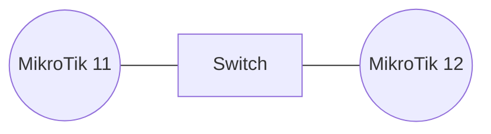

# Open Shortest Path First (OSPF)

OSPF is a link-state dynamic routing protocol that discovers neighbors, exchanges link information, and computes the shortest path using Dijkstra’s algorithm. Each router uses a unique Router-ID and participates in one or more OSPF Areas.

## Topology OSPF on MikroTik



## Addressing Plan

| Router | Interface | IP             | Layer            |
| ------ | --------- | -------------- | ---------------- |
| MT12   | ether1    | 172.16.19.2/24 | Link to Upstream |
| MT12   | vlan10    | 172.16.20.1/24 | Link to MT11     |
| MT11   | vlan10    | 172.16.20.2/24 | Link to MT12     |

We will create a custom area name instead of the default backbone.

---

## Create OSPF Instance on MT12

an instance defines router-id and global settings.
Input:

```
/routing ospf instance add name=office-inst router-id=172.16.20.1
```

---

## Create OSPF Area on MT12

an area groups routers to exchange LSAs.
Input:

```
/routing ospf area add name=office-area area-id=0.0.0.0 instance=office-inst
```

---

## Enable OSPF on VLAN Interface MT12

OSPF only forms neighbors on enabled interfaces.
Input:

```
/routing ospf interface add network-type=broadcast interface=vlan10
```

---

## Advertise Network on MT12

instruct OSPF to announce a subnet.
Input:

```
/routing ospf network add area=office-area network=172.16.20.0/24
/routing ospf network add area=office-area network=172.16.19.0/24
```

---

## Create OSPF instance on MT11

router-id must be unique.
Input:

```
/routing ospf instance add name=office-inst router-id=172.16.20.2
```

---

## Create OSPF Area on MT11

area must match to become neighbors.
Input:

```
/routing ospf area add name=office-area area-id=0.0.0.0 instance=office-inst
```

---

## Enable OSPF on VLAN Interface MT11

OSPF will send Hello packets on this link.
Input:

```
/routing ospf interface add network-type=broadcast interface=vlan10
```

---

## Advertise Network on MT11

both sides advertise the shared LAN.
Input:

```
/routing ospf network add area=office-area network=172.16.20.0/24
```

---

## Verify OSPF Neighbors

Full state means LSDB synchronized.
Input:

```
/routing ospf neighbor print
```

Output:

```
INSTANCE         STATE        NEIGHBOR-ID     ADDRESS         INTERFACE
office-inst      Full         172.16.20.1     172.16.20.1     vlan10
```

The output shows adjacency formed.

---

## Show Learned OSPF Routes

OSPF routes appear with “o” flag.

Input on MK11:

```
/ip route print where ospf
```

Output:

```
Flags: X - disabled, A - active, D - dynamic, C - connect, S - static, r - rip, b - bgp, o - ospf, m - mme, 
B - blackhole, U - unreachable, P - prohibit 
 #      DST-ADDRESS        PREF-SRC        GATEWAY            DISTANCE
 0 ADo  172.16.19.0/24                     172.16.20.1             110
```

The output shows dynamically learned routes.

---
