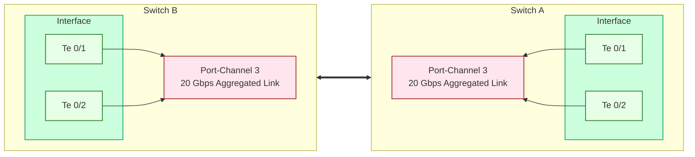

# Link Aggregation Control Protocol (LACP)

LACP (IEEE 802.3ad) aggregates multiple physical links into one logical interface called a port-channel, increasing total bandwidth and providing failover protection. All member interfaces must match in speed, duplex, MTU, and link type.

---

## Topology



--- 

:::info Each switch contributes two 10G links. LACP combines them into a single 20 Gbps logical channel.
:::

---

:::info Tested with DeLL Force10
:::
## Switch A Configuration

### Port-Channel Creation

Create the logical bundle first.

Input:
```
interface port-channel 3
description lacp-distribution
```

:::info
#### Optional configuration:
- If this is a Layer 3 port-channel, add:
  ```
  no switchport
  ip address <IP> <MASK>
  ```
- If using static (non-LACP):
  ```
  port-channel 3 mode on
  ```
  :::warning Not recommended unless connecting to a device without LACP.

- If needing fast LACP timers:
  ```
  lacp rate fast
  ```
  > 30s → 1s heartbeat
:::
---

### Physical Member Ports

#### Te 0/1

Input:
```
interface te 0/1
no switchport
no shutdown
description lacp3-core
port-channel-protocol lacp
port-channel 3 mode active
```

Output:
- Interface becomes routed (L3) if supported.
- Joins LACP Port-channel 3 in active LACP negotiation mode.

:::info
#### Optional configuration:
- If you want passive LACP mode (waits for peer, more conservative):
  ```
  port-channel 3 mode passive
  ```
- If you want Layer2 only, remove `no switchport`:
  ```
  switchport
  ```
:::

---

#### Te 0/2

Same settings as Te0/1.

Input:
```
interface te 0/2
no switchport
no shutdown
description lacp3-core
port-channel-protocol lacp
port-channel 3 mode active
```

---

## Switch B Configuration

Configuration mirrors Switch A.

---

### Port-Channel Creation

Input:
```
interface port-channel 3
description lacp-distribution
```

---

### Physical Member Ports

#### Te 0/1

Input:
```
interface te 0/1
no switchport
no shutdown
description lacp3-core
port-channel-protocol lacp
port-channel 3 mode active
```

---

#### Te 0/2

Input:
```
interface te 0/2
no switchport
no shutdown
description lacp3-core
port-channel-protocol lacp
port-channel 3 mode active
```
---

## Verification Commands

### Port-Channel Summary

Input:
```
show interfaces port-channel 3 brief
```

Output:
```
Codes: L - LACP Port-channel

    LAG Mode  Status       Uptime      Ports          
L   3   L2    up           29w5d14h    Te 0/1    (Up)
                                       Te 0/2    (Up)
```

:::info
- Port-channel is up.
- Both physical links are operational and negotiated via LACP.
:::

---

### Detailed Port-Channel State

Input:
```
show interfaces port-channel 3
```

Output:
```
Port-channel 3 is up, line protocol is up
Created by LACP protocol
Description: lacp3-core
LineSpeed 20000 Mbit
Members in this channel:  Te 0/1(U) Te 0/2(U)
```

:::info
- Bundle total bandwidth = 20G (2 × 10G).
- Both interfaces show U = In Use.
:::

---

## Decision Logic & Optional Behavior

#### If you want to enforce symmetric hashing (better load balance):
```
port-channel load-balance src-dst-ip
```

#### If connecting to a device without LACP support:
Use static mode:
```
port-channel 3 mode on
```

#### If you need rapid failover:
```
lacp rate fast
```

#### If links keep flapping:
Check:
```
show lacp counters
show log
```

#### If member interfaces refuse to join:
Common mismatches:
- switchport vs no switchport
- speed/duplex mismatches
- port-channel mode mismatch (active vs on)
- LACP not enabled on peer

---
